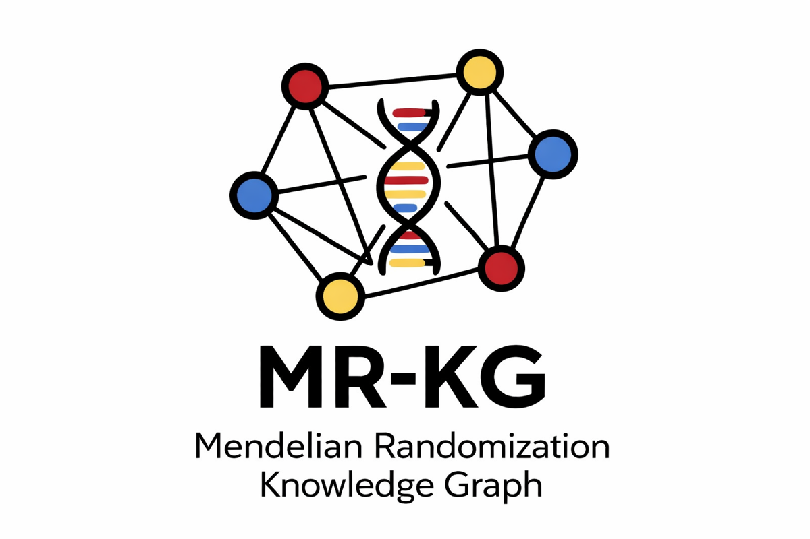
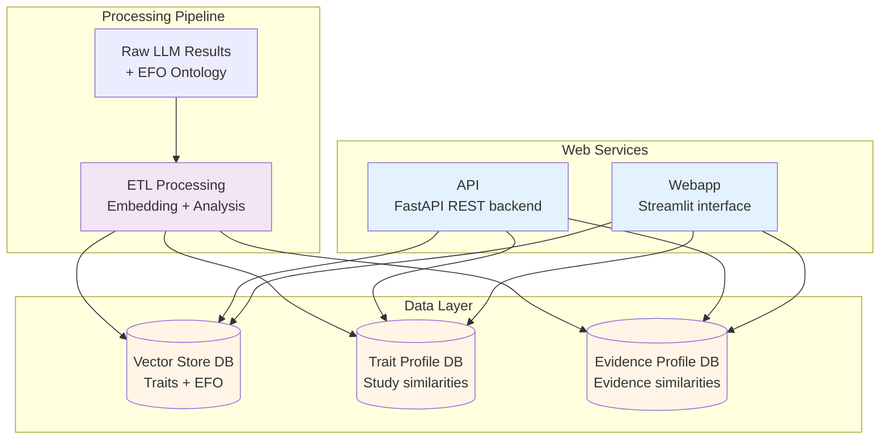

# MR-KG: A knowledge graph of Mendelian randomization evidence powered by large language models



This is the project repository for MR-KG ([medRxiv preprint](http://dx.doi.org/10.64898/2025.12.14.25342218)), a synthesised knowledge graph resource for Mendelian randomization extracted from literature by large language models (LLMs).

The live service is deployed here:

- the web application https://epigraphdb.org/mr-kg
- the API https://epigraphdb.org/mr-kg/api

## Architecture

MR-KG consists of three main components:



Components:

- **API (FastAPI)**: RESTful backend providing programmatic access to MR data
- **Webapp (Streamlit)**: User-facing interface for interactive exploration (standalone, accesses DuckDB databases directly)
- **Processing pipeline**: ETL pipeline that creates DuckDB databases from raw LLM results and EFO ontology data

The webapp and API are independent services that both access the same DuckDB databases through a shared repository layer.

## Quick start

Clone the repository and set up the development environment:

```bash
git clone https://github.com/MRCIEU/mr-kg
cd mr-kg
just setup-dev
```

Start the web services using Docker:

```bash
# Run from project root
just dev
```

Access the services:

- Webapp: http://localhost:8501/mr-kg
- API documentation: http://localhost:8000/mr-kg/api/

For detailed development instructions including local development without
Docker, see DEV.md

## Web services

MR-KG provides web services for:

- Searching and exploring MR studies by trait or study title
- Viewing detailed extraction results from multiple LLM models
- Discovering similar studies through trait profile and evidence profile
  similarity metrics
- Accessing resource-wide statistics

### API endpoints

| Endpoint                          | Description                           |
|-----------------------------------|---------------------------------------|
| GET /mr-kg/api/studies                  | Search and list studies               |
| GET /mr-kg/api/studies/{pmid}/extraction| Get extraction results for a study    |
| GET /mr-kg/api/studies/{pmid}/similar/trait | Find similar studies by trait     |
| GET /mr-kg/api/studies/{pmid}/similar/evidence | Find similar studies by evidence |
| GET /mr-kg/api/traits/autocomplete      | Trait name suggestions                |
| GET /mr-kg/api/studies/autocomplete     | Study title suggestions               |
| GET /mr-kg/api/statistics               | Resource-wide statistics              |
| GET /mr-kg/api/health                   | Service health check                  |

Full API documentation available at `/mr-kg/api/` when the service is running.

### Webapp pages

- **Search by Trait**: Find studies investigating specific traits
- **Search by Study**: Search studies by title
- **Study Info**: View extraction details and similar studies
- **Info**: Resource statistics and methodology documentation

## Project structure

See DEV.md for detailed project structure and file organization.

## Documentation

- Development guide: DEV.md
- Data structure: docs/DATA.md
- Key terms and concepts: docs/GLOSSARY.md
- Processing pipeline: docs/processing/pipeline.md
- Case study analyses: docs/processing/case-studies.md
- API documentation: api/README.md
- Webapp documentation: webapp/README.md

## Citation

```bibtex
@article{liu2025mr-kg,
  title = {MR-KG: A knowledge graph of Mendelian randomization evidence powered by large language models},
  url = {http://dx.doi.org/10.64898/2025.12.14.25342218},
  DOI = {10.64898/2025.12.14.25342218},
  publisher = {openRxiv},
  author = {Liu, Yi and Burton, Joshua and Gatua, Winfred and Hemani, Gibran and Gaunt, Tom R},
  year = {2025},
  month = dec
}
```
