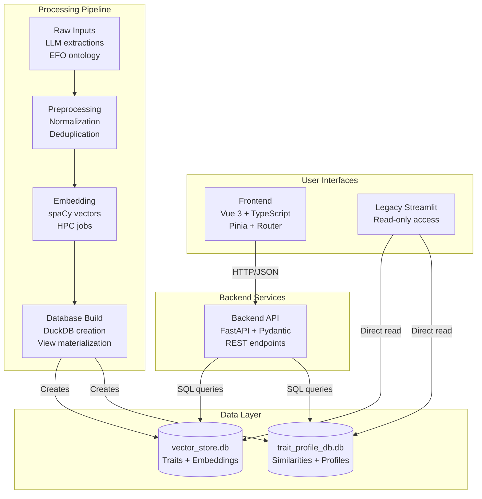

# MR-KG System Architecture

For project overview and navigation, see @DEV.md.

Scope: Architecture-only reference. Operational guidance lives in
@docs/DEVELOPMENT.md and @docs/DEPLOYMENT.md. Environment configuration is in
@docs/ENV.md.

## System Overview

MR-KG is a fullstack system for exploring Mendelian Randomization studies using
LLM-extracted traits and vector similarity search. It transforms raw literature
artifacts into searchable vector stores and exposes them via a REST API and a
modern web interface. A legacy Streamlit app is maintained for compatibility.

## High-Level Architecture



## Component Architecture

For detailed component architecture including API endpoints, service layer
design, database access patterns, and frontend component interactions, see
@docs/topics/components.md.

### Frontend (Vue.js)

The frontend is a single-page application that consumes the REST API and
presents interactive exploration interfaces.

- Composition API with TypeScript
- State management with Pinia
- Vue Router for navigation
- Tailwind CSS for styling
- API service layer for HTTP access

Responsibilities

- Present trait search, study views, and similarity exploration
- Manage client-side state and derived data
- Handle pagination, loading states, and error display

Representative structure

```
frontend/src/
- components/          Reusable UI components
- views/               Page-level components (Home, Traits, Studies, etc.)
- stores/              Pinia stores (traits, studies, similarities)
- services/            API client and endpoint wrappers
- types/               API and domain types
- router/              SPA routing
```

### Backend (FastAPI)

The backend provides a versioned REST API that mediates all access to the data
layer and implements business logic including vector similarity operations.

- FastAPI with Pydantic models
- Layered organization: api, core, models, services, utils
- DuckDB data access with repository-style services
- OpenAPI documentation generated by FastAPI

Responsibilities

- Expose stable, versioned endpoints for traits, studies, similarities
- Validate and serialize requests and responses
- Perform vector similarity queries and result aggregation
- Centralize error handling and cross-cutting concerns

Representative structure

```
backend/app/
- api/v1/             Route handlers (health, system, traits, studies, sims)
- core/               Config, database, dependencies, middleware
- models/             Pydantic request/response models
- services/           Repositories, domain services, similarity logic
- utils/              Shared helpers
```

### Legacy Interface (Streamlit)

A Streamlit application provides a compatible interface for legacy workflows.
It reads the same DuckDB databases as the backend.

## Data Layer Architecture

The data layer consists of file-backed DuckDB databases optimized for vector
search and analytical queries.

For complete database schema documentation, see @processing/docs/db_schema.md.

Access patterns

- Repository-style data access from backend services
- Vector similarity queries over embedding tables
- Read-optimized schemas and views for common aggregations
- Controlled write paths via processing pipeline outputs

Shared schema source

- src/common_funcs/common_funcs/schema/database_schema.py

## Processing Pipeline Architecture

The pipeline converts raw inputs into vectorized databases consumed by the web
stack. For complete pipeline documentation including workflows, scripts, and
HPC details, see @processing/README.md.

Key responsibilities

- Normalize and link heterogeneous trait labels across models
- Generate embeddings for traits and EFO terms
- Build read-optimized schemas supporting vector search and joins
- Precompute similarity artifacts for efficient UI queries

## Integration Patterns

### Frontend to Backend

- HTTP(S) with JSON payloads
- API service layer encapsulates endpoints and error handling
- Request flow

```
Vue component -> Pinia action -> API service -> FastAPI endpoint
UI update    <- state update  <- response    <- DB query
```

### Backend to Data Layer

- Centralized database service managing connections
- Repository methods encapsulate SQL and vector operations
- Read-mostly workload with batched queries and pagination

Query styles

- Vector similarity (cosine-like) over embedding tables
- Filtered retrievals by trait, study, model, or EFO term
- Aggregations for summaries and rankings

### Processing to Data Layer

- Deterministic schema materialization with validation
- Versioned outputs enabling reproducibility
- Separation of write-time processing from read-time serving

### Shared Contracts

- Typed request/response models in backend
- Shared schema definitions in src/common_funcs for processing and serving

## Security Architecture (principles)

- Defense in depth across frontend, backend, and data access
- Strict input validation and output encoding
- CORS and security headers appropriate to deployment context
- Authentication and authorization at the API boundary
- Least-privilege access to file-backed databases
- Audit-friendly structured logging

## Performance Architecture (principles)

Frontend

- Code splitting and lazy loading
- Derived state and efficient list rendering
- Caching of static assets

Backend

- Async request handling with non-blocking I/O
- Batching and pagination for large result sets
- Response compression and structured serialization

Data layer

- Read-optimized tables and materialized views
- Vector-friendly representations for similarity queries
- Predictable memory usage and concurrency for multiple readers

## Monitoring and Observability (principles)

- Health endpoints covering application and data layer readiness
- Metrics for latency, throughput, and error rates
- Structured, correlated logs for request tracing
- Dashboards that reflect user-facing performance and error budgets

## Scalability Considerations

- Stateless API instances behind a reverse proxy or load balancer
- Horizontal scaling at the API layer; shared read-only DuckDB artifacts
- Precomputation of heavy similarity artifacts to bound request latency
- Controlled data growth via indexing, partitioning-by-convention, and views

## Runtime Topology Overview

A typical deployment places the SPA and API behind a reverse proxy. Static
assets are served efficiently, while dynamic requests are routed to the API,
which reads from file-backed DuckDB databases.

```
Internet -> Reverse proxy / CDN
  - Serves SPA static assets
  - Proxies /api/v1 -> FastAPI -> DuckDB files
```
