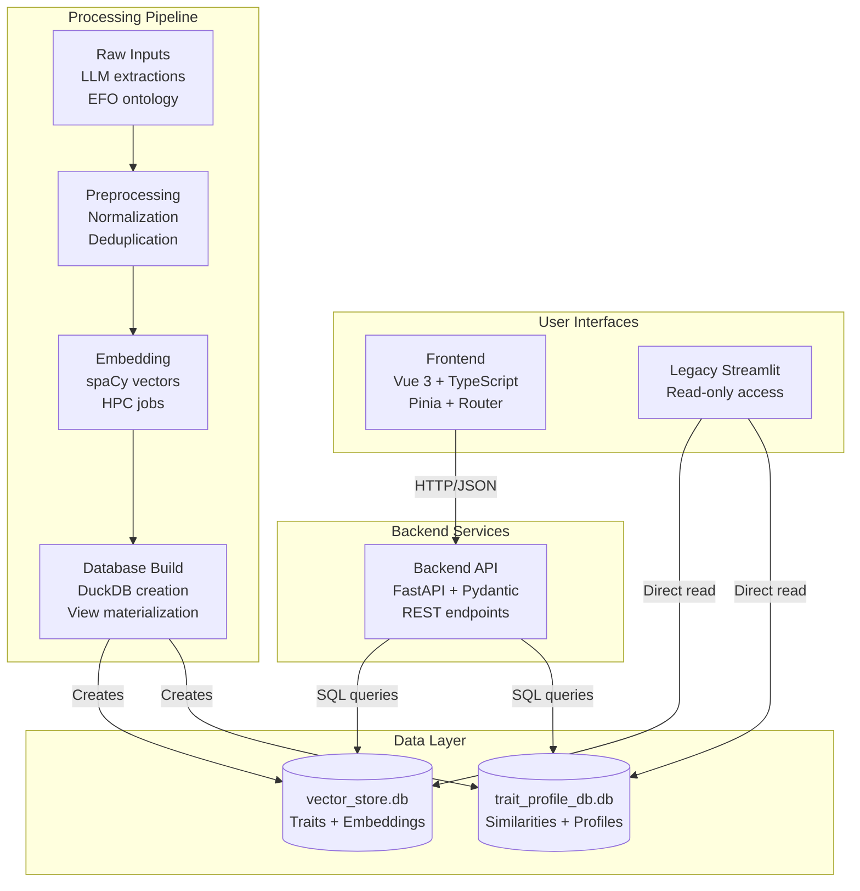
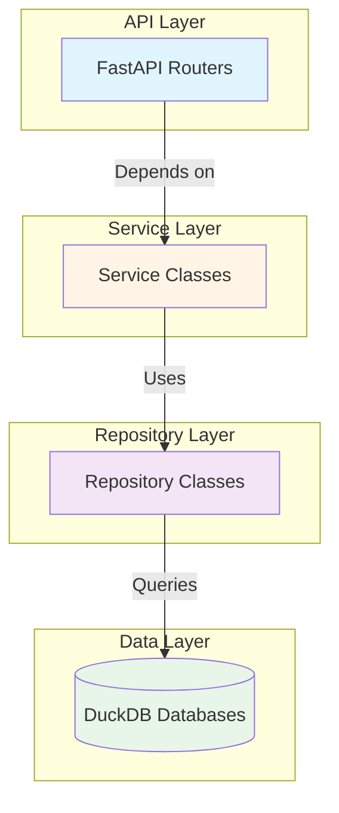
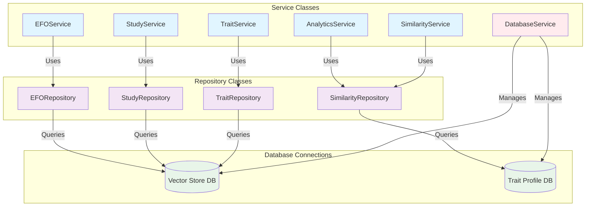
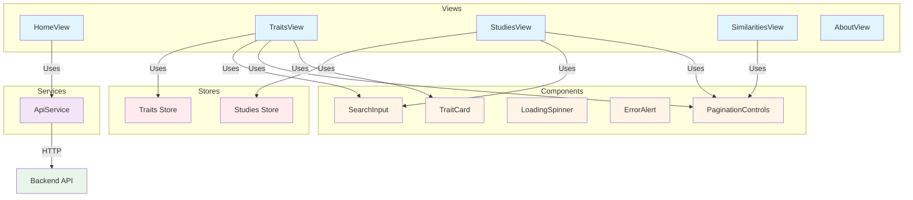
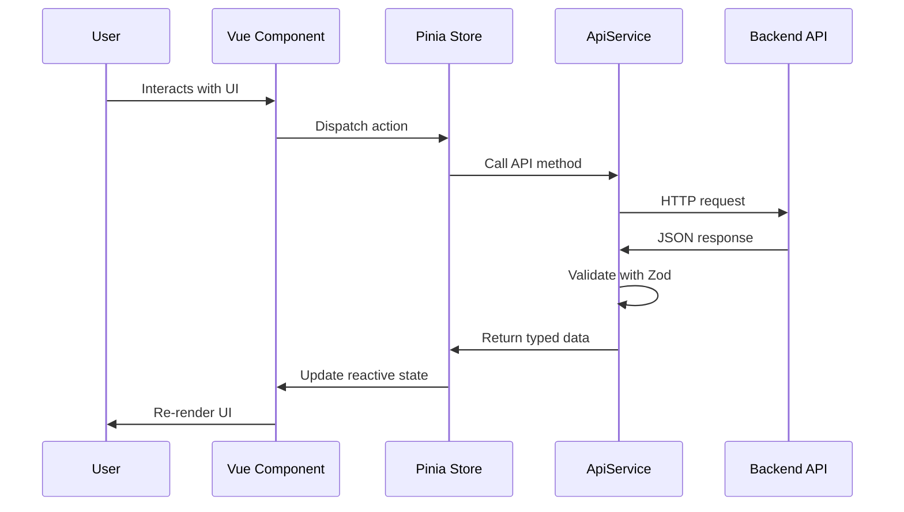

# System architecture

MR-KG is a fullstack system for exploring Mendelian Randomization studies using LLM-extracted traits and vector similarity search.

For project overview and navigation, see @DEV.md.

## System overview



## Backend architecture

### Overview

The backend follows a layered architecture with clear separation of concerns:



### API structure

Backend API endpoints organized by domain under `backend/app/api/v1/`:

- `/health` - Health checks and monitoring
- `/system` - System information and diagnostics
- `/traits` - Trait exploration and search
- `/studies` - Study analysis and retrieval
- `/similarities` - Similarity computation and ranking

For detailed endpoint documentation, see @docs/backend/api-design.md.

### Service layer



For database layer details, see @docs/backend/database-layer.md.

## Frontend architecture

### Overview

Vue 3 single-page application with component-based architecture:



For detailed frontend architecture, see @docs/frontend/overview.md.

### Backend integration flow



## Data layer

File-backed DuckDB databases optimized for vector search and analytical queries:

- **Vector store database** (`vector_store.db`): Trait embeddings, EFO embeddings, model results
- **Trait profile database** (`trait_profile_db.db`): Precomputed trait similarities

Access patterns:
- Repository-style data access from backend services
- Vector similarity queries over embedding tables
- Read-optimized schemas and views for common aggregations

For complete database schema, see @docs/processing/db-schema.md.

## Processing pipeline

Converts raw inputs into vectorized databases via HPC-enabled ETL:

1. **Preprocessing**: Normalize traits and EFO terms, create indices
2. **Embedding**: Generate 200-dim vectors using SciSpaCy (HPC)
3. **Database build**: Create vector_store.db with embeddings and results
4. **Similarity**: Compute trait profile similarities (HPC)
5. **Profile database**: Create trait_profile_db.db for network analysis

For complete pipeline documentation, see @processing/README.md.

## Integration patterns

### Frontend to backend

HTTP(S) with JSON payloads via centralized API service:

```
Vue component -> Pinia action -> API service -> FastAPI endpoint
UI update    <- state update  <- response    <- DB query
```

### Backend to data layer

- Centralized database service managing connections
- Repository methods encapsulate SQL and vector operations
- Read-mostly workload with batched queries and pagination

### Processing to data layer

- Deterministic schema materialization with validation
- Versioned outputs enabling reproducibility
- Separation of write-time processing from read-time serving

## Deployment topology

```
Internet -> Reverse proxy / CDN
  - Serves SPA static assets
  - Proxies /api/v1 -> FastAPI -> DuckDB files
```

For deployment details, see @docs/deployment.md.
