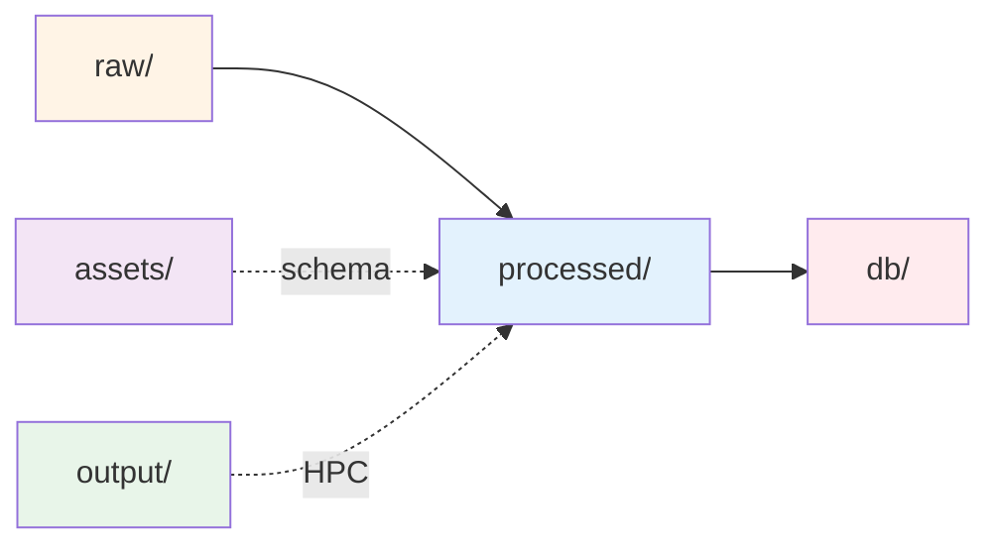

# Data structure

> Note: This document is the canonical reference for the data directory layout
> and database schema artifacts. Processing pipeline steps are documented in
> processing/README.md.

## Overview

The MR-KG data directory contains raw source datasets, intermediate
processing artifacts, production databases, and batch computation outputs.
Data flows from raw inputs through processing stages to final database
artifacts consumed by the web application.

## Processing workflow



## Top-level directories

### raw/

Source datasets ingested as-is from external sources or sibling repositories.
No processing or transformation applied.

**Contents:**

- **efo/**: Experimental Factor Ontology (EFO) data
  - `efo.json`: EFO ontology release (v3.80) in JSON format containing
    ~67K biomedical terms with hierarchical relationships
- **llm-results-aggregated/**: Model extraction outputs from the sibling
  `llm-data-extraction` repository
  - Per-model directories containing raw and validated extraction results
  - Schema validation logs tracking data quality issues
- **mr-pubmed-data/**: PubMed metadata corpus for MR studies
  - `mr-pubmed-data.json`: ~15K papers with titles, abstracts, publication
    metadata

**Upstream sources:**

- EFO: https://github.com/EBISPOT/efo/releases
- LLM results: Sibling repository `llm-data-extraction`
- PubMed data: Curated MR literature corpus

### processed/

Derived artifacts generated by the processing pipeline. These intermediate
files feed into database construction.

**Data transformations:**

- Trait extraction and deduplication
- Embedding generation (200-dimensional vectors via SciSpaCy)
- Model result consolidation and normalization
- Trait profile similarity computation

**Directory structure:**

- **traits/**: Deduplicated trait labels with index assignments
- **embeddings/**: Vector representations for semantic search
- **model_results/**: Consolidated extraction outputs with schema validation
- **trait-profile-similarities/**: Precomputed study similarity matrices
- **evidence-profiles/**: Harmonized evidence profiles and similarities
- **efo/**: Processed ontology terms for lookup and mapping
- **overall-stats/**: Database-wide summary statistics
- **trait-profiles/analysis/**: Trait similarity analysis outputs
- **evidence-profiles/analysis/**: Evidence similarity analysis outputs

**Key files:**

- `unique_traits.csv`: ~25K unique trait labels with assigned indices
  (columns: trait_index, trait_label)
- `traits.json`: 200-dim embeddings for each trait (keyed by trait_index)
- `efo.json`: 200-dim embeddings for EFO terms (keyed by EFO ID)
- `processed_model_results.json`: ~26K model extraction results with
  normalized structure
- `trait-profile-similarities.json`: ~248K pairwise study similarity scores

### db/

Production DuckDB databases containing optimized data structures for the
web application. Built from processed artifacts via database build scripts.

**Databases:**

- **vector_store.db**: Primary database (~1.7B trait-EFO similarity pairs)
  - Trait and EFO embeddings with cosine similarity search
  - Model extraction results linked to trait indices
  - PubMed metadata joined with extraction results
  - Optimized indexes for semantic search queries
- **trait_profile_db.db**: Study similarity database (~248K pairs)
  - Precomputed trait profile similarities (semantic + Jaccard)
  - Model-specific similarity comparisons
  - Views for network analysis and related study discovery

**Backup files:**

- `backup-{date}-*.db`: Timestamped database snapshots

**Schema documentation:**
See docs/processing/db-schema.md for complete table definitions,
relationships, indexes, and views. See docs/processing/databases.md for
architectural overview.

### artifacts/

Version-controlled reference files, JSON schemas, and manuscript tables
used for data validation and publication.
Stored in Git alongside code.

**Contents:**

- **data-schema/**: JSON Schema definitions for LLM extraction outputs
  - `example-data/`: Sample valid extraction results
  - `processed_results/`: Schemas for metadata and results arrays
    - Results schema: exposure, outcome, effect size (beta/OR/HR),
      confidence intervals, p-values, direction
    - Metadata schema: paper identifiers, extraction model info
- **manuscript-tables/**: LaTeX-formatted summary tables for publication
  - `summary-table-full.tex`: Complete statistics table
  - `summary-table-compact.tex`: Condensed version for main text
  - `summary-table-data.json`: Raw data for custom table generation
  - Case study specific tables (cs1, cs5)

**Purpose:**
Enforce data quality standards, enable validation during processing, and
provide publication-ready artifacts.

### output/

HPC batch job outputs from SLURM array jobs run on Bristol's BC4 cluster.
Contains chunked intermediate results and execution logs.

**Structure:**

- `bc4-{job_id}/`: Per-job directories
  - `logs/`: SLURM stdout/stderr for each array task
  - `results/`: JSON chunks from parallel processing
  - `README`: Job metadata and parameters

**Job types:**

- Trait embedding generation (chunked by trait batches)
- EFO embedding generation (chunked by EFO term batches)
- Trait similarity computation (chunked by PMID-model combinations)

**Usage:**
Debug-only. Results are aggregated into `processed/` by aggregation
scripts. Logs provide audit trail for HPC execution.

## Detailed file descriptions

### raw/llm-results-aggregated/

Per-model extraction outputs organized by LLM identifier (e.g., `gpt-4-1`,
`llama3`). Each model directory contains:

- **raw_results.json**: Original LLM responses without processing
  - Format: Array of objects with metadata and raw extraction
  - Size: ~26K entries per model
- **processed_results.json**: Schema-normalized extractions
  - Standardized field names and types
  - Missing fields filled with null values
- **processed_results_valid.json**: Subset passing JSON Schema validation
  - High-quality extractions conforming to expected structure
- **processed_results_invalid.json**: Failed validation
  - Extraction attempts with schema violations
- **`logs/{model}_schema_validation_errors.log`**: Detailed error messages
  for each validation failure

**Available models:**
`deepseek-r1-distilled`, `gpt-4-1`, `gpt-4o`, `llama3`, `llama3-2`,
`o4-mini`

### processed/traits/unique_traits.csv

Deduplicated trait labels extracted from all model outputs across all
papers and models.

**Schema:**

```
trait_index,trait_label
0,"body mass index"
1,"type 2 diabetes"
...
```

**Generation:**
Extracted via `preprocess-traits.py` by:

1. Collecting all exposure and outcome trait labels from model results
2. Deduplicating by exact string match (case-sensitive)
3. Assigning monotonic integer indices
4. Sorting alphabetically by label

**Usage:**

- Canonical trait index for all downstream processing
- Basis for embedding generation
- Foreign key for linking model results to trait vectors

### processed/embeddings/

200-dimensional vector representations generated using SciSpaCy
`en_core_sci_lg` model (v0.5.4).

**traits.json format:**

```json
{
  "0": [0.123, -0.456, ...],  // 200 floats
  "1": [-0.789, 0.234, ...],
  ...
}
```

Keyed by trait_index from unique_traits.csv.

**efo.json format:**

```json
{
  "EFO:0000001": [0.345, -0.678, ...],
  "EFO:0000002": [0.901, -0.123, ...],
  ...
}
```

Keyed by EFO ID from efo_terms.json.

**Similarity:**
Cosine similarity between vectors enables semantic search and ontology
mapping.

### processed/model_results/processed_model_results.json

Consolidated extraction results from all models with schema validation
and trait index linkage.

**Structure:**

```json
[
  {
    "model": "gpt-4-1",
    "pmid": "12345678",
    "metadata": {
      "title": "...",
      "abstract": "...",
      ...
    },
    "results": [
      {
        "exposure": "body mass index",
        "outcome": "type 2 diabetes",
        "beta": null,
        "odds ratio": 1.45,
        "95% CI": [1.23, 1.67],
        "P-value": 0.001,
        "direction": "increases"
      },
      ...
    ]
  },
  ...
]
```

**Processing steps:**

1. Load processed_results_valid.json from each model
2. Normalize field names and types
3. Link traits to unique_traits.csv indices
4. Combine into single array (~26K results)

### processed/trait-profile-similarities/

Precomputed pairwise similarity scores between PMID-model combinations
based on their trait profiles (combined exposure and outcome traits).

**trait-profile-similarities.json structure:**

```json
[
  {
    "query_pmid": "12345678",
    "query_model": "gpt-4-1",
    "query_title": "...",
    "query_trait_count": 5,
    "similar_studies": [
      {
        "similar_pmid": "23456789",
        "similar_model": "gpt-4-1",
        "similar_title": "...",
        "trait_profile_similarity": 0.85,
        "trait_jaccard_similarity": 0.42,
        "similar_trait_count": 6
      },
      ...
    ]
  },
  ...
]
```

**Similarity metrics:**

- **trait_profile_similarity**: Semantic similarity (average of maximum
  cosine similarities between trait embeddings, range 0-1)
- **trait_jaccard_similarity**: Set overlap (|intersection| / |union|,
  range 0-1)

See docs/processing/trait-profile-similarity.md for detailed methodology.

**aggregation_stats.json**: Summary statistics (mean, median, std)
across all similarity pairs per model.

### processed/overall-stats/

Comprehensive database-wide statistics from the vector store database,
generated for manuscript preparation and reporting.

**Contents:**

- **database-summary.csv**: Overall statistics including total PMIDs,
  unique traits, model counts, temporal coverage
- **database-summary.json**: Same data in JSON format
- **model-statistics.csv**: Per-model extraction counts, average traits
  per extraction, result statistics
- **temporal-statistics.csv**: Publication year distributions, cumulative
  growth, yearly model activity
- **trait-usage-statistics.csv**: Top 50 traits by usage frequency,
  exposure/outcome breakdown
- **journal-statistics.csv**: Top 20 journals by publication count

Generated by: `generate-overall-database-stats.py`

### processed/trait-profiles/analysis/

Summary statistics and distributions for trait profile similarities.

**Contents:**

- **summary-stats-by-model.csv**: Model-level statistics (total
  combinations, average trait counts, similarity pair counts)
- **similarity-distributions.csv**: Percentile distributions (25th, 50th,
  75th, 95th) for semantic and Jaccard similarities
- **metric-correlations.csv**: Pearson correlations between semantic and
  Jaccard similarity metrics
- **trait-count-distributions.csv**: Distribution statistics for trait
  counts per study

Generated by: `analyze-trait-summary-stats.py`

### processed/evidence-profiles/analysis/

Comprehensive analysis outputs for evidence profile similarities.

**Contents:**

- **summary-stats-by-model.csv**: Model-level evidence statistics
- **similarity-distributions.csv**: Distributions for direction concordance,
  effect size similarity, composite scores
- **metric-correlations.csv**: Correlations between evidence similarity
  metrics
- **trait-vs-evidence-correlation.csv**: Comparison of trait and evidence
  similarities
- **quadrant-classification.csv**: Study pair classification by similarity
  types
- **interesting-cases.csv**: Discordant cases (high trait/low evidence
  similarity and vice versa)
- **data-quality-report.json**: Completeness and quality metrics
- **validation-report.json**: Top similar pairs validation statistics
- **top-similar-pairs.csv**: Detailed records of high-similarity study pairs
- **discordant-pairs.csv**: Study pairs with conflicting evidence patterns

Generated by: Multiple analysis scripts (analyze-evidence-*.py)

### artifacts/manuscript-tables/

LaTeX-formatted tables consolidating statistics from all three databases,
ready for manuscript inclusion.

**Contents:**

- **summary-table-full.tex**: Complete LaTeX table with all statistics
  from vector store, trait profile, and evidence profile databases
- **summary-table-compact.tex**: Condensed table for main manuscript text
- **summary-table-data.json**: Raw consolidated data for custom table
  generation

**Table sections:**

1. Overall MR-KG characteristics (papers, traits, temporal coverage)
2. Trait profile similarity (comparisons, semantic/Jaccard metrics)
3. Evidence profile similarity (comparisons, concordance metrics)

Generated by: `generate-manuscript-summary-table.py`

### processed/efo/efo_terms.json

Parsed EFO terms extracted from the raw ontology JSON.

**Format:**

```json
[
  {
    "id": "EFO:0000001",
    "label": "experimental factor"
  },
  ...
]
```

**Filtering:**
Only terms with labels are included (~67K terms). Terms without labels
(structural nodes) are excluded.

## Data volume and scale

| Artifact                   | Count   | Notes                            |
| -------------------------- | ------- | -------------------------------- |
| EFO terms                  | 67,270  | Terms with labels                |
| Unique traits              | 25,385  | Deduplicated from all models     |
| Model results              | 26,165  | PMID-model combinations          |
| Trait linkages             | 114,276 | model_result_traits mappings     |
| PubMed records             | 15,635  | MR literature corpus             |
| Trait-EFO pairs            | 1.7B    | Cartesian product for similarity |
| Trait-trait pairs          | 644M    | Cartesian product for similarity |
| Trait profile similarities | 248,560 | Top-10 similar studies per query |

## Database architecture

See docs/processing/databases.md for detailed architecture and
docs/processing/db-schema.md for complete schema reference with ERD
diagrams.

### vector_store.db

**Core tables:**

- `trait_embeddings`: 25,385 rows (trait_index, label, 200-dim vector)
- `efo_embeddings`: 67,270 rows (EFO ID, label, 200-dim vector)
- `model_results`: 26,165 rows (model, PMID, metadata, results JSON)
- `model_result_traits`: 114,276 rows (linking table with trait indices)
- `mr_pubmed_data`: 15,635 rows (PMID, title, abstract, journal, etc.)

**Views:**

- `trait_similarity_search`: 644M rows (all trait-trait similarity pairs)
- `trait_efo_similarity_search`: 1.7B rows (all trait-EFO pairs)
- `pmid_model_analysis`: 26,165 rows (joined PubMed + results + traits)

**Key indexes:**

- B-tree indexes on foreign keys and lookup columns
- No specialized vector indexes (DuckDB computes cosine similarity on-the-fly)

### trait_profile_db.db

**Core tables:**

- `query_combinations`: 24,856 rows (PMID-model with trait counts)
- `trait_similarities`: 248,560 rows (top-10 similar studies per query)

**Views:**

- `trait_similarity_analysis`: Ranked similarities with partitioning
- `model_similarity_stats`: Per-model aggregate statistics
- `top_similarity_pairs`: High-similarity pairs (threshold >= 0.8)

## JSON Schema definitions

Located in `assets/data-schema/processed_results/`.

### results.schema.json

Defines the structure for extraction result arrays:

**Required fields:**

- `exposure` (string | null): Exposure trait label
- `outcome` (string | null): Outcome trait label
- `beta` (number | string | null): Effect size (continuous outcomes)
- `units` (string | null): Units for beta
- `odds ratio` (number | string | null): OR for binary outcomes
- `hazard ratio` (number | string | null): HR for survival outcomes
- `95% CI` (array[2] | string | null): Confidence interval bounds
- `SE` (number | string | null): Standard error
- `P-value` (number | string | null): Statistical significance
- `direction` (string | null): Effect direction (increases/decreases)

**Validation:**

- All fields required but may be null
- Effect sizes accept numeric or string representations (handles
  LLM output variability)
- CI accepts either [lower, upper] array or string format

### metadata.schema.json

Defines paper and extraction metadata structure (title, PMID, model
identifier, extraction timestamp, etc.).

# file tree (2025-08-10)

```
❯ eza -T ./data
./data
├── assets
│   ├── data-schema
│   │   ├── example-data
│   │   │   ├── metadata.json
│   │   │   ├── metadata.schema.json
│   │   │   ├── results.json
│   │   │   └── results.schema.json
│   │   └── processed_results
│   │       ├── metadata.schema.json
│   │       └── results.schema.json
│   └── database_schema
│       └── database_info.txt
├── db
│   ├── backup-20250809-trait_profile_db.db
│   ├── backup-20250809-vector_store.db
│   ├── trait_profile_db.db
│   └── vector_store.db
├── output
│   ├── bc4-12431897
│   │   ├── logs
│   │   │   ├── script-12431897.out
│   │   │   ├── slurm-12431897_0.out
│   │   │   ├── slurm-12431897_1.out
│   │   │   ├── slurm-12431897_2.out
│   │   │   ├── slurm-12431897_3.out
│   │   │   └── slurm-12431897_4.out
│   │   ├── README
│   │   └── results
│   │       ├── trait_vectors_chunk_0.json
│   │       ├── trait_vectors_chunk_2.json
│   │       ├── trait_vectors_chunk_3.json
│   │       └── trait_vectors_chunk_4.json
│   ├── bc4-12432782
│   │   ├── logs
│   │   │   ├── script-12432782.out
│   │   │   ├── slurm-12432782_0.out
│   │   │   ├── slurm-12432782_1.out
│   │   │   ├── slurm-12432782_2.out
│   │   │   ├── slurm-12432782_3.out
│   │   │   ├── slurm-12432782_4.out
│   │   │   ├── slurm-12432782_5.out
│   │   │   ├── slurm-12432782_6.out
│   │   │   ├── slurm-12432782_7.out
│   │   │   ├── slurm-12432782_8.out
│   │   │   ├── slurm-12432782_9.out
│   │   ├── README
│   │   └── results
│   │       ├── efo_vectors_chunk_0.json
│   │       ├── efo_vectors_chunk_1.json
│   │       ├── efo_vectors_chunk_2.json
│   │       ├── efo_vectors_chunk_3.json
│   │       ├── efo_vectors_chunk_4.json
│   │       ├── efo_vectors_chunk_5.json
│   │       ├── efo_vectors_chunk_6.json
│   │       ├── efo_vectors_chunk_7.json
│   │       ├── efo_vectors_chunk_8.json
│   │       └── efo_vectors_chunk_9.json
│   ├── bc4-12440480
│   │   ├── logs
│   │   │   ├── script-12440480.out
│   │   │   ├── slurm-12440480_0.out
│   │   │   ├── slurm-12440480_1.out
│   │   │   ├── slurm-12440480_2.out
│   │   │   ├── slurm-12440480_3.out
│   │   │   ├── slurm-12440480_4.out
│   │   │   ├── slurm-12440480_5.out
│   │   │   ├── slurm-12440480_6.out
│   │   │   ├── slurm-12440480_7.out
│   │   │   ├── slurm-12440480_8.out
│   │   │   ├── slurm-12440480_9.out
│   │   │   ├── slurm-12440480_10.out
│   │   │   ├── slurm-12440480_11.out
│   │   │   ├── slurm-12440480_12.out
│   │   │   ├── slurm-12440480_13.out
│   │   │   ├── slurm-12440480_14.out
│   │   │   ├── slurm-12440480_15.out
│   │   │   ├── slurm-12440480_16.out
│   │   │   ├── slurm-12440480_17.out
│   │   │   ├── slurm-12440480_18.out
│   │   │   └── slurm-12440480_19.out
│   │   └── results
│   ├── bc4-12440505
│   │   ├── logs
│   │   │   ├── script-12440505.out
│   │   │   ├── slurm-12440505_0.out
│   │   │   ├── slurm-12440505_1.out
│   │   │   ├── slurm-12440505_2.out
│   │   │   ├── slurm-12440505_3.out
│   │   │   ├── slurm-12440505_4.out
│   │   │   ├── slurm-12440505_5.out
│   │   │   ├── slurm-12440505_6.out
│   │   │   ├── slurm-12440505_7.out
│   │   │   ├── slurm-12440505_8.out
│   │   │   ├── slurm-12440505_9.out
│   │   │   ├── slurm-12440505_10.out
│   │   │   ├── slurm-12440505_11.out
│   │   │   ├── slurm-12440505_12.out
│   │   │   ├── slurm-12440505_13.out
│   │   │   ├── slurm-12440505_14.out
│   │   │   ├── slurm-12440505_15.out
│   │   │   ├── slurm-12440505_16.out
│   │   │   ├── slurm-12440505_17.out
│   │   │   ├── slurm-12440505_18.out
│   │   │   └── slurm-12440505_19.out
│   │   ├── README
│   │   └── results
│   │       ├── trait_similarities_chunk_0.json
│   │       ├── trait_similarities_chunk_1.json
│   │       ├── trait_similarities_chunk_2.json
│   │       ├── trait_similarities_chunk_3.json
│   │       ├── trait_similarities_chunk_4.json
│   │       ├── trait_similarities_chunk_5.json
│   │       ├── trait_similarities_chunk_6.json
│   │       ├── trait_similarities_chunk_7.json
│   │       ├── trait_similarities_chunk_8.json
│   │       ├── trait_similarities_chunk_9.json
│   │       ├── trait_similarities_chunk_10.json
│   │       ├── trait_similarities_chunk_11.json
│   │       ├── trait_similarities_chunk_12.json
│   │       ├── trait_similarities_chunk_13.json
│   │       ├── trait_similarities_chunk_14.json
│   │       ├── trait_similarities_chunk_15.json
│   │       ├── trait_similarities_chunk_16.json
│   │       ├── trait_similarities_chunk_17.json
│   │       └── trait_similarities_chunk_19.json
│   ├── bc4-12467639
│   │   ├── logs
│   │   │   ├── script-12467639.out
│   │   │   ├── slurm-12467639_0.out
│   │   │   ├── slurm-12467639_1.out
│   │   │   ├── slurm-12467639_2.out
│   │   │   ├── slurm-12467639_3.out
│   │   │   └── slurm-12467639_4.out
│   │   ├── README
│   │   └── results
│   │       ├── trait_vectors_chunk_0.json
│   │       ├── trait_vectors_chunk_2.json
│   │       ├── trait_vectors_chunk_3.json
│   │       └── trait_vectors_chunk_4.json
│   ├── bc4-12468629
│   │   ├── logs
│   │   │   ├── script-12468629.out
│   │   │   ├── slurm-12468629_0.out
│   │   │   ├── slurm-12468629_1.out
│   │   │   ├── slurm-12468629_2.out
│   │   │   ├── slurm-12468629_3.out
│   │   │   ├── slurm-12468629_4.out
│   │   │   ├── slurm-12468629_5.out
│   │   │   ├── slurm-12468629_6.out
│   │   │   ├── slurm-12468629_7.out
│   │   │   ├── slurm-12468629_8.out
│   │   │   ├── slurm-12468629_9.out
│   │   │   ├── slurm-12468629_10.out
│   │   │   ├── slurm-12468629_11.out
│   │   │   ├── slurm-12468629_12.out
│   │   │   ├── slurm-12468629_13.out
│   │   │   ├── slurm-12468629_14.out
│   │   │   ├── slurm-12468629_15.out
│   │   │   ├── slurm-12468629_16.out
│   │   │   ├── slurm-12468629_17.out
│   │   │   ├── slurm-12468629_18.out
│   │   │   └── slurm-12468629_19.out
│   │   ├── README
│   │   └── results
│   │       ├── trait_similarities_chunk_0.json
│   │       ├── trait_similarities_chunk_1.json
│   │       ├── trait_similarities_chunk_2.json
│   │       ├── trait_similarities_chunk_3.json
│   │       ├── trait_similarities_chunk_4.json
│   │       ├── trait_similarities_chunk_5.json
│   │       ├── trait_similarities_chunk_6.json
│   │       ├── trait_similarities_chunk_7.json
│   │       ├── trait_similarities_chunk_8.json
│   │       ├── trait_similarities_chunk_9.json
│   │       ├── trait_similarities_chunk_10.json
│   │       ├── trait_similarities_chunk_11.json
│   │       ├── trait_similarities_chunk_12.json
│   │       ├── trait_similarities_chunk_13.json
│   │       ├── trait_similarities_chunk_14.json
│   │       ├── trait_similarities_chunk_15.json
│   │       ├── trait_similarities_chunk_16.json
│   │       ├── trait_similarities_chunk_17.json
│   │       ├── trait_similarities_chunk_18.json
│   │       └── trait_similarities_chunk_19.json
│   ├── slurm-12431897_0.out
│   ├── slurm-12431897_1.out
│   ├── slurm-12431897_2.out
│   ├── slurm-12431897_3.out
│   ├── slurm-12431897_4.out
│   ├── slurm-12432782_0.out
│   ├── slurm-12432782_1.out
│   ├── slurm-12432782_2.out
│   ├── slurm-12432782_3.out
│   ├── slurm-12432782_4.out
│   ├── slurm-12432782_5.out
│   ├── slurm-12432782_6.out
│   ├── slurm-12432782_7.out
│   ├── slurm-12432782_8.out
│   ├── slurm-12432782_9.out
│   ├── slurm-12440480_0.out
│   ├── slurm-12440480_1.out
│   ├── slurm-12440480_2.out
│   ├── slurm-12440480_3.out
│   ├── slurm-12440480_4.out
│   ├── slurm-12440480_5.out
│   ├── slurm-12440480_6.out
│   ├── slurm-12440480_7.out
│   ├── slurm-12440480_8.out
│   ├── slurm-12440480_9.out
│   ├── slurm-12440480_10.out
│   ├── slurm-12440480_11.out
│   ├── slurm-12440480_12.out
│   ├── slurm-12440480_13.out
│   ├── slurm-12440480_14.out
│   ├── slurm-12440480_15.out
│   ├── slurm-12440480_16.out
│   ├── slurm-12440480_17.out
│   ├── slurm-12440480_18.out
│   ├── slurm-12440480_19.out
│   ├── slurm-12440505_0.out
│   ├── slurm-12440505_1.out
│   ├── slurm-12440505_2.out
│   ├── slurm-12440505_3.out
│   ├── slurm-12440505_4.out
│   ├── slurm-12440505_5.out
│   ├── slurm-12440505_6.out
│   ├── slurm-12440505_7.out
│   ├── slurm-12440505_8.out
│   ├── slurm-12440505_9.out
│   ├── slurm-12440505_10.out
│   ├── slurm-12440505_11.out
│   ├── slurm-12440505_12.out
│   ├── slurm-12440505_13.out
│   ├── slurm-12440505_14.out
│   ├── slurm-12440505_15.out
│   ├── slurm-12440505_16.out
│   ├── slurm-12440505_17.out
│   ├── slurm-12440505_18.out
│   ├── slurm-12440505_19.out
│   ├── slurm-12467639_0.out
│   ├── slurm-12467639_1.out
│   ├── slurm-12467639_2.out
│   ├── slurm-12467639_3.out
│   ├── slurm-12467639_4.out
│   ├── slurm-12468629_0.out
│   ├── slurm-12468629_1.out
│   ├── slurm-12468629_2.out
│   ├── slurm-12468629_3.out
│   ├── slurm-12468629_4.out
│   ├── slurm-12468629_5.out
│   ├── slurm-12468629_6.out
│   ├── slurm-12468629_7.out
│   ├── slurm-12468629_8.out
│   ├── slurm-12468629_9.out
│   ├── slurm-12468629_10.out
│   ├── slurm-12468629_11.out
│   ├── slurm-12468629_12.out
│   ├── slurm-12468629_13.out
│   ├── slurm-12468629_14.out
│   ├── slurm-12468629_15.out
│   ├── slurm-12468629_16.out
│   ├── slurm-12468629_17.out
│   ├── slurm-12468629_18.out
│   └── slurm-12468629_19.out
├── processed
│   ├── efo
│   │   └── efo_terms.json
│   ├── embeddings
│   │   ├── efo.json
│   │   └── traits.json
│   ├── model_results
│   │   └── processed_model_results.json
│   ├── trait-profile-similarities
│   │   ├── aggregation_stats.json
│   │   └── trait-profile-similarities.json
│   └── traits
│       └── unique_traits.csv
└── raw
    ├── efo
    │   └── efo.json
    ├── llm-results-aggregated
    │   ├── deepseek-r1-distilled
    │   │   ├── processed_results.json
    │   │   ├── processed_results_invalid.json
    │   │   ├── processed_results_valid.json
    │   │   └── raw_results.json
    │   ├── gpt-4-1
    │   │   ├── processed_results.json
    │   │   ├── processed_results_invalid.json
    │   │   ├── processed_results_valid.json
    │   │   └── raw_results.json
    │   ├── gpt-4o
    │   │   ├── processed_results.json
    │   │   ├── processed_results_invalid.json
    │   │   ├── processed_results_valid.json
    │   │   └── raw_results.json
    │   ├── llama3
    │   │   ├── processed_results.json
    │   │   ├── processed_results_invalid.json
    │   │   ├── processed_results_valid.json
    │   │   └── raw_results.json
    │   ├── llama3-2
    │   │   ├── processed_results.json
    │   │   ├── processed_results_invalid.json
    │   │   ├── processed_results_valid.json
    │   │   └── raw_results.json
    │   ├── logs
    │   │   ├── deepseek-r1-distilled_schema_validation_errors.log
    │   │   ├── gpt-4-1_schema_validation_errors.log
    │   │   ├── gpt-4o_schema_validation_errors.log
    │   │   ├── llama3-2_schema_validation_errors.log
    │   │   ├── llama3_schema_validation_errors.log
    │   │   └── o4-mini_schema_validation_errors.log
    │   └── o4-mini
    │       ├── processed_results.json
    │       ├── processed_results_invalid.json
    │       ├── processed_results_valid.json
    │       └── raw_results.json
    └── mr-pubmed-data
        └── mr-pubmed-data.json
```
