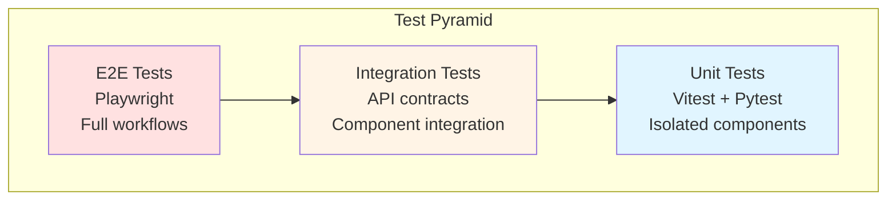

# Testing Strategy and Guidelines

Comprehensive testing strategy for the MR-KG fullstack application.

## Overview

- **Backend testing**: Python/pytest-based testing (covered in this doc)
- **Frontend testing**: Vue/Vitest/Playwright-based testing (see @docs/frontend/testing.md)
- **Integration testing**: Cross-component validation

## Test pyramid



Higher levels provide more confidence but are slower. The majority of tests should be unit tests.

## Backend Testing

### Test Structure

```
backend/tests/
├── unit/                    # Unit tests
│   ├── test_config.py       # Configuration testing
│   ├── test_models.py       # Pydantic model validation
│   └── test_utils.py        # Utility function testing
├── integration/             # Integration tests
│   ├── test_database_integration.py  # Database layer testing
│   ├── test_api_integration.py       # Full API integration
│   └── test_repositories.py          # Repository pattern testing
├── api/                     # API endpoint testing
│   ├── test_health.py       # Health check endpoints
│   ├── test_traits_api.py   # Traits API endpoints
│   ├── test_studies_api.py  # Studies API endpoints
│   └── test_similarities_api.py  # Similarities API endpoints
├── performance/             # Performance testing
│   ├── test_query_performance.py    # Database query timing
│   └── test_api_performance.py      # API response timing
└── conftest.py              # Shared test configuration
```

### Running Backend Tests

```bash
cd backend

# Run all tests
just test

# Run with coverage
just test-cov

# Run specific test categories
pytest tests/unit/ -v           # Unit tests only
pytest tests/integration/ -v    # Integration tests only
pytest tests/api/ -v            # API tests only

# Run specific test files
pytest tests/test_health.py -v
pytest tests/test_database_integration.py -v

# Run with markers
pytest -m "slow" -v            # Slow tests (integration/performance)
pytest -m "fast" -v            # Fast tests (unit tests)
pytest -m "database" -v        # Database-related tests
```

### Unit Testing

#### Configuration Testing

```python
# tests/unit/test_config.py
def test_config_defaults():
    """Test default configuration values."""
    settings = Settings()
    assert settings.DEBUG is True
    assert settings.PORT == 8000
    assert settings.DB_PROFILE == "local"

def test_config_environment_override():
    """Test environment variable overrides."""
    with patch.dict(os.environ, {"PORT": "9000", "DEBUG": "false"}):
        settings = Settings()
        assert settings.PORT == 9000
        assert settings.DEBUG is False
```

#### Model Validation Testing

```python
# tests/unit/test_models.py
def test_trait_embedding_validation():
    """Test TraitEmbedding model validation."""
    valid_data = {
        "trait_index": 1,
        "trait_label": "height",
        "embedding": [0.1, 0.2, 0.3]
    }
    trait = TraitEmbedding(**valid_data)
    assert trait.trait_index == 1
    assert trait.trait_label == "height"

def test_invalid_trait_embedding():
    """Test TraitEmbedding validation errors."""
    with pytest.raises(ValidationError):
        TraitEmbedding(trait_index="invalid", trait_label="height")
```

### Integration Testing

#### Database Integration

```python
# tests/integration/test_database_integration.py
@pytest.fixture
def database_config():
    """Provide test database configuration."""
    return DatabaseConfig(
        vector_store_path="test_data/vector_store.db",
        trait_profile_path="test_data/trait_profile_db.db",
        max_connections=5
    )

@pytest.mark.database
def test_connection_pool_creation(database_config):
    """Test database connection pool creation."""
    pool = DatabaseConnectionPool(database_config)
    assert pool.vector_store_pool is not None
    assert pool.trait_profile_pool is not None

@pytest.mark.database
async def test_vector_store_query(database_config):
    """Test basic vector store queries."""
    pool = DatabaseConnectionPool(database_config)
    async with pool.get_vector_store_connection() as conn:
        result = conn.execute("SELECT COUNT(*) FROM trait_embeddings").fetchone()
        assert result[0] >= 0
```

#### Repository Testing

```python
# tests/integration/test_repositories.py
@pytest.mark.database
async def test_trait_repository_search(trait_repository):
    """Test trait search functionality."""
    filters = TraitSearchFilters(
        search_term="height",
        min_appearance_count=5,
        limit=10
    )
    results = await trait_repository.search_traits(filters)
    assert len(results) <= 10
    assert all("height" in trait.trait_label.lower() for trait in results)
```

### API Testing

#### Health Check Testing

```python
# tests/api/test_health.py
def test_basic_health_check(client):
    """Test basic health endpoint."""
    response = client.get("/api/v1/health/")
    assert response.status_code == 200
    data = response.json()
    assert data["success"] is True
    assert "timestamp" in data

def test_detailed_health_check(client):
    """Test detailed health endpoint with database status."""
    response = client.get("/api/v1/health/detailed")
    assert response.status_code == 200
    data = response.json()
    assert "vector_store" in data["data"]
    assert "trait_profile" in data["data"]
```

#### Traits API Testing

```python
# tests/api/test_traits_api.py
def test_search_traits(client):
    """Test trait search endpoint."""
    response = client.get("/api/v1/traits/search?search_term=height&limit=5")
    assert response.status_code == 200
    data = response.json()
    assert "data" in data
    assert len(data["data"]["traits"]) <= 5

def test_get_trait_details(client):
    """Test trait details endpoint."""
    response = client.get("/api/v1/traits/1")
    assert response.status_code == 200
    data = response.json()
    assert data["data"]["trait_index"] == 1
```

#### Error Handling Testing

```python
# tests/api/test_error_handling.py
def test_not_found_error(client):
    """Test 404 error handling."""
    response = client.get("/api/v1/traits/999999")
    assert response.status_code == 404
    data = response.json()
    assert data["success"] is False
    assert "error" in data

def test_validation_error(client):
    """Test validation error handling."""
    response = client.get("/api/v1/traits/invalid")
    assert response.status_code == 422
    data = response.json()
    assert data["success"] is False
```

### Performance Testing

#### Query Performance

```python
# tests/performance/test_query_performance.py
@pytest.mark.slow
def test_trait_search_performance(database_service):
    """Test trait search query performance."""
    start_time = time.time()

    filters = TraitSearchFilters(search_term="test", limit=100)
    results = database_service.search_traits(filters)

    execution_time = time.time() - start_time
    assert execution_time < 1.0  # Should complete within 1 second
    assert len(results) <= 100

@pytest.mark.slow
def test_similarity_computation_performance(database_service):
    """Test similarity computation performance."""
    start_time = time.time()

    similarities = database_service.compute_trait_similarities(
        trait_index=1,
        threshold=0.7,
        limit=50
    )

    execution_time = time.time() - start_time
    assert execution_time < 2.0  # Should complete within 2 seconds
```

#### API Performance

```python
# tests/performance/test_api_performance.py
@pytest.mark.slow
def test_concurrent_api_requests(client):
    """Test API performance under concurrent load."""
    import concurrent.futures

    def make_request():
        return client.get("/api/v1/health/")

    with concurrent.futures.ThreadPoolExecutor(max_workers=10) as executor:
        futures = [executor.submit(make_request) for _ in range(50)]
        responses = [future.result() for future in futures]

    # All requests should succeed
    assert all(r.status_code == 200 for r in responses)

    # Average response time should be reasonable
    avg_time = sum(r.elapsed.total_seconds() for r in responses) / len(responses)
    assert avg_time < 0.5  # Average response time under 500ms
```

### Test Configuration

#### pytest Configuration

```python
# backend/conftest.py
import pytest
from fastapi.testclient import TestClient
from app.main import create_app
from app.core.database import DatabaseConnectionPool
from app.core.config import Settings

@pytest.fixture(scope="session")
def test_app():
    """Create test application instance."""
    settings = Settings(
        DEBUG=True,
        DB_PROFILE="test",
        VECTOR_STORE_PATH="test_data/vector_store.db",
        TRAIT_PROFILE_PATH="test_data/trait_profile_db.db"
    )
    return create_app(settings)

@pytest.fixture
def client(test_app):
    """Create test client."""
    return TestClient(test_app)

@pytest.fixture
def database_pool():
    """Create test database connection pool."""
    config = DatabaseConfig(
        vector_store_path="test_data/vector_store.db",
        trait_profile_path="test_data/trait_profile_db.db"
    )
    return DatabaseConnectionPool(config)

# Pytest markers
pytest.mark.slow = pytest.mark.slow
pytest.mark.database = pytest.mark.database
pytest.mark.integration = pytest.mark.integration
```

#### Test Data Setup

```python
# tests/fixtures/database_fixtures.py
@pytest.fixture(scope="session")
def test_database_setup():
    """Set up test databases with sample data."""
    # Create minimal test databases
    create_test_vector_store()
    create_test_trait_profile()
    yield
    # Cleanup after tests
    cleanup_test_databases()

def create_test_vector_store():
    """Create minimal vector store for testing."""
    conn = duckdb.connect("test_data/vector_store.db")

    # Create minimal schema
    conn.execute("""
        CREATE TABLE trait_embeddings (
            trait_index INTEGER PRIMARY KEY,
            trait_label TEXT,
            embedding FLOAT[]
        )
    """)

    # Insert test data
    conn.execute("""
        INSERT INTO trait_embeddings VALUES
        (1, 'height', [0.1, 0.2, 0.3]),
        (2, 'weight', [0.4, 0.5, 0.6]),
        (3, 'BMI', [0.7, 0.8, 0.9])
    """)

    conn.close()
```

## Frontend Testing

For detailed frontend testing documentation including unit tests, integration tests, E2E tests, and MSW setup, see @docs/frontend/testing.md.

### Quick Overview

Frontend testing uses:
- Vitest + MSW for unit tests (isolated components)
- Integration tests with Zod schema validation
- Playwright for E2E tests (full workflows)

See @docs/frontend/testing.md for complete frontend testing guide.

## Integration Testing

### Full Stack Integration

```python
# tests/integration/test_fullstack_integration.py
@pytest.mark.integration
def test_trait_search_workflow(client, database_setup):
    """Test complete trait search workflow."""
    # Search for traits
    response = client.get("/api/v1/traits/search?search_term=height")
    assert response.status_code == 200

    traits = response.json()["data"]["traits"]
    assert len(traits) > 0

    # Get details for first trait
    trait_index = traits[0]["trait_index"]
    response = client.get(f"/api/v1/traits/{trait_index}")
    assert response.status_code == 200

    trait_details = response.json()["data"]
    assert trait_details["trait_index"] == trait_index

    # Find similar traits
    response = client.get(f"/api/v1/similarities/traits/{trait_index}")
    assert response.status_code == 200

    similarities = response.json()["data"]["similar_traits"]
    assert isinstance(similarities, list)
```

### API Contract Testing

```python
# tests/integration/test_api_contracts.py
def test_api_response_schemas(client):
    """Test API responses match expected schemas."""

    # Test traits search response schema
    response = client.get("/api/v1/traits/search")
    data = response.json()

    # Validate response structure
    assert "success" in data
    assert "data" in data
    assert "traits" in data["data"]
    assert "pagination" in data["data"]

    # Validate trait schema
    if data["data"]["traits"]:
        trait = data["data"]["traits"][0]
        assert "trait_index" in trait
        assert "trait_label" in trait
        assert "appearance_count" in trait
```

## Performance Testing

### Load Testing

```python
# tests/performance/test_load_testing.py
import asyncio
import aiohttp
import time

@pytest.mark.slow
async def test_api_load_performance():
    """Test API performance under load."""

    async def make_request(session, url):
        start_time = time.time()
        async with session.get(url) as response:
            await response.json()
            return time.time() - start_time

    async with aiohttp.ClientSession() as session:
        # Simulate 100 concurrent requests
        tasks = [
            make_request(session, "http://localhost:8000/api/v1/health/")
            for _ in range(100)
        ]

        response_times = await asyncio.gather(*tasks)

    # Performance assertions
    avg_response_time = sum(response_times) / len(response_times)
    assert avg_response_time < 0.5  # Average under 500ms

    max_response_time = max(response_times)
    assert max_response_time < 2.0  # Max under 2 seconds
```

### Database Performance Testing

```python
# tests/performance/test_database_performance.py
@pytest.mark.slow
def test_large_dataset_query_performance(database_service):
    """Test query performance with large datasets."""

    # Test trait search with large result set
    start_time = time.time()
    results = database_service.search_traits(
        TraitSearchFilters(limit=1000)
    )
    search_time = time.time() - start_time

    assert search_time < 5.0  # Should complete within 5 seconds
    assert len(results) <= 1000

    # Test similarity computation
    start_time = time.time()
    similarities = database_service.compute_trait_similarities(
        trait_index=1,
        threshold=0.5,
        limit=100
    )
    similarity_time = time.time() - start_time

    assert similarity_time < 3.0  # Should complete within 3 seconds
```

## Test Data Management

### Test Database Creation

```bash
# scripts/create_test_data.py
"""Create minimal test databases for testing."""

import duckdb
import numpy as np

def create_test_vector_store():
    """Create test vector store database."""
    conn = duckdb.connect("test_data/vector_store.db")

    # Create schema
    conn.execute(open("sql/vector_store_schema.sql").read())

    # Insert sample data
    traits = [
        (1, "height", np.random.rand(300).tolist()),
        (2, "weight", np.random.rand(300).tolist()),
        (3, "BMI", np.random.rand(300).tolist()),
    ]

    conn.executemany(
        "INSERT INTO trait_embeddings VALUES (?, ?, ?)",
        traits
    )

    conn.close()

if __name__ == "__main__":
    create_test_vector_store()
    create_test_trait_profile()
```

### Test Data Fixtures

```python
# tests/fixtures/data_fixtures.py
@pytest.fixture
def sample_traits():
    """Provide sample trait data for testing."""
    return [
        TraitEmbedding(
            trait_index=1,
            trait_label="height",
            embedding=[0.1, 0.2, 0.3],
            appearance_count=100
        ),
        TraitEmbedding(
            trait_index=2,
            trait_label="weight",
            embedding=[0.4, 0.5, 0.6],
            appearance_count=150
        )
    ]

@pytest.fixture
def sample_studies():
    """Provide sample study data for testing."""
    return [
        StudyMetadata(
            pmid="12345678",
            title="Test Study 1",
            authors=["Author A", "Author B"],
            year=2023,
            journal="Test Journal"
        )
    ]
```

## Continuous Integration

### GitHub Actions Testing

```yaml
# .github/workflows/test.yml
name: Test Suite

on:
  push:
    branches: [main, develop]
  pull_request:
    branches: [main]

jobs:
  backend-tests:
    runs-on: ubuntu-latest

    steps:
    - uses: actions/checkout@v4

    - name: Set up Python
      uses: actions/setup-python@v4
      with:
        python-version: '3.12'

    - name: Install uv
      run: curl -LsSf https://astral.sh/uv/install.sh | sh

    - name: Install dependencies
      run: |
        cd backend
        uv sync

    - name: Run tests
      run: |
        cd backend
        uv run pytest --cov=app --cov-report=xml

    - name: Upload coverage
      uses: codecov/codecov-action@v3
      with:
        file: ./backend/coverage.xml

  frontend-tests:
    runs-on: ubuntu-latest

    steps:
    - uses: actions/checkout@v4

    - name: Set up Node.js
      uses: actions/setup-node@v4
      with:
        node-version: '18'
        cache: 'npm'
        cache-dependency-path: frontend/package-lock.json

    - name: Install dependencies
      run: |
        cd frontend
        npm ci

    - name: Run tests
      run: |
        cd frontend
        npm run test:coverage

    - name: Upload coverage
      uses: codecov/codecov-action@v3
      with:
        file: ./frontend/coverage/lcov.info

  integration-tests:
    runs-on: ubuntu-latest

    steps:
    - uses: actions/checkout@v4

    - name: Create test databases
      run: |
        mkdir -p test_data
        python scripts/create_test_data.py

    - name: Run integration tests
      run: |
        docker-compose -f docker-compose.test.yml up --abort-on-container-exit
```

