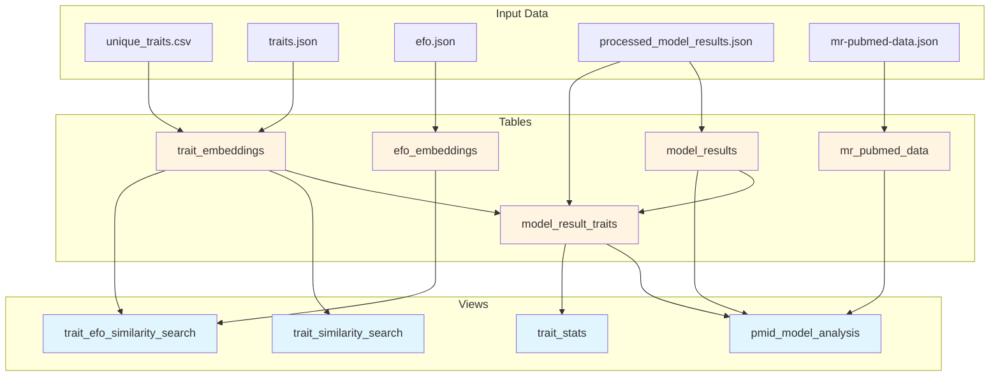
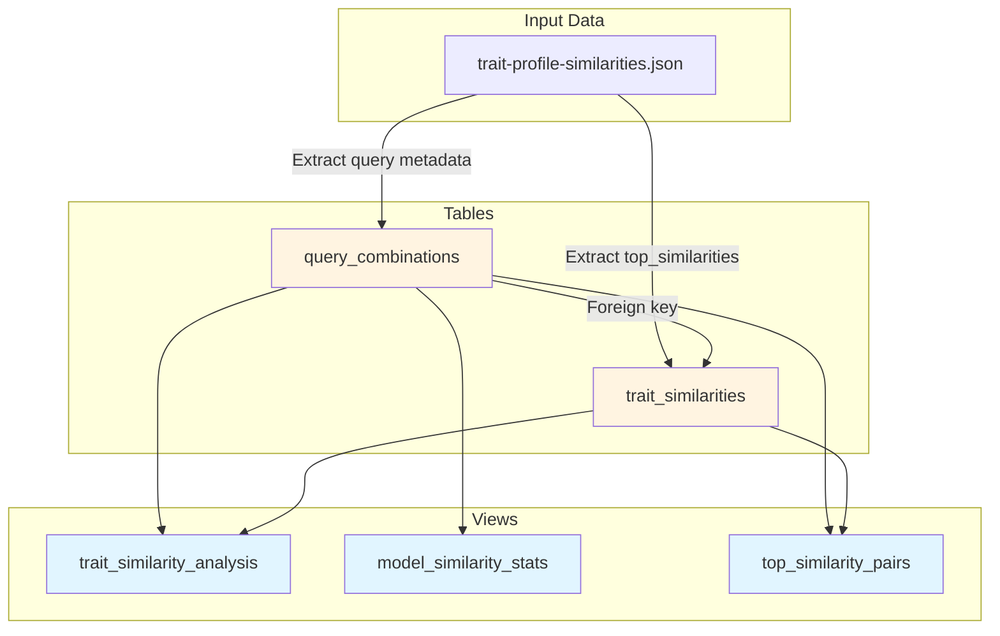
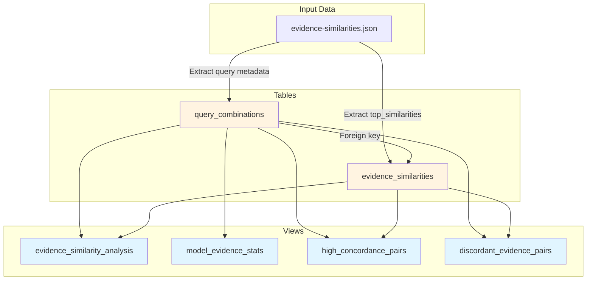

# Vector stores and database architecture

See processing/README.md for complete pipeline overview and workflow.

## Overview

MR-KG uses DuckDB databases to store vectorized trait data, EFO ontology
embeddings, and model results. The databases support semantic similarity
search and trait profile analysis for Mendelian randomization studies.

## Database types

### Vector store database

**Location**: `data/db/vector_store.db`

**Purpose**: Primary database containing trait embeddings, EFO term
embeddings, model extraction results, and optimized views for similarity
search.

**Key capabilities**:

- Semantic search across traits using 200-dimensional embeddings
- EFO term mapping and similarity lookup
- Model result querying by PMID and extraction model
- Cosine similarity computation using DuckDB's built-in functions

**Schema reference**: See docs/processing/db-schema.md for complete
table definitions, indexes, and views.

#### Tables

**trait_embeddings**

Trait embeddings indexed by unique_traits.csv indices.

Generated by: `create_trait_embeddings_table()` in
@processing/scripts/main-db/build-main-database.py:202

Purpose: Stores 200-dimensional SciSpacy embeddings for trait labels.
Only traits with both unique_traits entry and valid embedding vector are
included.

Key columns:

- `trait_index` (INTEGER, PRIMARY KEY): Canonical trait identifier from
  unique_traits.csv
- `trait_label` (VARCHAR): Human-readable trait name for display and search
- `vector` (FLOAT[200]): 200-dimensional embedding for similarity
  calculations

**efo_embeddings**

EFO (Experimental Factor Ontology) term embeddings.

Generated by: `create_efo_embeddings_table()` in
@processing/scripts/main-db/build-main-database.py:247

Purpose: Stores embeddings for EFO ontology terms to enable trait-to-EFO
semantic mapping and standardization.

Key columns:

- `id` (VARCHAR, PRIMARY KEY): EFO ontology identifier (e.g., "EFO_0004340")
- `label` (VARCHAR): Human-readable EFO term label
- `vector` (FLOAT[200]): 200-dimensional embedding for similarity with traits

**model_results**

Extracted structural data from model results organized by PMID.

Generated by: `create_model_results_tables()` in
@processing/scripts/main-db/build-main-database.py:294

Purpose: Stores complete LLM extraction outputs with metadata containing
exposure/outcome trait references.

Key columns:

- `id` (INTEGER, PRIMARY KEY): Auto-incrementing result identifier
- `model` (VARCHAR): LLM model name (e.g., "gpt-4-1", "deepseek-r1")
- `pmid` (VARCHAR): PubMed ID linking to source publication
- `metadata` (JSON): Structured metadata with exposures and outcomes lists
- `results` (JSON): Complete raw model output and extracted results

**model_result_traits**

Links model results to traits based on unique_traits indices.

Generated by: `create_model_results_tables()` in
@processing/scripts/main-db/build-main-database.py:294

Purpose: Validates and links model trait references to canonical trait
embeddings. Combines exposure and outcome traits without role distinction.

Key columns:

- `id` (INTEGER, PRIMARY KEY): Auto-incrementing link identifier
- `model_result_id` (INTEGER, FOREIGN KEY): References model_results.id
- `trait_index` (INTEGER, FOREIGN KEY): References
  trait_embeddings.trait_index
- `trait_label` (VARCHAR): Denormalized label for query performance
- `trait_id_in_result` (VARCHAR): Original trait ID from model output

**mr_pubmed_data**

Raw PubMed metadata for papers with MR analysis.

Generated by: `create_mr_pubmed_data_table()` in
@processing/scripts/main-db/build-main-database.py:485

Purpose: Stores PubMed metadata for research papers analyzed by LLMs,
enabling joins with model results.

Key columns:

- `pmid` (VARCHAR, PRIMARY KEY): PubMed identifier
- `title` (VARCHAR): Paper title
- `abstract` (VARCHAR): Complete abstract text
- `pub_date` (VARCHAR): Publication date
- `journal` (VARCHAR): Journal name
- `journal_issn` (VARCHAR): Journal ISSN
- `author_affil` (VARCHAR): Author affiliation information

#### Views

**trait_similarity_search**

Pre-computed similarity matrix for all trait-to-trait comparisons.

Generated by: `create_similarity_functions()` in
@processing/scripts/main-db/build-main-database.py:523

Purpose: Enables fast semantic similarity lookup between traits using
cosine similarity on 200-dimensional embeddings. Excludes self-comparisons.

Key columns:

- `query_id` (INTEGER): Query trait index
- `query_label` (VARCHAR): Query trait label
- `result_id` (INTEGER): Result trait index
- `result_label` (VARCHAR): Result trait label
- `similarity` (FLOAT): Cosine similarity score (0.0 to 1.0)

**trait_efo_similarity_search**

Cross-reference matrix between traits and EFO ontology terms.

Generated by: `create_similarity_functions()` in
@processing/scripts/main-db/build-main-database.py:537

Purpose: Maps traits to relevant EFO terms for ontology alignment and
automatic trait categorization.

Key columns:

- `trait_index` (INTEGER): Trait index from trait_embeddings
- `trait_label` (VARCHAR): Trait label
- `efo_id` (VARCHAR): EFO term identifier
- `efo_label` (VARCHAR): EFO term label
- `similarity` (FLOAT): Cosine similarity score (0.0 to 1.0)

**pmid_model_analysis**

Comprehensive view combining PubMed metadata, model results, and extracted
traits.

Generated by: `create_similarity_functions()` in
@processing/scripts/main-db/build-main-database.py:551

Purpose: Provides unified access to paper metadata, model outputs, and
associated traits. Each row is unique per PMID-model combination with
traits aggregated into nested structure.

Key columns:

- `pmid` (VARCHAR): PubMed ID
- `model` (VARCHAR): Model name
- `model_result_id` (INTEGER): Result identifier
- `metadata` (JSON): Model metadata
- `results` (JSON): Model results
- `title`, `abstract`, `pub_date`, `journal`, `journal_issn`, `author_affil`
  (VARCHAR): PubMed fields
- `traits` (JSON): Aggregated list of trait structs with trait_index,
  trait_label, trait_id_in_result

**trait_stats**

Trait appearance statistics across model results.

Generated by: `create_similarity_functions()` in
@processing/scripts/main-db/build-main-database.py:584

Purpose: Provides frequency counts for how often each trait appears across
all model results.

Key columns:

- `trait_index` (INTEGER): Trait identifier
- `trait_label` (VARCHAR): Trait label
- `appearance_count` (INTEGER): Number of model results containing this trait

#### Generation flow



Legend: Yellow = Tables, Blue = Views

### Trait profile database

**Location**: `data/db/trait_profile_db.db`

**Purpose**: Stores precomputed trait-to-trait similarity scores and
study similarity profiles for network analysis.

**Key capabilities**:

- Fast lookup of similar studies based on trait profiles
- Model-specific similarity comparisons
- Both semantic and Jaccard similarity metrics
- Support for study network construction

**Concepts**: See docs/processing/trait-profile-similarity.md for details on
trait profile similarity methodology.

**Schema reference**: See docs/processing/db-schema.md for complete
table definitions, indexes, and views.

#### Tables

**query_combinations**

PMID-model combinations with trait profile metadata.

Generated by: `create_query_combinations_table()` in
@processing/scripts/trait-profile/build-trait-profile-database.py:60

Purpose: Stores canonical reference for all analyzed PMID-model
combinations with their trait profile characteristics.

Key columns:

- `id` (INTEGER, PRIMARY KEY): Auto-incrementing combination identifier
- `pmid` (VARCHAR): PubMed ID of analyzed paper
- `model` (VARCHAR): LLM model name that analyzed this paper
- `title` (VARCHAR): Paper title from PubMed
- `trait_count` (INTEGER): Number of traits identified by model

Constraints:

- UNIQUE(pmid, model): Ensures one entry per PMID-model pair

**trait_similarities**

Similarity relationships between PMID-model combinations within same model.

Generated by: `create_trait_similarities_table()` in
@processing/scripts/trait-profile/build-trait-profile-database.py:94

Purpose: Stores top-10 most similar combinations for each query using
dual similarity metrics (semantic and Jaccard).

Key columns:

- `id` (INTEGER, PRIMARY KEY): Auto-incrementing relationship identifier
- `query_combination_id` (INTEGER, FOREIGN KEY): References
  query_combinations.id
- `similar_pmid` (VARCHAR): PubMed ID of similar paper
- `similar_model` (VARCHAR): Model name (matches query model)
- `similar_title` (VARCHAR): Title of similar paper
- `trait_profile_similarity` (DOUBLE): Semantic similarity score (0.0-1.0)
- `trait_jaccard_similarity` (DOUBLE): Jaccard similarity score (0.0-1.0)
- `query_trait_count` (INTEGER): Trait count in query combination
- `similar_trait_count` (INTEGER): Trait count in similar combination

Notes:

- Each query has maximum 10 similarity entries (top-k filtering)
- All comparisons are intra-model (same model only)

#### Views

**trait_similarity_analysis**

Comprehensive similarity analysis with ranking.

Generated by: `create_views()` in
@processing/scripts/trait-profile/build-trait-profile-database.py:265

Purpose: Combines query and similarity data with window function ranking
for easy top-N retrieval.

Key columns:

- `query_pmid`, `query_model`, `query_title`, `query_trait_count`:
  Query combination metadata
- `similar_pmid`, `similar_model`, `similar_title`, `similar_trait_count`:
  Similar combination metadata
- `trait_profile_similarity` (DOUBLE): Semantic similarity score
- `trait_jaccard_similarity` (DOUBLE): Jaccard similarity score
- `similarity_rank` (INTEGER): Rank within query combination by semantic
  similarity

**model_similarity_stats**

Statistical summary per model.

Generated by: `create_views()` in
@processing/scripts/trait-profile/build-trait-profile-database.py:295

Purpose: Aggregates statistics about each model's trait extraction
patterns and data distribution.

Key columns:

- `model` (VARCHAR): Model name
- `total_combinations` (INTEGER): Count of PMID-model combinations
- `avg_trait_count` (DOUBLE): Average traits per combination
- `min_trait_count` (INTEGER): Minimum traits in any combination
- `max_trait_count` (INTEGER): Maximum traits in any combination
- `total_similarity_pairs` (INTEGER): Total similarity relationships
  (combinations × 10)

**top_similarity_pairs**

High-quality similarity pairs (≥0.8 threshold).

Generated by: `create_views()` in
@processing/scripts/trait-profile/build-trait-profile-database.py:315

Purpose: Filters for strong trait profile relationships useful for
finding related papers and validating similarity quality.

Key columns:

- `model` (VARCHAR): Model name
- `query_pmid`, `similar_pmid` (VARCHAR): Paper identifiers
- `query_title`, `similar_title` (VARCHAR): Paper titles
- `trait_profile_similarity` (DOUBLE): Semantic similarity (≥0.8)
- `trait_jaccard_similarity` (DOUBLE): Jaccard similarity
- `query_trait_count`, `similar_trait_count` (INTEGER): Trait counts

Filter: Only includes pairs with trait_profile_similarity ≥ 0.8

#### Generation flow



Legend: Yellow = Tables, Blue = Views

### Evidence profile database

**Location**: `data/db/evidence_profile_db.db`

**Purpose**: Stores precomputed evidence-based similarity scores comparing
quantitative causal evidence patterns across MR studies.

**Key capabilities**:

- Fast lookup of similar studies based on evidence profiles
- Model-specific evidence similarity comparisons
- Multiple similarity metrics (effect size, direction, statistical consistency)
- Within-type and cross-type effect comparisons
- Quality-weighted composite scores
- Support for temporal and data quality analysis

**Concepts**: See docs/processing/evidence-profile-similarity.md for details on
evidence profile similarity methodology and metrics.

**Schema reference**: See docs/processing/db-schema.md for complete
table definitions, indexes, and views.

#### Tables

**query_combinations**

PMID-model combinations with evidence profile metadata.

Generated by: `create_query_combinations_table()` in
@processing/scripts/evidence-profile/build-evidence-profile-database.py:116

Purpose: Stores canonical reference for all analyzed PMID-model
combinations with their evidence profile characteristics and data quality
metrics.

Key columns:

- `id` (INTEGER, PRIMARY KEY): Auto-incrementing combination identifier
- `pmid` (VARCHAR): PubMed ID of analyzed paper
- `model` (VARCHAR): LLM model name that analyzed this paper
- `title` (VARCHAR): Paper title from PubMed
- `result_count` (INTEGER): Total number of exposure-outcome results
- `complete_result_count` (INTEGER): Number of results with complete
  effect size data
- `data_completeness` (DOUBLE): Proportion of complete results (0.0-1.0)
- `publication_year` (INTEGER): Year of publication for temporal analysis

Constraints:

- UNIQUE(pmid, model): Ensures one entry per PMID-model pair

**evidence_similarities**

Similarity relationships between PMID-model combinations within same model.

Generated by: `create_evidence_similarities_table()` in
@processing/scripts/evidence-profile/build-evidence-profile-database.py:160

Purpose: Stores top-10 most similar combinations for each query using
six evidence similarity metrics with quality weighting.

Key columns:

- `id` (INTEGER, PRIMARY KEY): Auto-incrementing relationship identifier
- `query_combination_id` (INTEGER, FOREIGN KEY): References
  query_combinations.id
- `similar_pmid` (VARCHAR): PubMed ID of similar paper
- `similar_model` (VARCHAR): Model name (matches query model)
- `similar_title` (VARCHAR): Title of similar paper
- `matched_pairs` (INTEGER): Number of matched exposure-outcome pairs
- `effect_size_similarity` (DOUBLE): Pearson correlation of harmonized
  effect sizes (-1.0 to 1.0, nullable)
- `effect_size_within_type` (DOUBLE): Correlation for same-type pairs
  (beta-beta, OR-OR, HR-HR)
- `effect_size_cross_type` (DOUBLE): Correlation for different-type pairs
- `n_within_type_pairs` (INTEGER): Count of same-type matched pairs
- `n_cross_type_pairs` (INTEGER): Count of different-type matched pairs
- `direction_concordance` (DOUBLE): Proportion of concordant effect
  directions (-1.0 to 1.0)
- `statistical_consistency` (DOUBLE): Cohen's kappa for significance
  patterns (-1.0 to 1.0, nullable)
- `evidence_overlap` (DOUBLE): Jaccard similarity of significant findings
  (0.0 to 1.0)
- `null_concordance` (DOUBLE): Proportion of shared null findings (0.0 to 1.0)
- `composite_similarity_equal` (DOUBLE): Equal-weighted composite score
  with quality adjustment (0.0 to 1.0, nullable)
- `composite_similarity_direction` (DOUBLE): Direction-prioritized composite
  score with quality adjustment (0.0 to 1.0, nullable)
- `query_completeness` (DOUBLE): Data completeness of query study
- `similar_completeness` (DOUBLE): Data completeness of similar study
- `similar_publication_year` (INTEGER): Publication year of similar paper

Notes:

- Each query has maximum 10 similarity entries (top-k filtering)
- All comparisons are intra-model (same model only)
- Composite scores quality-weighted by min(query_completeness,
  similar_completeness)
- Pairs excluded if insufficient non-null metrics (<2)

#### Views

**evidence_similarity_analysis**

Comprehensive similarity analysis with ranking.

Generated by: `create_views()` in
@processing/scripts/evidence-profile/build-evidence-profile-database.py

Purpose: Combines query and similarity data with window function ranking
for easy top-N retrieval and filtering.

Key columns:

- `query_pmid`, `query_model`, `query_title`, `query_result_count`,
  `query_completeness`: Query combination metadata
- `similar_pmid`, `similar_model`, `similar_title`, `similar_result_count`:
  Similar combination metadata
- `matched_pairs`: Number of matched exposure-outcome pairs
- All similarity metrics (effect_size_similarity, direction_concordance,
  statistical_consistency, evidence_overlap, null_concordance)
- `composite_similarity_equal`, `composite_similarity_direction`:
  Composite scores
- `similarity_rank`: Rank within query combination by direction-prioritized
  composite score

**model_evidence_stats**

Statistical summary per model.

Generated by: `create_views()` in
@processing/scripts/evidence-profile/build-evidence-profile-database.py

Purpose: Provides aggregate statistics for quality assessment and
model comparison.

Key columns:

- `model`: Model name
- `total_combinations`: Count of PMID-model combinations
- `avg_result_count`: Average number of results per combination
- `avg_completeness`: Average data completeness
- `min_result_count`, `max_result_count`: Result count range

**high_concordance_pairs**

Studies with high directional agreement.

Generated by: `create_views()` in
@processing/scripts/evidence-profile/build-evidence-profile-database.py

Purpose: Filters to study pairs with strong directional concordance
(>= 0.8) for finding consistent evidence patterns.

Key columns:

- Study identifiers (query_pmid, similar_pmid)
- Study titles
- `direction_concordance`: Directional agreement score (>= 0.8)
- `effect_size_similarity`, `evidence_overlap`: Supporting metrics
- `matched_pairs`: Number of shared exposure-outcome pairs

**discordant_evidence_pairs**

Studies with contradictory evidence (opposite directions).

Generated by: `create_views()` in
@processing/scripts/evidence-profile/build-evidence-profile-database.py

Purpose: Identifies study pairs with negative direction concordance
for investigating contradictory findings.

Key columns:

- Study identifiers and titles
- `direction_concordance`: Negative values indicate opposing directions
- `matched_pairs`, `evidence_overlap`: Relationship strength metrics

#### Generation flow



Legend: Yellow = Tables, Blue = Views

## Embedding model

**Model**: SciSpaCy `en_core_sci_lg` (v0.5.4)
**Dimensions**: 200
**Use cases**:

- Trait label vectorization
- EFO term vectorization
- Semantic similarity computation

The embedding model provides domain-specific scientific language
representations optimized for biomedical text.

## Database operations

### Building databases

```bash
just build-main-db
just build-trait-profile-db
just build-evidence-profile-db
```

See processing/README.md for complete build workflow and prerequisites.

### Querying databases

Example using `query-database.py`:

```bash
cd processing

uv run python scripts/main-db/query-database.py \
    --database ../data/db/vector_store.db \
    --query-trait "coffee intake" \
    --limit 10
```

### Validation

Validate database schema:

```bash
uv run python scripts/main-db/validate-database.py \
    --database ../data/db/vector_store.db
```

### Schema documentation

Generate updated schema documentation:

```bash
just generate-schema-docs
```

## Data sources

See docs/DATA.md for complete data structure documentation.
