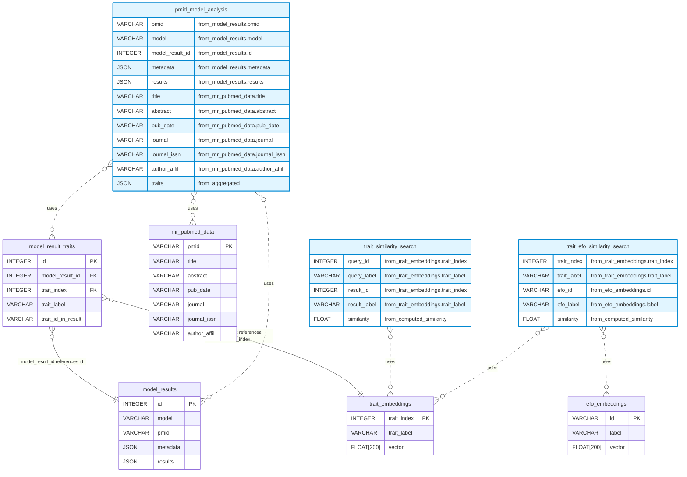
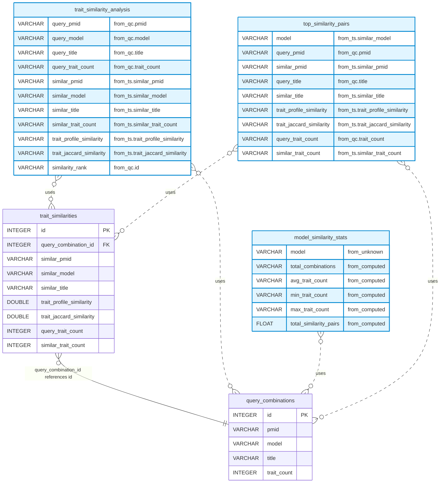
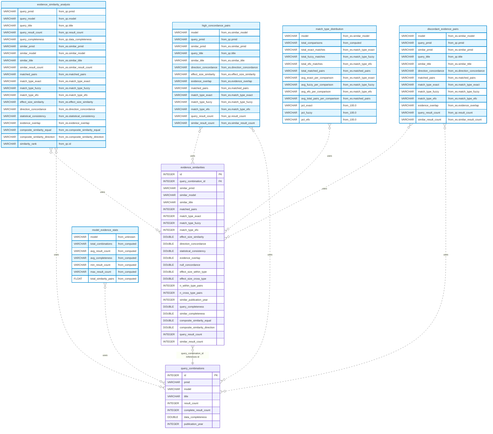

# Database schema

Auto-generated documentation from schema definitions and live database statistics.

This document covers three databases:
- **Vector store database** (`vector_store.db`): MR-KG embeddings and analysis
- **Trait profile database** (`trait_profile_db.db`): Trait similarity profiles
- **Evidence profile database** (`evidence_profile_db.db`): Evidence similarity profiles

## Database statistics

Live statistics from the actual database files.

### Vector store database

**DuckDB Version:** v1.3.2

| Table/View | Row Count |
|------------|-----------|
| `efo_embeddings` | 67,270 |
| `model_result_traits` | 283,537 |
| `model_results` | 50,402 |
| `mr_pubmed_data` | 15,635 |
| `pmid_model_analysis` | 50,402 |
| `trait_efo_similarity_search` | 5,053,389,670 |
| `trait_embeddings` | 75,121 |
| `trait_similarity_search` | 5,643,089,520 |
| `trait_stats` | 75,121 |

### Trait profile database

**DuckDB Version:** v1.3.2

| Table/View | Row Count |
|------------|-----------|
| `model_similarity_stats` | 6 |
| `query_combinations` | 50,402 |
| `top_similarity_pairs` | 154,115 |
| `trait_similarities` | 504,020 |
| `trait_similarity_analysis` | 504,020 |

### Evidence profile database

**DuckDB Version:** v1.3.2

| Table/View | Row Count |
|------------|-----------|
| `discordant_evidence_pairs` | 1,670 |
| `evidence_similarities` | 6,388 |
| `evidence_similarity_analysis` | 6,388 |
| `high_concordance_pairs` | 4,438 |
| `model_evidence_stats` | 6 |
| `query_combinations` | 6,132 |


## Vector store database

### Overview



### Quick reference

| Table | Description | Key Columns |
|-------|-------------|-------------|
| `trait_embeddings` | Trait embeddings indexed by unique_traits | trait_index |
| `efo_embeddings` | EFO (Experimental Factor Ontology) term embeddings | id |
| `model_results` | Extracted structural data from model results organized by PMID | id |
| `model_result_traits` | Links model results to traits based on unique_traits indices | id |
| `mr_pubmed_data` | Raw PubMed metadata for papers with MR analysis | pmid |


### Tables

#### trait_embeddings

Trait embeddings indexed by unique_traits.csv indices

**Columns:**

- **`trait_index`** (INTEGER, NOT NULL) (PRIMARY KEY)

- **`trait_label`** (VARCHAR, NOT NULL)

- **`vector`** (FLOAT[200], NOT NULL)

#### efo_embeddings

EFO (Experimental Factor Ontology) term embeddings

**Columns:**

- **`id`** (VARCHAR, NOT NULL) (PRIMARY KEY)

- **`label`** (VARCHAR, NOT NULL)

- **`vector`** (FLOAT[200], NOT NULL)

#### model_results

Extracted structural data from model results organized by PMID

**Columns:**

- **`id`** (INTEGER, NOT NULL) (PRIMARY KEY)

- **`model`** (VARCHAR, NOT NULL)

- **`pmid`** (VARCHAR, NOT NULL)

- **`metadata`** (JSON, NOT NULL)

- **`results`** (JSON, NOT NULL)

#### model_result_traits

Links model results to traits based on unique_traits indices

**Columns:**

- **`id`** (INTEGER, NOT NULL) (PRIMARY KEY)

- **`model_result_id`** (INTEGER, NOT NULL)

- **`trait_index`** (INTEGER, NOT NULL)

- **`trait_label`** (VARCHAR, NOT NULL)

- **`trait_id_in_result`** (VARCHAR, nullable)

**Foreign Keys:**

- `model_result_id` -> `model_results.id`
- `trait_index` -> `trait_embeddings.trait_index`

#### mr_pubmed_data

Raw PubMed metadata for papers with MR analysis

**Columns:**

- **`pmid`** (VARCHAR, NOT NULL) (PRIMARY KEY)

- **`title`** (VARCHAR, NOT NULL)

- **`abstract`** (VARCHAR, NOT NULL)

- **`pub_date`** (VARCHAR, NOT NULL)

- **`journal`** (VARCHAR, NOT NULL)

- **`journal_issn`** (VARCHAR, nullable)

- **`author_affil`** (VARCHAR, nullable)

### Indexes

Performance optimization indexes:

#### efo_embeddings

- **`idx_efo_embeddings_label`** on (label)

#### model_result_traits

- **`idx_model_result_traits_trait_index`** on (trait_index)

- **`idx_model_result_traits_model_result_id`** on (model_result_id)

- **`idx_model_result_traits_trait_label`** on (trait_label)

#### model_results

- **`idx_model_results_model`** on (model)

- **`idx_model_results_pmid`** on (pmid)

#### mr_pubmed_data

- **`idx_mr_pubmed_data_pmid`** on (pmid)

- **`idx_mr_pubmed_data_journal`** on (journal)

- **`idx_mr_pubmed_data_pub_date`** on (pub_date)

#### trait_embeddings

- **`idx_trait_embeddings_label`** on (trait_label)

- **`idx_trait_embeddings_index`** on (trait_index)

### Views

Pre-computed views for common queries:

#### trait_similarity_search

Pre-computed similarity matrix for all trait-to-trait comparisons. Uses cosine similarity on 200-dimensional embeddings to find semantically related traits. Excludes self-comparisons. Useful for discovering related traits and clustering analysis.

**SQL Definition:**

```sql
SELECT
            t1.trait_index as query_id,
            t1.trait_label as query_label,
            t2.trait_index as result_id,
            t2.trait_label as result_label,
            array_cosine_similarity(t1.vector, t2.vector) as similarity
        FROM trait_embeddings t1
        CROSS JOIN trait_embeddings t2
        WHERE t1.trait_index != t2.trait_index
```

#### trait_efo_similarity_search

Cross-reference matrix between traits and EFO ontology terms. Uses cosine similarity to map traits to relevant EFO terms for ontology alignment. Enables automatic trait categorization and standardization against biomedical ontologies. Results can be filtered by similarity threshold to find best EFO matches.

**SQL Definition:**

```sql
SELECT
            t.trait_index as trait_index,
            t.trait_label as trait_label,
            e.id as efo_id,
            e.label as efo_label,
            array_cosine_similarity(t.vector, e.vector) as similarity
        FROM trait_embeddings t
        CROSS JOIN efo_embeddings e
```

#### pmid_model_analysis

Comprehensive view combining PubMed metadata, model results, and extracted traits. Each row is unique per PMID-model combination with traits aggregated into a nested structure. Includes original PubMed data, model metadata/results, and all associated traits. Useful for detailed paper analysis and cross-referencing model outputs with source data.

**SQL Definition:**

```sql
SELECT
            mr.pmid,
            mr.model,
            mr.id as model_result_id,
            mr.metadata,
            mr.results,
            mpd.title,
            mpd.abstract,
            mpd.pub_date,
            mpd.journal,
            mpd.journal_issn,
            mpd.author_affil,
            COALESCE(
                LIST(
                    STRUCT_PACK(
                        trait_index := mrt.trait_index,
                        trait_label := mrt.trait_label,
                        trait_id_in_result := mrt.trait_id_in_result
                    )
                ) FILTER (WHERE mrt.trait_index IS NOT NULL),
                []
            ) as traits
        FROM model_results mr
        LEFT JOIN mr_pubmed_data mpd ON mr.pmid = mpd.pmid
        LEFT JOIN model_result_traits mrt ON mr.id = mrt.model_result_id
        GROUP BY 
            mr.pmid, mr.model, mr.id, mr.metadata, mr.results,
            mpd.title, mpd.abstract, mpd.pub_date, mpd.journal, 
            mpd.journal_issn, mpd.author_affil
```


## Trait profile database

### Overview



### Quick reference

| Table | Description | Key Columns |
|-------|-------------|-------------|
| `query_combinations` | PMID-model combinations with trait profile metadata | id |
| `trait_similarities` | Similarity relationships between PMID-model combinations within same model | id |


### Tables

#### query_combinations

PMID-model combinations with trait profile metadata

**Columns:**

- **`id`** (INTEGER, NOT NULL) (PRIMARY KEY)

- **`pmid`** (VARCHAR, NOT NULL)

- **`model`** (VARCHAR, NOT NULL)

- **`title`** (VARCHAR, NOT NULL)

- **`trait_count`** (INTEGER, NOT NULL)

#### trait_similarities

Similarity relationships between PMID-model combinations within same model

**Columns:**

- **`id`** (INTEGER, NOT NULL) (PRIMARY KEY)

- **`query_combination_id`** (INTEGER, NOT NULL)

- **`similar_pmid`** (VARCHAR, NOT NULL)

- **`similar_model`** (VARCHAR, NOT NULL)

- **`similar_title`** (VARCHAR, NOT NULL)

- **`trait_profile_similarity`** (DOUBLE, NOT NULL)

- **`trait_jaccard_similarity`** (DOUBLE, NOT NULL)

- **`query_trait_count`** (INTEGER, NOT NULL)

- **`similar_trait_count`** (INTEGER, NOT NULL)

**Foreign Keys:**

- `query_combination_id` -> `query_combinations.id`

### Indexes

Performance optimization indexes:

#### query_combinations

- **`idx_query_combinations_pmid`** on (pmid)

- **`idx_query_combinations_model`** on (model)

- **`idx_query_combinations_pmid_model`** on (pmid, model)

#### trait_similarities

- **`idx_trait_similarities_query_id`** on (query_combination_id)

- **`idx_trait_similarities_similar_pmid`** on (similar_pmid)

- **`idx_trait_similarities_similar_model`** on (similar_model)

- **`idx_trait_similarities_trait_profile_sim`** on (trait_profile_similarity)

- **`idx_trait_similarities_jaccard_sim`** on (trait_jaccard_similarity)

### Views

Pre-computed views for common queries:

#### trait_similarity_analysis

**SQL Definition:**

```sql
SELECT
            qc.pmid as query_pmid,
            qc.model as query_model,
            qc.title as query_title,
            qc.trait_count as query_trait_count,
            ts.similar_pmid,
            ts.similar_model,
            ts.similar_title,
            ts.similar_trait_count,
            ts.trait_profile_similarity,
            ts.trait_jaccard_similarity,
            RANK() OVER (
                PARTITION BY qc.id 
                ORDER BY ts.trait_profile_similarity DESC
            ) as similarity_rank
        FROM query_combinations qc
        JOIN trait_similarities ts ON qc.id = ts.query_combination_id
        ORDER BY qc.pmid, qc.model, ts.trait_profile_similarity DESC
```

#### model_similarity_stats

**SQL Definition:**

```sql
SELECT
            model,
            COUNT(*) as total_combinations,
            AVG(trait_count) as avg_trait_count,
            MIN(trait_count) as min_trait_count,
            MAX(trait_count) as max_trait_count,
            COUNT(*) * 10 as total_similarity_pairs
        FROM query_combinations
        GROUP BY model
        ORDER BY model
```

#### top_similarity_pairs

**SQL Definition:**

```sql
SELECT
            ts.similar_model as model,
            qc.pmid as query_pmid,
            ts.similar_pmid,
            qc.title as query_title,
            ts.similar_title,
            ts.trait_profile_similarity,
            ts.trait_jaccard_similarity,
            qc.trait_count as query_trait_count,
            ts.similar_trait_count
        FROM trait_similarities ts
        JOIN query_combinations qc ON ts.query_combination_id = qc.id
        WHERE ts.trait_profile_similarity >= 0.8
        ORDER BY ts.similar_model, ts.trait_profile_similarity DESC
```


## Evidence profile database

### Overview



### Quick reference

| Table | Description | Key Columns |
|-------|-------------|-------------|
| `query_combinations` | PMID-model combinations with evidence profile metadata and data quality metrics | id |
| `evidence_similarities` | Similarity relationships between PMID-model combinations within same model based on quantitative causal evidence | id |


### Tables

#### query_combinations

PMID-model combinations with evidence profile metadata and data quality metrics

**Columns:**

- **`id`** (INTEGER, NOT NULL) (PRIMARY KEY)

- **`pmid`** (VARCHAR, NOT NULL)

- **`model`** (VARCHAR, NOT NULL)

- **`title`** (VARCHAR, NOT NULL)

- **`result_count`** (INTEGER, NOT NULL)

- **`complete_result_count`** (INTEGER, NOT NULL)

- **`data_completeness`** (DOUBLE, NOT NULL)

- **`publication_year`** (INTEGER, nullable)

#### evidence_similarities

Similarity relationships between PMID-model combinations within same model based on quantitative causal evidence

**Columns:**

- **`id`** (INTEGER, NOT NULL) (PRIMARY KEY)

- **`query_combination_id`** (INTEGER, NOT NULL)

- **`similar_pmid`** (VARCHAR, NOT NULL)

- **`similar_model`** (VARCHAR, NOT NULL)

- **`similar_title`** (VARCHAR, NOT NULL)

- **`matched_pairs`** (INTEGER, NOT NULL)

- **`match_type_exact`** (INTEGER, NOT NULL)

- **`match_type_fuzzy`** (INTEGER, NOT NULL)

- **`match_type_efo`** (INTEGER, NOT NULL)

- **`effect_size_similarity`** (DOUBLE, nullable)

- **`direction_concordance`** (DOUBLE, NOT NULL)

- **`statistical_consistency`** (DOUBLE, nullable)

- **`evidence_overlap`** (DOUBLE, NOT NULL)

- **`null_concordance`** (DOUBLE, NOT NULL)

- **`effect_size_within_type`** (DOUBLE, nullable)

- **`effect_size_cross_type`** (DOUBLE, nullable)

- **`n_within_type_pairs`** (INTEGER, NOT NULL)

- **`n_cross_type_pairs`** (INTEGER, NOT NULL)

- **`similar_publication_year`** (INTEGER, nullable)

- **`query_completeness`** (DOUBLE, NOT NULL)

- **`similar_completeness`** (DOUBLE, NOT NULL)

- **`composite_similarity_equal`** (DOUBLE, nullable)

- **`composite_similarity_direction`** (DOUBLE, nullable)

- **`query_result_count`** (INTEGER, NOT NULL)

- **`similar_result_count`** (INTEGER, NOT NULL)

**Foreign Keys:**

- `query_combination_id` -> `query_combinations.id`

### Indexes

Performance optimization indexes:

#### evidence_similarities

- **`idx_evidence_similarities_query_id`** on (query_combination_id)

- **`idx_evidence_similarities_similar_pmid`** on (similar_pmid)

- **`idx_evidence_similarities_similar_model`** on (similar_model)

- **`idx_evidence_similarities_composite_equal`** on (composite_similarity_equal)

- **`idx_evidence_similarities_composite_direction`** on (composite_similarity_direction)

- **`idx_evidence_similarities_direction_concordance`** on (direction_concordance)

- **`idx_evidence_similarities_match_type_exact`** on (match_type_exact)

- **`idx_evidence_similarities_match_type_fuzzy`** on (match_type_fuzzy)

- **`idx_evidence_similarities_match_type_efo`** on (match_type_efo)

#### query_combinations

- **`idx_query_combinations_pmid`** on (pmid)

- **`idx_query_combinations_model`** on (model)

- **`idx_query_combinations_pmid_model`** on (pmid, model)

### Views

Pre-computed views for common queries:

#### evidence_similarity_analysis

**SQL Definition:**

```sql
SELECT
            qc.pmid as query_pmid,
            qc.model as query_model,
            qc.title as query_title,
            qc.result_count as query_result_count,
            qc.data_completeness as query_completeness,
            es.similar_pmid,
            es.similar_model,
            es.similar_title,
            es.similar_result_count,
            es.matched_pairs,
            es.match_type_exact,
            es.match_type_fuzzy,
            es.match_type_efo,
            es.effect_size_similarity,
            es.direction_concordance,
            es.statistical_consistency,
            es.evidence_overlap,
            es.composite_similarity_equal,
            es.composite_similarity_direction,
            RANK() OVER (
                PARTITION BY qc.id 
                ORDER BY es.composite_similarity_direction DESC
            ) as similarity_rank
        FROM query_combinations qc
        JOIN evidence_similarities es ON qc.id = es.query_combination_id
        ORDER BY qc.pmid, qc.model, es.composite_similarity_direction DESC
```

#### model_evidence_stats

**SQL Definition:**

```sql
SELECT
            model,
            COUNT(*) as total_combinations,
            AVG(result_count) as avg_result_count,
            AVG(data_completeness) as avg_completeness,
            MIN(result_count) as min_result_count,
            MAX(result_count) as max_result_count,
            COUNT(*) * 10 as total_similarity_pairs
        FROM query_combinations
        GROUP BY model
        ORDER BY model
```

#### high_concordance_pairs

**SQL Definition:**

```sql
SELECT
            es.similar_model as model,
            qc.pmid as query_pmid,
            es.similar_pmid,
            qc.title as query_title,
            es.similar_title,
            es.direction_concordance,
            es.effect_size_similarity,
            es.evidence_overlap,
            es.matched_pairs,
            es.match_type_exact,
            es.match_type_fuzzy,
            es.match_type_efo,
            qc.result_count as query_result_count,
            es.similar_result_count
        FROM evidence_similarities es
        JOIN query_combinations qc ON es.query_combination_id = qc.id
        WHERE es.direction_concordance >= 0.8
        ORDER BY es.similar_model, es.direction_concordance DESC
```

#### discordant_evidence_pairs

**SQL Definition:**

```sql
SELECT
            es.similar_model as model,
            qc.pmid as query_pmid,
            es.similar_pmid,
            qc.title as query_title,
            es.similar_title,
            es.direction_concordance,
            es.matched_pairs,
            es.match_type_exact,
            es.match_type_fuzzy,
            es.match_type_efo,
            es.evidence_overlap,
            qc.result_count as query_result_count,
            es.similar_result_count
        FROM evidence_similarities es
        JOIN query_combinations qc ON es.query_combination_id = qc.id
        WHERE es.direction_concordance < 0
        ORDER BY es.similar_model, es.direction_concordance ASC
```

#### match_type_distribution

**SQL Definition:**

```sql
SELECT
            es.similar_model as model,
            COUNT(*) as total_comparisons,
            SUM(es.match_type_exact) as total_exact_matches,
            SUM(es.match_type_fuzzy) as total_fuzzy_matches,
            SUM(es.match_type_efo) as total_efo_matches,
            SUM(es.matched_pairs) as total_matched_pairs,
            AVG(es.match_type_exact) as avg_exact_per_comparison,
            AVG(es.match_type_fuzzy) as avg_fuzzy_per_comparison,
            AVG(es.match_type_efo) as avg_efo_per_comparison,
            AVG(es.matched_pairs) as avg_total_pairs_per_comparison,
            ROUND(100.0 * SUM(es.match_type_exact) / NULLIF(SUM(es.matched_pairs), 0), 2) as pct_exact,
            ROUND(100.0 * SUM(es.match_type_fuzzy) / NULLIF(SUM(es.matched_pairs), 0), 2) as pct_fuzzy,
            ROUND(100.0 * SUM(es.match_type_efo) / NULLIF(SUM(es.matched_pairs), 0), 2) as pct_efo
        FROM evidence_similarities es
        GROUP BY es.similar_model
        ORDER BY es.similar_model
```
