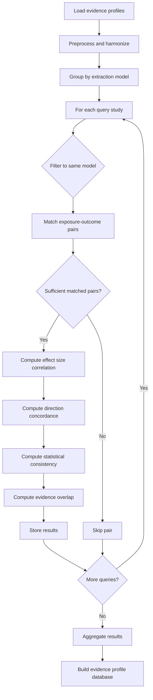

# Evidence profile similarity

See @processing/README.md for complete processing pipeline workflow.

## Overview

Evidence profile similarity is a method for comparing studies based on the
statistical evidence patterns observed in their Mendelian Randomization (MR)
analyses.
Unlike trait profile similarity which focuses on which traits are investigated,
evidence profile similarity examines how the exposure-outcome relationships
behave statistically across studies.

Each study (identified by PMID and extraction model) is represented by an
evidence profile: the collection of statistical results for all
exposure-outcome pairs investigated in that study.
By comparing these evidence patterns, we can discover studies with concordant
or discordant findings, identify potential systematic biases, and understand
the consistency of MR evidence across different study contexts.

Studies with similar evidence profiles may:

- Report consistent effect directions across shared trait pairs
- Show similar patterns of statistical significance
- Have comparable effect size magnitudes
- Share methodological characteristics affecting results

By comparing evidence profiles, we can assess the robustness and consistency
of MR findings beyond simple meta-analysis, considering the full pattern of
evidence across multiple trait relationships.

### Conceptual difference from trait similarity

Evidence profile similarity differs fundamentally from trait profile similarity:

- **Trait profile similarity**: Compares what traits are investigated,
  regardless of results (research focus overlap)
- **Evidence profile similarity**: Compares how trait relationships behave
  statistically, requiring matched trait pairs (finding consistency)

Example scenario:

Two studies (A and B) investigate the same set of two exposure-outcome pairs:

- BMI -> Type 2 Diabetes
- BMI -> Coronary Heart Disease

Trait similarity: 100 percent (identical trait profiles)

Evidence similarity: Depends on statistical patterns:

- If both find positive, significant effects: High evidence similarity
- If Study A finds positive effects and Study B finds null effects: Low
  evidence similarity

This distinction enables separate analysis of research coverage (trait
similarity) versus finding reproducibility (evidence similarity).

### Model-specific comparisons

Evidence profiles are computed per extraction model (e.g., gpt-4-1, llama3).
Comparisons are performed only within the same model to ensure consistency in
extraction methodology.
This design choice prevents artifacts from model differences influencing
similarity measures.

## Similarity metrics

We use six complementary metrics to measure evidence profile similarity, each
capturing different aspects of statistical evidence alignment:

### 1. Effect size similarity

Definition: Pearson correlation of harmonized effect sizes for matched
exposure-outcome pairs.

Rationale: Quantifies agreement in effect magnitude and direction.
High correlation indicates studies observe similar effect size patterns across
shared trait relationships.

Computation:

1. Identify exposure-outcome pairs present in both studies
2. Harmonize all effect sizes to beta (log scale) equivalents:
   - OR and HR: Apply log transformation (log(OR), log(HR))
   - Beta coefficients: Keep as-is
3. Compute Pearson correlation of effect sizes across matched pairs

Range: -1 to 1

- 1: Perfect positive correlation (effect sizes align perfectly)
- 0: No correlation (effect sizes are independent)
- -1: Perfect negative correlation (effect sizes systematically opposite)

Stratified analysis:

- Within-type similarity: Correlation for pairs with same effect type
  (beta-beta, OR-OR, HR-HR) - more reliable
- Cross-type similarity: Correlation for pairs with different effect types
  - less reliable due to harmonization assumptions

Note: Requires minimum 3 matched pairs for computation. Returns None if
insufficient data.

### 2. Direction concordance

Definition: Agreement in classified effect directions (positive, negative,
null) for matched pairs.

Rationale: Provides categorical assessment of effect direction consistency
without sensitivity to exact effect size magnitudes.

Computation:

1. Classify each effect as positive, negative, or null based on harmonized
   beta values
   - Positive: beta > 0
   - Negative: beta < 0
   - Null: beta = 0 or missing
2. For each matched pair, score agreement:
   - Both same direction (positive-positive or negative-negative): +1
   - Both null: 0
   - Opposite directions: -1
   - One null, one directional: 0
3. Average agreement scores across all matched pairs

Range: -1 to 1

- 1: Perfect concordance (all effects agree in direction)
- 0: Random agreement or mixed null/directional
- -1: Perfect discordance (all effects opposite)

### 3. Statistical consistency

Definition: Cohen's kappa coefficient for agreement in statistical
significance classifications.

Rationale: Measures consistency in which trait relationships reach statistical
significance, accounting for chance agreement.

Computation:

1. Classify each effect as significant or non-significant (p < 0.05 threshold)
2. Compute Cohen's kappa across matched pairs
3. Kappa adjusts observed agreement for expected agreement by chance

Range: -1 to 1

- 1: Perfect consistency (significance patterns identical)
- 0: Agreement equivalent to chance
- -1: Systematic disagreement (worse than chance)

Interpretation (Landis & Koch scale):

- < 0: Poor (less than chance)
- 0.0 to 0.20: Slight
- 0.21 to 0.40: Fair
- 0.41 to 0.60: Moderate
- 0.61 to 0.80: Substantial
- 0.81 to 1.00: Almost perfect

### 4. Evidence overlap

Definition: Jaccard similarity of sets of statistically significant
exposure-outcome pairs.

Rationale: Set-based measure of which specific trait relationships show
significant evidence in each study.

Computation:

1. For each study, identify set of exposure-outcome pairs with p < 0.05
2. Compute Jaccard similarity: |A ∩ B| / |A ∪ B|

Range: 0 to 1

- 1: Identical sets of significant findings
- 0: No overlap in significant findings

Edge case handling:

- If both studies have zero significant findings, returns 0.0 (not 1.0) to
  avoid inflating similarity for underpowered studies

Advantages:

- Simple and interpretable
- Not sensitive to effect size magnitudes
- Focuses on reproducibility of specific findings

### 5. Null concordance

Definition: Proportion of matched pairs where both results are non-significant.

Rationale: Measures concordance in null findings, which may indicate shared
power limitations or truly null relationships.

Computation:

1. For each matched pair, check if both results have p >= 0.05
2. Compute proportion of pairs with both non-significant

Range: 0 to 1

- 1: All matched pairs have null findings in both studies
- 0: No matched pairs have null findings in both studies

Interpretation:

- High null concordance + high direction concordance = strong evidence consistency
- High null concordance + low direction concordance = potential shared power limitations
- Low null concordance = studies differ in which relationships reach significance

### 6. Composite similarity scores

Definition: Weighted combinations of individual metrics into summary scores.

Rationale: Provide single interpretable values balancing multiple evidence
dimensions for ranking and filtering.

Implementation: Two composite scores with different weighting schemes:

**Equal-weighted composite:**

- Average of all available normalized metrics
- Each metric contributes equally to final score
- Balances all aspects of evidence similarity

**Direction-prioritized composite:**

- Weights: 0.50 × direction + 0.20 × effect_size + 0.15 × consistency + 0.15 × overlap
- Emphasizes directional concordance as primary indicator
- Recommended for main analyses

Normalization procedure:

All metrics are normalized to [0, 1] scale before combination:

- Effect similarity: (r + 1) / 2 transforms [-1, 1] → [0, 1]
- Direction concordance: (concordance + 1) / 2 transforms [-1, 1] → [0, 1]
- Statistical consistency: (kappa + 1) / 2 transforms [-1, 1] → [0, 1]
- Evidence overlap: Already in [0, 1], no transformation needed

Missing data handling:

- If effect_size_similarity or statistical_consistency is None, they are
  excluded from the composite calculation
- Weights are renormalized across available metrics
- Requires minimum 2 non-null metrics (including direction, which is always available)
- Returns None if insufficient metrics

Quality weighting:

- Composite scores are multiplied by min(query_completeness, similar_completeness)
- Down-weights comparisons involving studies with incomplete data
- Accounts for data quality differences across studies

Range: 0 to 1 (or None if insufficient data)

- 1: Maximum similarity across all available dimensions with perfect data quality
- 0: No similarity or very low data quality
- Scores reduced proportionally to worst data completeness between study pair

## Workflow

The evidence similarity computation follows these steps:



### Data preparation

1. Load evidence profiles from model results
2. Each profile contains:
   - Study identifier (PMID)
   - Extraction model used
   - List of exposure-outcome pairs with:
     - Trait indices (exposure_trait_idx, outcome_trait_idx)
     - Effect size (beta or OR or HR)
     - Standard error
     - P-value
     - Sample size (if available)

### Harmonization

Before comparison, statistical measures are harmonized:

1. **Effect size harmonization:**

   - Convert OR (odds ratio) to log scale: beta = log(OR)
   - Convert HR (hazard ratio) to log scale: beta = log(HR)
   - Keep beta values unchanged
   - Handle invalid values (OR/HR ≤ 0) as missing

2. **Direction classification:**

   - Positive: harmonized beta > 0
   - Negative: harmonized beta < 0
   - Null: beta = 0, missing, or invalid

3. **Significance classification:**

   - Significant: p < 0.05
   - Non-significant: p ≥ 0.05 or missing

### Pairwise comparison

For each query PMID-model combination:

1. Filter comparison candidates to same model only
2. For each candidate (excluding self):
   - Match exposure-outcome pairs by trait indices
   - Skip if fewer than 2 matched pairs (insufficient for correlation)
   - Compute all four similarity metrics on matched pairs
   - Calculate summary statistics:
     - Total exposure-outcome pairs in each study
     - Number of matched pairs
     - Matched pair fraction (matched / min(query_pairs, candidate_pairs))
3. Store all results (no filtering by similarity score)

### Parallel processing

The workload is distributed using SLURM job arrays:

- Total combinations divided into N chunks
- Each job processes one chunk independently
- Within each job, multiprocessing parallelizes query processing
- Results saved as separate JSON files per chunk

### Output structure

Each query-candidate comparison produces a record containing:

**Query metadata:**

- PMID and extraction model
- Number of exposure-outcome pairs in profile

**Candidate metadata:**

- PMID and extraction model
- Number of exposure-outcome pairs in profile

**Matching information:**

- Number of matched exposure-outcome pairs
- Matched pair fraction

**Similarity metrics:**

- Effect size similarity (Pearson correlation, null if insufficient pairs)
- Direction concordance (agreement score)
- Statistical consistency (Cohen's kappa, null if no variance)
- Evidence overlap (Jaccard similarity of significant pairs)

## Analysis workflows

The evidence profile database supports four complementary analysis workflows:

### 1. Summary statistics analysis

**Purpose:** Understand overall distribution and characteristics of evidence
similarities.

**Key outputs:**

- Model-level statistics (mean, median, std for each metric)
- Percentile distributions showing metric ranges
- Metric correlations revealing relationships between measures

**Use cases:**

- Assess typical similarity levels in the dataset
- Identify whether metrics capture different aspects (low correlation) or
  redundant information (high correlation)
- Establish baseline expectations for similarity values

### 2. Trait comparison analysis

**Purpose:** Compare evidence-based similarities with trait-based similarities
to understand relationship between research focus and finding consistency.

**Key outputs:**

- Correlations between trait and evidence metrics by model
- Quadrant classification:
  - High trait, high evidence: Studies investigating similar traits with
    consistent findings
  - High trait, low evidence: Studies investigating similar traits with
    inconsistent findings (interesting for heterogeneity)
  - Low trait, high evidence: Studies investigating different traits with
    similar evidence patterns
  - Low trait, low evidence: Unrelated studies
- Top discordant cases for detailed examination

**Use cases:**

- Identify studies with high trait overlap but divergent findings (potential
  heterogeneity sources)
- Discover methodological factors affecting finding reproducibility
- Assess whether similar trait profiles predict similar evidence patterns

### 3. Data quality analysis

**Purpose:** Assess completeness and distribution of evidence data.

**Key outputs:**

- Overall data quality metrics (total pairs, matched pairs distribution)
- Field completeness by model (percentage of records with each field)
- Distribution of matched exposure-outcome pairs per study pair

**Use cases:**

- Identify models with sparse evidence profiles
- Assess whether matching requirements filter too many comparisons
- Validate data extraction quality by field completeness

### 4. Validation analysis

**Purpose:** Validate similarity computation through examination of extreme
cases.

**Key outputs:**

- Summary statistics for top similar pairs
- Detailed records of highest similarity study pairs
- Discordant pairs (conflicting direction and significance patterns)

**Use cases:**

- Verify that high similarity pairs are truly similar through manual
  inspection
- Identify potential computation errors or edge cases
- Find interesting biological examples of consistent or contradictory evidence

### 5. Match type quality stratification

**Purpose:** Analyze whether match quality varies by trait matching strategy
(exact, fuzzy, EFO).

**Script:** `scripts/analysis/analyze-match-type-quality.py`

**Key outputs:**

- Quality metrics stratified by predominant match type
- Direction concordance, effect size similarity, statistical consistency by
  match type
- Match type distribution across similarity quartiles
- Data completeness analysis by match type

**Use cases:**

- Validate that exact matches produce higher quality similarities than fuzzy
  or EFO matches
- Identify whether EFO category-level matching introduces noise
- Assess trade-off between match rate and match quality for fuzzy matching
- Inform decisions about fuzzy matching thresholds

**Note:** This analysis operates on intermediate chunk files from HPC jobs
(before aggregation into the database).

**Command reference:**

Just recipe:

```bash
just analyze-match-type-quality
```

Python script:

```bash
cd processing
uv run scripts/analysis/analyze-match-type-quality.py \
  --input-dir ../data/output/<experiment-id>/results
```

The script expects chunk files at the specified input directory with pattern
`evidence_similarities_chunk_*.json`.

### 6. Alternative metrics analysis

**Purpose:** Assess feasibility of alternative similarity metrics beyond the
core six metrics.

**Script:** `scripts/evidence-profile/analyze-alternative-metrics.py`

**Key outputs:**

- Evaluation of alternative metric formulations
- Comparison with existing metrics
- Feasibility assessment for implementation

**Use cases:**

- Explore whether alternative metrics capture additional aspects of evidence
  similarity
- Validate that current metrics provide comprehensive coverage
- Inform future metric development decisions

**Command reference:**

Just recipe:

```bash
just analyze-alternative-metrics
```

Python script:

```bash
cd processing
uv run scripts/evidence-profile/analyze-alternative-metrics.py \
  --evidence-db ../data/db/evidence_profile_db.db \
  --output-dir ../data/processed/evidence-profiles/analysis
```

### 7. EFO matching failure analysis

**Purpose:** Investigate EFO matching performance and threshold sensitivity to
understand why trait matching may fail.

**Script:** `scripts/evidence-profile/analyze-efo-matching-failure.py`

**Key outputs:**

- Analysis of EFO matching success rates
- Threshold sensitivity evaluation
- Common failure patterns identification

**Use cases:**

- Identify systematic issues in EFO-based trait matching
- Optimize matching thresholds for better coverage
- Understand trade-offs between precision and recall in trait matching

**Note:** This analysis operates on intermediate chunk files from HPC jobs.

**Command reference:**

Just recipe:

```bash
just analyze-efo-matching-failure
```

Python script:

```bash
cd processing
uv run scripts/evidence-profile/analyze-efo-matching-failure.py \
  --batch-output-dir ../data/output/<experiment-id>/results
```

The script expects chunk files at the specified batch output directory.

## Database schema

The evidence profile database contains a single table:

### evidence_similarities

**Description:** Pairwise evidence profile similarity scores between studies.

**Columns:**

- `query_pmid` (INTEGER): PMID of query study
- `query_model` (VARCHAR): Extraction model for query study
- `query_pairs` (INTEGER): Number of exposure-outcome pairs in query study
- `similar_pmid` (INTEGER): PMID of candidate study
- `similar_model` (VARCHAR): Extraction model for candidate study
- `similar_pairs` (INTEGER): Number of exposure-outcome pairs in candidate
  study
- `matched_pairs` (INTEGER): Number of exposure-outcome pairs matched between
  studies
- `matched_fraction` (DOUBLE): Fraction of pairs matched relative to smaller
  study
- `effect_size_similarity` (DOUBLE): Pearson correlation of harmonized effect
  sizes (null if insufficient data)
- `direction_concordance` (DOUBLE): Agreement in effect directions
  (-1 to 1 scale)
- `statistical_consistency` (DOUBLE): Cohen's kappa for significance agreement
  (null if no variance)
- `evidence_overlap` (DOUBLE): Jaccard similarity of significant pairs

**Indexes:**

- Primary key: (query_pmid, query_model, similar_pmid, similar_model)
- Index on query_pmid for efficient query lookup
- Index on similar_pmid for reverse lookup
- Index on query_model for model-specific queries

**Constraints:**

- Query and similar records must have same extraction model
- matched_pairs ≤ min(query_pairs, similar_pairs)
- matched_fraction between 0 and 1
- All similarity metrics between -1 and 1 (except where null allowed)

## Usage examples

### Query similar evidence profiles

Find studies with similar evidence patterns to a specific study:

```sql
SELECT
    similar_pmid,
    similar_pairs,
    matched_pairs,
    effect_size_similarity,
    direction_concordance,
    statistical_consistency,
    evidence_overlap
FROM evidence_similarities
WHERE query_pmid = 12345678
  AND query_model = 'gpt-4-1'
ORDER BY effect_size_similarity DESC NULLS LAST
LIMIT 10;
```

### Find highly concordant studies

Identify study pairs with strong agreement across all metrics:

```sql
SELECT
    query_pmid,
    similar_pmid,
    matched_pairs,
    effect_size_similarity,
    direction_concordance,
    statistical_consistency,
    evidence_overlap
FROM evidence_similarities
WHERE query_model = 'gpt-4-1'
  AND matched_pairs >= 5
  AND effect_size_similarity > 0.7
  AND direction_concordance > 0.7
  AND statistical_consistency > 0.6
  AND evidence_overlap > 0.5
ORDER BY effect_size_similarity DESC;
```

### Identify discordant evidence patterns

Find study pairs investigating similar traits but with opposite findings:

```sql
-- Requires joining with trait_profile_db.db
-- Conceptual query (requires ATTACH DATABASE)
SELECT
    e.query_pmid,
    e.similar_pmid,
    e.matched_pairs,
    e.effect_size_similarity,
    e.direction_concordance,
    t.semantic_similarity as trait_semantic_similarity,
    t.jaccard_similarity as trait_jaccard_similarity
FROM evidence_similarities e
JOIN trait_similarities t
    ON e.query_pmid = t.query_pmid
    AND e.query_model = t.query_model
    AND e.similar_pmid = t.similar_pmid
    AND e.similar_model = t.similar_model
WHERE e.query_model = 'gpt-4-1'
  AND t.semantic_similarity > 0.7  -- High trait similarity
  AND e.direction_concordance < -0.3  -- Opposite effect directions
  AND e.matched_pairs >= 3
ORDER BY t.semantic_similarity DESC;
```

### Model comparison

Compare evidence similarity distributions across extraction models:

```sql
SELECT
    query_model,
    COUNT(*) as n_comparisons,
    AVG(matched_pairs) as avg_matched_pairs,
    AVG(effect_size_similarity) as avg_effect_corr,
    AVG(direction_concordance) as avg_direction,
    AVG(statistical_consistency) as avg_kappa,
    AVG(evidence_overlap) as avg_overlap
FROM evidence_similarities
GROUP BY query_model
ORDER BY query_model;
```

## Limitations and assumptions

### Within-study correlation

**Limitation:** Results within the same study are non-independent due to
shared methodological features, instrumental variables, and populations.

**Impact:** Confidence intervals and significance tests for similarity scores
may be overstated since the independence assumption is violated.

**Current approach:** Phase 1 implementation treats results as independent and
computes mean similarity across matched pairs without adjustment for
correlation structure.

**Future enhancement (Phase 2):** Implement bootstrap confidence intervals
that resample entire studies (not individual results) to properly account for
within-study correlation when estimating uncertainty in similarity scores.

**Practical note:** This primarily affects uncertainty quantification, not
point estimates. The similarity metrics themselves remain valid descriptive
measures of evidence patterns.

### Cross-effect-type comparisons

**Assumption:** Harmonizing OR, HR, and beta to log scale enables meaningful
cross-type comparisons.

**Limitation:** Log(OR) and log(HR) are not strictly equivalent to beta
coefficients due to different underlying outcome scales and measurement units.

**Current approach:**

- Primary metric: Overall effect_size_similarity combines all effect types
- Sensitivity analysis: effect_size_within_type and effect_size_cross_type
  reported separately
- Diagnostic fields: n_within_type_pairs and n_cross_type_pairs track
  proportion of each comparison type

**Recommendation:** Prioritize within-type comparisons when sufficient data
available. Interpret cross-type correlations cautiously.

### Temporal and population heterogeneity

**Limitation:** Studies from different time periods or populations may have
systematically different effect sizes even for the same causal relationships.

**Current approach:** All studies compared regardless of publication year or
population. Publication year extracted and stored for post-hoc stratification.

**Future enhancement:** Add publication year difference penalty or stratify
analyses by time period if temporal effects are detected.

### Missing data and power

**Limitation:** Studies with high null concordance may reflect shared power
limitations rather than truly null relationships.

**Current approach:** null_concordance metric reported separately to flag
potential power issues. Quality weighting down-weights studies with incomplete
data.

**Recommendation:** Interpret high null concordance in context of study sample
sizes and precision. High null_concordance + wide confidence intervals suggests
power issues rather than evidence consistency.

## Glossary

- **Evidence profile:** The collection of statistical results (effect sizes,
  p-values, directions) for all exposure-outcome pairs investigated in a study,
  representing the complete pattern of observed statistical evidence
  (identified uniquely by PMID and extraction model)
- **Evidence profile similarity:** A multi-metric quantitative assessment of
  statistical evidence alignment between two studies, computed across matched
  exposure-outcome pairs using effect size correlation, direction concordance,
  significance consistency, and evidence overlap measures
- **Harmonized effect size:** Effect size converted to beta (log) scale to
  enable comparison across different effect measures (beta, OR, HR)
- **Matched pairs:** Exposure-outcome trait combinations present in both
  studies being compared, identified by matching trait indices
- **Direction concordance:** Agreement in classified effect directions
  (positive, negative, null) across matched pairs
- **Statistical consistency:** Cohen's kappa measuring agreement in
  statistical significance classifications (p < 0.05 threshold)
- **Evidence overlap:** Jaccard similarity of sets of statistically
  significant exposure-outcome pairs between studies
- **Null concordance:** Proportion of matched pairs where both results are
  non-significant, indicating shared null findings
- **Within-type similarity:** Effect size correlation computed only for
  matched pairs with identical effect types (beta-beta, OR-OR, HR-HR)
- **Cross-type similarity:** Effect size correlation computed for matched
  pairs with different effect types after harmonization
- **Quality weighting:** Adjustment of composite scores by multiplying by
  min(query_completeness, similar_completeness) to account for data quality
  differences
