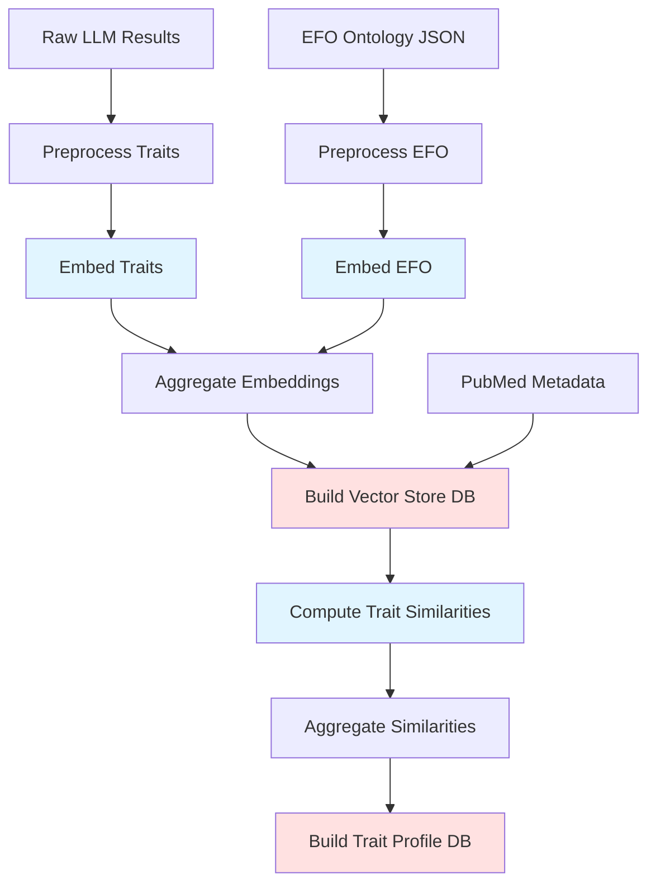
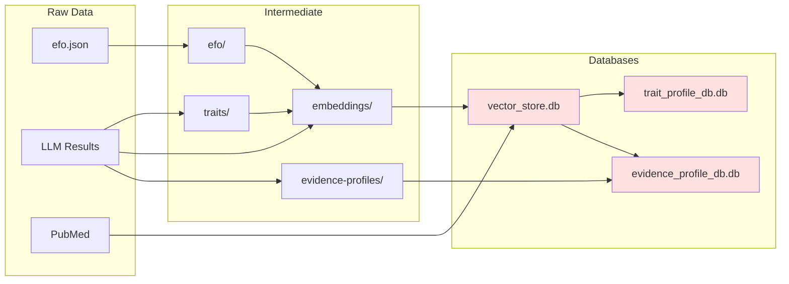

# MR-KG processing pipeline

This document describes the complete processing pipeline for MR-KG, including
detailed command reference, input/output specifications, and flag documentation
for each processing step.

## Pipeline overview

The processing pipeline transforms raw LLM extraction results and EFO ontology
data into queryable DuckDB databases through six main stages:



Legend: Blue = HPC batch jobs, Red = Database outputs

## Stage 1: Preprocessing

### Trait preprocessing

Extract unique trait labels from model results and create indexed mappings.

Command reference

Just recipe:

```bash
just preprocess-traits
```

Python script:

```bash
uv run scripts/main-processing/preprocess-traits.py [FLAGS]
```

Flags

`--dry-run`, `-n`

Perform dry run without processing.
Validates file paths and setup without executing the main processing logic.

Input files

`data/raw/llm-results-aggregated/<model>/processed_results_valid.json`

Raw LLM extraction results for each model.
The script processes results from: llama3, llama3-2, deepseek-r1-distilled,
gpt-4-1, o4-mini.

Output files

`data/processed/traits/unique_traits.csv`

CSV file containing indexed unique traits.
Columns: index (integer), trait (string).

`data/processed/model_results/processed_model_results.json`

Model results with linked indices added to traits.
Each trait now includes a linked_index field referencing the unique_traits
index.

Processing details

The script extracts trait labels from model exposures and outcomes, creates a
global trait index, and adds linked_index fields to all trait references in the
model data.

### EFO preprocessing

Extract term labels from EFO ontology.

Command reference

Just recipe:

```bash
just preprocess-efo
```

Python script:

```bash
uv run scripts/main-processing/preprocess-efo.py [FLAGS]
```

Flags

`--dry-run`, `-n`

Perform dry run without processing.
Validates file paths without executing processing.

Input files

`data/raw/efo/efo.json`

EFO ontology JSON file.
Download from <https://github.com/EBISPOT/efo/releases>.

Output files

`data/processed/efo/efo_terms.json`

Processed EFO terms.
JSON array containing objects with id and label fields.

Processing details

Extracts term IDs and labels from the EFO ontology JSON, filtering out terms
without labels.

## Stage 2: Embedding generation

### Trait embedding

Generate SciSpacy embeddings for trait labels.

Command reference

Just recipe (HPC submission):

```bash
just embed-traits
```

SLURM submission:

```bash
sbatch --account=${ACCOUNT_CODE} scripts/bc4/embed-traits.sbatch
```

Python script (for manual execution):

```bash
uv run scripts/main-processing/embed-traits.py [FLAGS]
```

Flags

`--dry-run`, `-n`

Perform dry run without processing.
Validates model paths and input files.

`--array-length <INT>`

Total number of array chunks for parallel processing.
Default: 10.

`--array-id <INT>`

Current array chunk ID (0-based indexing).
Default: 0.

`--output-dir <PATH>`

Output directory for embedding files.
Default: data/output.

Input files

`data/processed/traits/unique_traits.csv`

Unique traits from preprocessing stage.

`models/en_core_sci_lg-0.5.4/en_core_sci_lg/en_core_sci_lg-0.5.4/`

SciSpacy model for biomedical text processing.
Download from <https://s3-us-west-2.amazonaws.com/ai2-s2-scispacy>.

Output files

`<output-dir>/trait_vectors_chunk_<array-id>.json`

Chunk file containing trait embeddings.
Each record contains: index, trait, vector (200-dimensional).

HPC configuration

SLURM batch script: scripts/bc4/embed-traits.sbatch

Resources:

- Array size: 0-4 (5 chunks)
- Time limit: 10 hours
- Memory: 14GB per node
- Partition: mrcieu

Environment:

- Requires micromamba environment: mr-kg-processing
- Uses environment variable: ACCOUNT_CODE

Processing details

Loads SciSpacy model, processes trait labels in chunks, and generates
200-dimensional vectors.
Each array task processes a subset of traits based on chunk ID and array length.

### EFO embedding

Generate SciSpacy embeddings for EFO term labels.

Command reference

Just recipe (HPC submission):

```bash
just embed-efo
```

SLURM submission:

```bash
sbatch --account=${ACCOUNT_CODE} scripts/bc4/embed-efo.sbatch
```

Python script (for manual execution):

```bash
uv run scripts/main-processing/embed-efo.py [FLAGS]
```

Flags

`--dry-run`, `-n`

Perform dry run without processing.

`--array-length <INT>`

Total number of array chunks.
Default: 10.

`--array-id <INT>`

Current array chunk ID (0-based).
Default: 0.

`--output-dir <PATH>`

Output directory for embedding files.
Default: data/output.

Input files

`data/processed/efo/efo_terms.json`

EFO terms from preprocessing stage.

`models/en_core_sci_lg-0.5.4/en_core_sci_lg/en_core_sci_lg-0.5.4/`

SciSpacy model.

Output files

`<output-dir>/efo_vectors_chunk_<array-id>.json`

Chunk file containing EFO embeddings.
Each record contains: id, label, vector (200-dimensional).

HPC configuration

SLURM batch script: scripts/bc4/embed-efo.sbatch

Resources:

- Array size: 0-9 (10 chunks)
- Time limit: 5 hours
- Memory: 14GB per node
- Partition: mrcieu

Environment:

- Requires micromamba environment: mr-kg-processing
- Uses environment variable: ACCOUNT_CODE

Processing details

Similar to trait embedding but processes EFO term labels instead.

## Stage 3: Embedding aggregation

Combine embedding results from HPC array jobs.

Command reference

Just recipe:

```bash
just aggregate-embeddings
```

Python script:

```bash
uv run scripts/main-processing/aggregate-embeddings.py [FLAGS]
```

Flags

`--trait-results-dir <PATH>`

Directory containing trait embedding results.
Required.

`--efo-results-dir <PATH>`

Directory containing EFO embedding results.
Required.

`--dry-run`, `-n`

Perform dry run without processing.

Input files

`<trait-results-dir>/trait_vectors_chunk_*.json`

All trait embedding chunk files from HPC job.

`<efo-results-dir>/efo_vectors_chunk_*.json`

All EFO embedding chunk files from HPC job.

Output files

`data/processed/embeddings/traits.json`

Aggregated trait embeddings.
Format: Array of records with id (`trait_<index>`), label, vector.

`data/processed/embeddings/efo.json`

Aggregated EFO embeddings.
Format: Array of records with id, label, vector.

Processing details

Reads all chunk files, converts raw records to standardized EmbeddingRecord
format, and exports combined results.

## Stage 4: Vector store database

Build the main DuckDB vector store database.

Command reference

Just recipe:

```bash
just build-main-db
```

Python script:

```bash
uv run scripts/main-db/build-main-database.py [FLAGS]
```

Flags

`--dry-run`, `-n`

Perform dry run without creating database.
Validates all required input files exist.

`--database-name <NAME>`, `-db <NAME>`

Custom database name without .db extension.
If not provided, uses timestamp: `database-<timestamp>.db`.

`--force-write`, `-f`

Remove existing database before creating new one.
Without this flag, script will fail if database already exists.

Input files

`data/processed/embeddings/traits.json`

Aggregated trait embeddings.

`data/processed/embeddings/efo.json`

Aggregated EFO embeddings.

`data/processed/model_results/processed_model_results.json`

Model results with linked indices.

`data/processed/traits/unique_traits.csv`

Unique trait index.

`data/raw/mr-pubmed-data/mr-pubmed-data.json`

PubMed metadata for MR studies.

Output files

`data/db/<database-name>.db`

DuckDB vector store database containing tables: trait_embeddings,
efo_embeddings, model_results, model_result_traits, mr_pubmed_data.

Database schema

Tables:

trait_embeddings

Trait index, labels, and 200-dim vectors.
Primary key: trait_index.

efo_embeddings

EFO term IDs, labels, and 200-dim vectors.
Primary key: id.

model_results

Model extraction results with metadata.
Columns: id, model, pmid, metadata (JSON), results (JSON).

model_result_traits

Links model results to traits.
Foreign keys: model_result_id, trait_index.

mr_pubmed_data

PubMed metadata (title, abstract, journal, etc).
Primary key: pmid.

Views:

trait_similarity_search

Cross-join for trait-to-trait cosine similarity.

trait_efo_similarity_search

Cross-join for trait-to-EFO cosine similarity.

pmid_model_analysis

Comprehensive view joining model results, PubMed data, and traits.

trait_stats

Trait appearance counts across model results.

Processing details

Creates tables, populates with data, creates indexes for performance, and
validates schema.
The database supports efficient vector similarity search and trait analysis.

## Stage 5: Trait profile similarity

### Similarity computation

Compute pairwise trait profile similarities between studies.

Command reference

Just recipe (HPC submission):

```bash
just compute-trait-similarities
```

SLURM submission:

```bash
sbatch --account=${ACCOUNT_CODE} scripts/bc4/compute-trait-similarity.sbatch
```

Python script (for manual execution):

```bash
uv run scripts/trait-profile/compute-trait-similarity.py [FLAGS]
```

Flags

`--dry-run`, `-n`

Perform dry run without processing.

`--array-length <INT>`

Total number of array chunks.
Default: 10.

`--array-id <INT>`

Current array chunk ID (0-based).
Default: 0.

`--output-dir <PATH>`

Output directory for similarity files.
Default: data/output.

`--database-path <PATH>`

Path to DuckDB vector store database.
If not provided, uses latest `database-*.db` file.

`--top-k <INT>`

Number of top similar results to keep per combination.
Default: 10.

`--workers <INT>`

Number of worker processes for multiprocessing.
Default: 4.

Input files

`data/db/vector_store.db`

Vector store database from Stage 4.

Output files

`<output-dir>/trait_similarities_chunk_<array-id>.json`

Chunk file containing similarity results.
Each record contains query info and top-k similar combinations from same model.

HPC configuration

SLURM batch script: scripts/bc4/compute-trait-similarity.sbatch

Resources:

- Array size: 0-19 (20 chunks)
- Time limit: 24 hours
- Memory: 16GB per node
- CPUs per task: 8
- Partition: mrcieu

Environment:

- Requires micromamba environment: mr-kg-processing
- Uses environment variable: ACCOUNT_CODE

Processing details

Loads PMID-model combinations from database, computes trait profile similarity
(average maximum cosine similarity) and Jaccard similarity, keeps only top-k
results.
Uses multiprocessing for parallel computation.
Only compares within same model (e.g., gpt-4-1 vs gpt-4-1).

### Similarity aggregation

Combine similarity results from HPC array jobs.

Command reference

Just recipe:

```bash
just aggregate-trait-similarities
```

Python script:

```bash
uv run scripts/trait-profile/aggregate-trait-similarities.py [FLAGS]
```

Flags

`--input-dir <PATH>`

Directory containing chunk files from SLURM job array.
Required.
`--output-path <PATH>`

Output path for aggregated results.
Default: data/processed/trait-profile-similarities/trait-profile-similarities.json.

Input files

`<input-dir>/trait_similarities_chunk_*.json`

All similarity chunk files from HPC job.

Output files

`<output-path>`

Aggregated similarity data.
JSON array of all similarity records.

`<output-dir>/aggregation_stats.json`

Validation statistics.
Contains total records, unique queries, total similarities, averages.

Processing details

Loads all chunk files, validates completeness, and combines into single dataset.

### Profile database build

Create trait profile similarity database.

Command reference

Just recipe:

```bash
just build-trait-profile-db
```

Python script:

```bash
uv run scripts/trait-profile/build-trait-profile-database.py [FLAGS]
```

Flags

`--input-file <PATH>`

Path to trait profile similarities JSON file.
Default: data/processed/trait-profile-similarities/trait-profile-similarities.json.

`--dry-run`, `-n`

Perform dry run without creating database.

`--database-name <NAME>`, `-db <NAME>`

Custom database name without .db extension.
If not provided, uses timestamp: `trait-profile-db-<timestamp>.db`.

`--skip-indexes`

Skip index creation (for troubleshooting).

`--memory-limit <SIZE>`

Memory limit for DuckDB.
Default: 4GB.

`--force-write`

Remove existing database and create new one.

Input files

`data/processed/trait-profile-similarities/trait-profile-similarities.json`

Aggregated similarity data from previous step.

Output files

`data/db/<database-name>.db`

DuckDB trait profile similarity database.

Database schema

Tables:

query_combinations

PMID-model pairs with trait profiles.
Primary key: id.
Unique constraint: (pmid, model).

trait_similarities

Similarity relationships between combinations.
Foreign key: query_combination_id.

Views:

trait_similarity_analysis

Comprehensive similarity analysis with ranking.

model_similarity_stats

Per-model statistics (total combinations, avg trait count).

top_similarity_pairs

High-similarity pairs (similarity >= 0.8).

Processing details

Creates tables, populates data, creates indexes (skipping float indexes due to
DuckDB limitations), creates views, and validates database.

## Stage 6: Evidence profile similarity database

Build database of evidence-based similarities between studies using quantitative
causal evidence patterns.

See @docs/processing/evidence-profile-similarity.md for detailed methodology
and conceptual framework.

### Evidence profile preprocessing

Extract and harmonize evidence profiles from model results.

Command reference

Just recipe:

```bash
just preprocess-evidence-profiles
```

Python script:

```bash
uv run scripts/evidence-profile/preprocess-evidence-profiles.py [FLAGS]
```

Flags

`--dry-run`, `-n`

Perform dry run without processing.

`--database-path <PATH>`

Path to vector_store.db database.
Default: data/db/vector_store.db.

`--output-dir <PATH>`

Output directory for processed evidence profiles.
Default: data/processed/evidence-profiles.

`--min-results <INT>`

Minimum number of complete results required per study.
Default: 3.

`--max-missing-rate <FLOAT>`

Maximum allowed proportion of missing data (0-1).
Default: 0.75.

`--limit <INT>`

Limit number of combinations to process (for testing).
Optional.

Input files

`data/db/vector_store.db`

Vector store database from Stage 4 containing model_results table.

Output files

`data/processed/evidence-profiles/evidence-profiles.json`

JSON array of evidence profiles with harmonized effect sizes and metadata.

`data/processed/evidence-profiles/preprocessing-stats.json`

Statistics including total combinations, included/excluded counts, effect type
distribution, data completeness metrics, and unrecognized direction report.

Processing details

Queries database to extract all PMID-model combinations, harmonizes effect
sizes (log transformation for OR/HR), classifies directions and significance,
assesses data quality, filters by completeness thresholds.
Tracks unrecognized direction strings for quality improvement.

### Evidence similarity computation

Compute pairwise evidence profile similarities between studies.

Command reference

Just recipe (HPC submission):

```bash
just compute-evidence-similarities
```

SLURM submission:

```bash
sbatch --account=${ACCOUNT_CODE} scripts/bc4/compute-evidence-similarity.sbatch
```

Python script (for manual execution):

```bash
uv run scripts/evidence-profile/compute-evidence-similarity.py [FLAGS]
```

Flags

`--dry-run`, `-n`

Perform dry run without processing.

`--array-length <INT>`

Total number of array chunks for parallel processing.
Default: 20.

`--array-id <INT>`

Current array chunk ID (0-based indexing).
Default: 0.

`--input-file <PATH>`

Path to evidence profiles JSON file.
Default: data/processed/evidence-profiles/evidence-profiles.json.

`--output-dir <PATH>`

Output directory for similarity files.
Default: data/output/evidence-similarities.

`--top-k <INT>`

Number of top similar results to keep per combination.
Default: 10.

`--min-matched-pairs <INT>`

Minimum matched pairs required for comparison.
Default: 3.

`--workers <INT>`

Number of worker processes for parallelization.
Default: 4.

Input files

`data/processed/evidence-profiles/evidence-profiles.json`

Evidence profiles from preprocessing step.

Output files

`<output-dir>/evidence_similarities_chunk_<array-id>.json`

Chunk file containing similarity results.
Each record contains query info and top-k similar combinations from same model.

HPC configuration

SLURM batch script: scripts/bc4/compute-evidence-similarity.sbatch

Resources:

- Array size: 0-19 (20 chunks)
- Time limit: 12 hours
- Memory: 32GB per node
- CPUs per task: 8
- Partition: cpu

Environment:

- Requires micromamba environment: mr-kg-processing
- Uses environment variable: ACCOUNT_CODE

Processing details

Matches exposure-outcome pairs by trait indices, computes six similarity
metrics (effect size, within-type, cross-type, direction concordance,
statistical consistency, evidence overlap, null concordance), calculates
quality-weighted composite scores.
Uses multiprocessing for parallel computation.
Only compares within same model.

### Evidence similarity aggregation

Combine similarity results from HPC array jobs.

Command reference

Just recipe:

```bash
just aggregate-evidence-similarities
```

Python script:

```bash
uv run scripts/evidence-profile/aggregate-evidence-similarities.py [FLAGS]
```

Flags

`--dry-run`, `-n`

Perform dry run.

`--input-dir <PATH>`

Directory containing chunk files from SLURM job array.
Required.

`--output-dir <PATH>`

Output directory.
Default: data/processed/evidence-profiles.

Input files

`<input-dir>/evidence_similarities_chunk_*.json`

All similarity chunk files from HPC job.

Output files

`data/processed/evidence-profiles/evidence-similarities.json`

Aggregated similarity data.
JSON array of all similarity records.

`data/processed/evidence-profiles/aggregation_stats.json`

Validation statistics.
Contains total records, unique queries, total similarities, averages.

Processing details

Loads all chunk files, validates completeness, combines into single dataset.

### Evidence profile database build

Create evidence profile similarity database.

Command reference

Just recipe:

```bash
just build-evidence-profile-db
```

Python script:

```bash
uv run scripts/evidence-profile/build-evidence-profile-database.py [FLAGS]
```

Flags

`--input-file <PATH>`

Path to evidence-similarities.json file.
Default: data/processed/evidence-profiles/evidence-similarities.json.

`--dry-run`, `-n`

Perform dry run without creating database.

`--database-name <NAME>`, `-db <NAME>`

Database name without .db extension.
Default: evidence_profile_db.

`--skip-indexes`

Skip index creation (for troubleshooting).

`--memory-limit <SIZE>`

Memory limit for DuckDB.
Default: 4GB.

`--force-write`

Remove existing database and create new one.

Input files

`data/processed/evidence-profiles/evidence-similarities.json`

Aggregated similarity data from previous step.

Output files

`data/db/evidence_profile_db.db`

DuckDB evidence profile similarity database.

Database schema

Tables:

query_combinations

PMID-model pairs with evidence profiles.
Primary key: id.
Unique constraint: (pmid, model).
Includes publication_year for temporal analysis.

evidence_similarities

Similarity relationships between combinations.
Foreign key: query_combination_id.
Includes all metrics: effect_size_similarity, effect_size_within_type,
effect_size_cross_type, direction_concordance, statistical_consistency,
evidence_overlap, null_concordance, composite scores, completeness values.

Views:

evidence_similarity_analysis

Comprehensive similarity analysis with ranking.

model_evidence_stats

Per-model statistics (total combinations, avg result count, avg completeness).

high_concordance_pairs

High-similarity pairs (direction_concordance >= 0.8).

discordant_evidence_pairs

Studies with contradictory evidence (direction_concordance < 0).

Processing details

Creates tables, populates data, creates indexes, creates views, validates
database structure and content.

## Stage 7: Evidence profile similarity analysis

Analytical tools for understanding statistical evidence patterns in MR studies
through seven complementary analysis scripts.

See @docs/processing/evidence-profile-similarity.md for detailed methodology.

### Summary statistics analysis

Generate model-level statistics, similarity distributions, and metric
correlations.

Command reference

Just recipe:

```bash
just analyze-evidence-summary-stats
```

Python script:

```bash
cd processing
uv run python scripts/analysis/analyze-evidence-summary-stats.py \
  --evidence-db ../data/db/evidence_profile_db.db \
  --output-dir ../data/processed/evidence-profiles/analysis
```

Flags:

- `--evidence-db`: Path to evidence profile database (default:
  data/db/evidence_profile_db.db)
- `--output-dir`: Output directory for analysis results (default:
  data/processed/evidence-profiles/analysis)
- `-n, --dry-run`: Show what would be done without executing

Outputs:

- `summary-stats-by-model.csv`: Per-model statistics (count, mean, median,
  std, min, max for each metric)
- `similarity-distributions.csv`: Percentile distributions (5th, 25th, 50th,
  75th, 95th) for each metric
- `metric-correlations.csv`: Pairwise Pearson correlations between all
  similarity metrics

### Trait comparison analysis

Compare evidence-based similarities with trait-based similarities to identify
concordant and discordant cases.

Command reference

Just recipe:

```bash
just analyze-evidence-trait-comparison
```

Python script:

```bash
cd processing
uv run python scripts/analysis/analyze-evidence-trait-comparison.py \
  --evidence-db ../data/db/evidence_profile_db.db \
  --trait-db ../data/db/trait_profile_db.db \
  --output-dir ../data/processed/evidence-profiles/analysis
```

Flags:

- `--evidence-db`: Path to evidence profile database (default:
  data/db/evidence_profile_db.db)
- `--trait-db`: Path to trait profile database (default:
  data/db/trait_profile_db.db)
- `--output-dir`: Output directory for analysis results (default:
  data/processed/evidence-profiles/analysis)
- `-n, --dry-run`: Show what would be done without executing

Outputs:

- `trait-vs-evidence-correlation.csv`: Correlations between trait and
  evidence metrics by model
- `quadrant-classification.csv`: Classification of study pairs into four
  quadrants based on trait and evidence similarity
- `interesting-cases.csv`: Top discordant cases (high trait similarity with
  low evidence similarity, and vice versa)

### Data quality analysis

Assess completeness and distribution of evidence data across models and study
pairs.

Command reference

Just recipe:

```bash
just analyze-evidence-data-quality
```

Python script:

```bash
cd processing
uv run python scripts/analysis/analyze-evidence-data-quality.py \
  --evidence-db ../data/db/evidence_profile_db.db \
  --output-dir ../data/processed/evidence-profiles/analysis
```

Flags:

- `--evidence-db`: Path to evidence profile database (default:
  data/db/evidence_profile_db.db)
- `--output-dir`: Output directory for analysis results (default:
  data/processed/evidence-profiles/analysis)
- `-n, --dry-run`: Show what would be done without executing

Outputs:

- `data-quality-report.json`: Comprehensive quality metrics including total
  pairs, matched pairs count, field completeness percentages
- `completeness-by-model.csv`: Field-level completeness statistics per model
- `matched-pairs-distribution.csv`: Distribution of matched exposure-outcome
  pairs per study pair

### Validation analysis

Validate similarity computation through examination of top similar pairs and
discordant evidence patterns.

Command reference

Just recipe:

```bash
just analyze-evidence-validation
```

Python script:

```bash
cd processing
uv run python scripts/analysis/analyze-evidence-validation.py \
  --evidence-db ../data/db/evidence_profile_db.db \
  --output-dir ../data/processed/evidence-profiles/analysis \
  --top-n 100
```

Flags:

- `--evidence-db`: Path to evidence profile database (default:
  data/db/evidence_profile_db.db)
- `--output-dir`: Output directory for analysis results (default:
  data/processed/evidence-profiles/analysis)
- `--top-n`: Number of top similar pairs to extract (default: 100)
- `-n, --dry-run`: Show what would be done without executing

Outputs:

- `validation-report.json`: Summary statistics for top similar pairs
  including mean values, standard deviations, and ranges for each metric
- `top-similar-pairs.csv`: Detailed records of top-N most similar study
  pairs ranked by combined evidence score
- `discordant-pairs.csv`: Study pairs with conflicting direction concordance
  and statistical consistency metrics

### Match type quality analysis

Analyze quality stratification by trait matching strategy (exact, fuzzy, EFO).

Command reference

Just recipe:

```bash
just analyze-match-type-quality
```

Python script:

```bash
cd processing
uv run scripts/analysis/analyze-match-type-quality.py \
  --input-dir ../data/output/<experiment-id>/results
```

Flags

`--input-dir <PATH>`

Directory containing chunk files from SLURM job array.
Required.

`--output-dir <PATH>`

Output directory for analysis results.
Default: data/processed/evidence-profiles/analysis.

Input files

`<input-dir>/evidence_similarities_chunk_*.json`

All similarity chunk files from HPC job containing match type information.

Output files

Analysis outputs written to specified output directory with match type quality
metrics and distributions.

Processing details

Operates on intermediate chunk files before database aggregation to analyze
how trait matching strategy affects similarity quality metrics.

### Alternative metrics analysis

Assess feasibility of alternative similarity metric formulations.

Command reference

Just recipe:

```bash
just analyze-alternative-metrics
```

Python script:

```bash
cd processing
uv run scripts/evidence-profile/analyze-alternative-metrics.py \
  --evidence-db ../data/db/evidence_profile_db.db \
  --output-dir ../data/processed/evidence-profiles/analysis
```

Flags

`--evidence-db <PATH>`

Path to evidence profile database.
Default: data/db/evidence_profile_db.db.

`--output-dir <PATH>`

Output directory for analysis results.
Default: data/processed/evidence-profiles/analysis.

Input files

`data/db/evidence_profile_db.db`

Evidence profile database from Stage 6.

Output files

Analysis outputs evaluating alternative metric formulations and comparisons
with existing metrics.

Processing details

Explores alternative similarity metrics beyond the core six to assess whether
they capture additional aspects of evidence similarity.

### EFO matching failure analysis

Investigate EFO-based trait matching performance and threshold sensitivity.

Command reference

Just recipe:

```bash
just analyze-efo-matching-failure
```

Python script:

```bash
cd processing
uv run scripts/evidence-profile/analyze-efo-matching-failure.py \
  --batch-output-dir ../data/output/<experiment-id>/results
```

Flags

`--batch-output-dir <PATH>`

Directory containing chunk files from SLURM job array.
Required.

`--output-dir <PATH>`

Output directory for analysis results.
Default: data/processed/evidence-profiles/analysis.

Input files

`<batch-output-dir>/evidence_similarities_chunk_*.json`

All similarity chunk files from HPC job containing EFO matching information.

Output files

Analysis outputs examining EFO matching success rates, threshold sensitivity,
and common failure patterns.

Processing details

Operates on intermediate chunk files to analyze trait matching performance,
particularly for EFO-based matching strategies.

### Running all analyses

Execute all evidence profile analysis scripts sequentially:

```bash
just analyze-evidence-profile
```

This meta-recipe runs all analysis scripts in order, generating a complete
analytical report.

## Stage 8: Summary statistics generation

Generate manuscript-ready summary statistics and LaTeX tables from all three
MR-KG databases.

This stage consolidates statistics across the complete MR-KG ecosystem,
providing comprehensive metrics for publications and reports.

### Overall database statistics

Extract comprehensive statistics from the vector store database.

Command reference

Just recipe:

```bash
just generate-overall-stats
```

Python script:

```bash
uv run scripts/analysis/generate-overall-database-stats.py [FLAGS]
```

Flags

`--dry-run`, `-n`

Perform dry run without executing analysis.

`--vector-db <PATH>`

Path to vector store database.
Default: data/db/vector_store.db.

`--output-dir <PATH>`

Output directory for statistics.
Default: data/processed/overall-stats.

Input files

`data/db/vector_store.db`

Main vector store database from Stage 4.

Output files

`data/processed/overall-stats/database-summary.csv`

Overall database statistics including total PMIDs, traits, temporal coverage.

`data/processed/overall-stats/database-summary.json`

Same data in JSON format for programmatic access.

`data/processed/overall-stats/model-statistics.csv`

Per-model extraction counts and trait usage statistics.

`data/processed/overall-stats/temporal-statistics.csv`

Publication year distributions and cumulative growth.

`data/processed/overall-stats/trait-usage-statistics.csv`

Top 50 traits by usage patterns (exposure vs outcome).

`data/processed/overall-stats/journal-statistics.csv`

Top 20 journals by publication count.

Processing details

Queries vector store database for comprehensive statistics including unique
paper counts, trait distributions, temporal coverage, model performance
metrics, and trait usage patterns.

### Trait profile summary statistics

Generate summary statistics for trait similarity profiles.

Command reference

Just recipe:

```bash
just analyze-trait-summary-stats
```

Python script:

```bash
uv run scripts/analysis/analyze-trait-summary-stats.py [FLAGS]
```

Flags

`--dry-run`, `-n`

Perform dry run without executing analysis.

`--trait-db <PATH>`

Path to trait profile database.
Default: data/db/trait_profile_db.db.

`--output-dir <PATH>`

Output directory for analysis results.
Default: data/processed/trait-profiles/analysis.

Input files

`data/db/trait_profile_db.db`

Trait profile database from Stage 5.

Output files

`data/processed/trait-profiles/analysis/summary-stats-by-model.csv`

Model-level statistics including total combinations, average trait counts,
and similarity pair counts.

`data/processed/trait-profiles/analysis/similarity-distributions.csv`

Percentile distributions for semantic and Jaccard similarities.

`data/processed/trait-profiles/analysis/metric-correlations.csv`

Correlations between semantic and Jaccard similarity metrics.

`data/processed/trait-profiles/analysis/trait-count-distributions.csv`

Distribution statistics for trait counts per study.

Processing details

Computes comprehensive statistics on trait profile similarities including
distribution metrics (mean, median, percentiles), correlations between
semantic and set-based similarity measures, and trait count patterns.

### Manuscript table generation

Consolidate all statistics into LaTeX-formatted tables.

Command reference

Just recipe:

```bash
just generate-manuscript-tables
```

Python script:

```bash
uv run scripts/analysis/generate-manuscript-summary-table.py [FLAGS]
```

Flags

`--dry-run`, `-n`

Perform dry run without generating tables.

`--overall-dir <PATH>`

Directory with overall statistics.
Default: data/processed/overall-stats.

`--trait-dir <PATH>`

Directory with trait statistics.
Default: data/processed/trait-profiles/analysis.

`--evidence-dir <PATH>`

Directory with evidence statistics.
Default: data/processed/evidence-profiles/analysis.

`--output-dir <PATH>`

Output directory for tables.
Default: data/processed/manuscript-tables.

Input files

Requires outputs from:

- generate-overall-database-stats.py
- analyze-trait-summary-stats.py
- analyze-evidence-summary-stats.py

Output files

`data/processed/manuscript-tables/summary-table-full.tex`

Complete LaTeX table with all statistics from three databases.

`data/processed/manuscript-tables/summary-table-compact.tex`

Condensed table for main manuscript text.

`data/processed/manuscript-tables/summary-table-data.json`

Raw consolidated data for custom table generation.

Processing details

Reads statistics from all three analysis outputs, formats data into
LaTeX table code with proper formatting, generates both full and compact
versions suitable for different manuscript sections.

### Complete pipeline

Run all summary statistics generation steps:

```bash
just generate-all-summary-stats
```

This meta-recipe executes:

1. generate-overall-stats: Overall database statistics
2. analyze-trait-summary-stats: Trait profile statistics
3. generate-manuscript-tables: LaTeX table generation

The complete workflow generates all statistics and publication-ready tables
in a single command.

## Key processing scripts

### Script locations

```text
processing/scripts/
├── main-processing/     Core trait and EFO processing
│   ├── preprocess-traits.py
│   ├── preprocess-efo.py
│   ├── embed-traits.py
│   └── embed-efo.py
├── main-db/            Database building scripts
│   ├── build-main-database.py
│   └── query-database.py
├── trait-profile/      Trait similarity computation
│   ├── compute-trait-similarity.py
│   ├── aggregate-trait-similarities.py
│   └── build-trait-profile-database.py
├── evidence-profile/   Evidence similarity computation
│   ├── preprocess-evidence-profiles.py
│   ├── compute-evidence-similarity.py
│   ├── aggregate-evidence-similarities.py
│   └── build-evidence-profile-database.py
├── analysis/           Analysis and summary statistics scripts
│   ├── generate-overall-database-stats.py
│   ├── analyze-trait-summary-stats.py
│   ├── generate-manuscript-summary-table.py
│   ├── analyze-evidence-summary-stats.py
│   ├── analyze-evidence-trait-comparison.py
│   ├── analyze-evidence-data-quality.py
│   └── analyze-evidence-validation.py
└── bc4/               HPC batch job scripts
    ├── compute-trait-similarity.sbatch
    ├── compute-evidence-similarity.sbatch
    ├── embed-efo.sbatch
    └── embed-traits.sbatch
```

### Core scripts

- `preprocess-traits.py`: Extracts unique trait labels from all models,
  creates trait indices
- `preprocess-efo.py`: Processes EFO ontology JSON to extract term IDs and
  labels
- `embed-traits.py`: Generates embeddings for trait labels using spaCy models
- `build-main-database.py`: Creates vector_store.db with trait/EFO embeddings
  and model results
- `compute-trait-similarity.py`: Computes pairwise trait similarities
- `build-trait-profile-database.py`: Creates trait_profile_db.db for
  similarity analysis
- `preprocess-evidence-profiles.py`: Extracts and harmonizes evidence profiles
  from model results
- `compute-evidence-similarity.py`: Computes pairwise evidence similarities
- `build-evidence-profile-database.py`: Creates evidence_profile_db.db for
  evidence-based similarity analysis
- `generate-overall-database-stats.py`: Generates comprehensive statistics
  from vector store database
- `analyze-trait-summary-stats.py`: Computes trait profile similarity
  statistics and distributions
- `generate-manuscript-summary-table.py`: Consolidates statistics into
  LaTeX-formatted manuscript tables
- `analyze-evidence-*.py`: Analysis scripts for evidence profile exploration

## HPC integration

The pipeline uses SLURM batch jobs for computationally intensive tasks.

### Requirements

- Environment variable `ACCOUNT_CODE` required for HPC submissions
- Results stored in `data/output/` with experiment IDs
- SLURM job definitions in `scripts/bc4/*.sbatch`

### HPC workflow

1. Trait embedding: Distributes trait embedding generation across HPC nodes
2. EFO embedding: Generates EFO term embeddings in parallel
3. Similarity computation: Computes pairwise trait similarities using HPC
   resources
4. Result aggregation: Combines distributed results into final databases

### HPC configuration

```bash
export ACCOUNT_CODE=your-hpc-account

sbatch scripts/bc4/embed-traits.sbatch
sbatch scripts/bc4/embed-efo.sbatch
sbatch scripts/bc4/compute-trait-similarity.sbatch
sbatch scripts/bc4/compute-evidence-similarity.sbatch
```

## Output databases

See @docs/processing/databases.md for architecture details and
@docs/processing/db-schema.md for schema reference.

### Vector store database

Path: `data/db/vector_store.db`

Primary database containing trait embeddings, EFO embeddings, and model
extraction results with optimized views for similarity search.

### Trait profile database

Path: `data/db/trait_profile_db.db`

Precomputed trait-to-trait similarities for study network analysis.
See @docs/processing/trait-profile-similarity.md for similarity methodology.

### Evidence profile database

Path: `data/db/evidence_profile_db.db`

Precomputed evidence-based similarities comparing statistical evidence
patterns across MR studies.
See @docs/processing/evidence-profile-similarity.md for methodology and
metrics.

## Data flow



Directories:

- `data/raw/`: Source data (EFO, LLM outputs, PubMed)
- `data/processed/`: Normalized traits, embeddings, indices
- `data/output/`: HPC job results
- `data/db/`: Final database files

See @docs/DATA.md for complete data structure.

## Stage 9: Visualization and exploratory analysis

Generate publication-ready visualizations of summary statistics using Jupyter
notebooks.

### Visualization notebooks

Location: `processing/notebooks/`

**Prerequisites:**

```bash
# Generate all summary statistics first
just generate-all-summary-stats
```

**Available notebooks:**

1. **`1-mr-literature.ipynb`**: MR literature corpus characteristics
   - Temporal distribution of publications
   - Growth trajectory analysis
   - Basic corpus statistics

2. **`2-mr-kg.ipynb`**: Comprehensive MR-KG visualizations
   - Database entity counts and model statistics
   - Trait profile similarity distributions
   - Evidence profile similarity metrics
   - Cross-database comparisons

**Running notebooks:**

```bash
cd processing
jupyter notebook notebooks/
```

All visualizations use Altair for publication-quality interactive plots. Plots
can be exported as JSON, PNG, or SVG for manuscript inclusion.

See @docs/processing/visualization.md for detailed visualization guide.
