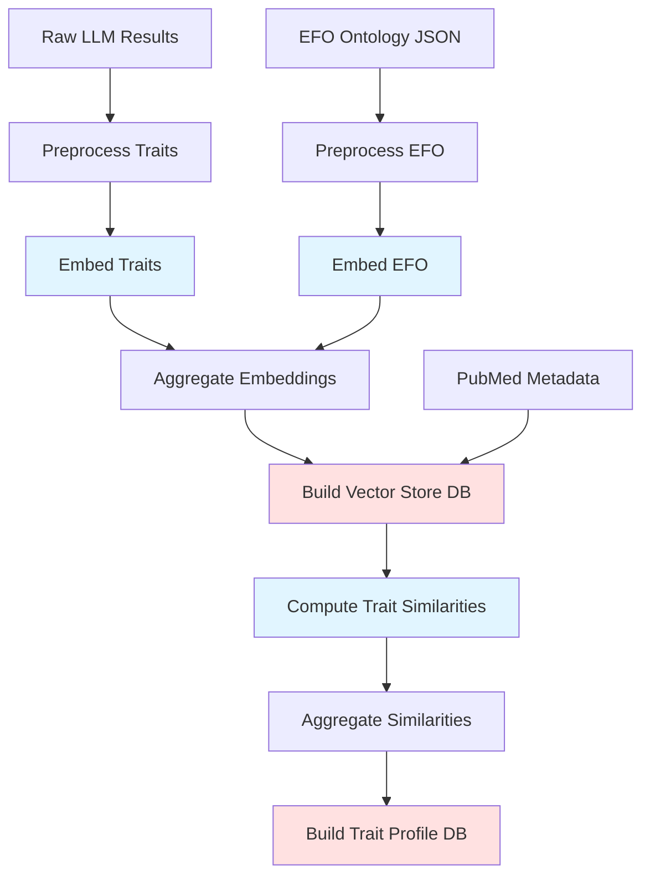
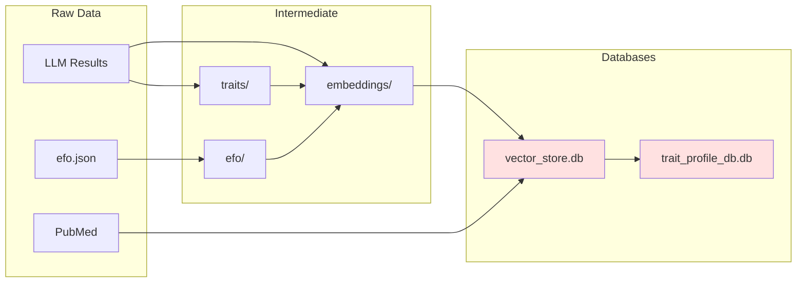

# MR-KG processing pipeline

This document describes the complete processing pipeline for MR-KG, including
detailed command reference, input/output specifications, and flag documentation
for each processing step.

## Pipeline overview

The processing pipeline transforms raw LLM extraction results and EFO ontology
data into queryable DuckDB databases through five main stages:



Legend: Blue = HPC batch jobs, Red = Database outputs

## Stage 1: Preprocessing

### Trait preprocessing

Extract unique trait labels from model results and create indexed mappings.

Command reference

Just recipe:

```bash
just preprocess-traits
```

Python script:

```bash
uv run scripts/main-processing/preprocess-traits.py [FLAGS]
```

Flags

`--dry-run`, `-n`

Perform dry run without processing.
Validates file paths and setup without executing the main processing logic.

Input files

`data/raw/llm-results-aggregated/<model>/processed_results_valid.json`

Raw LLM extraction results for each model.
The script processes results from: llama3, llama3-2, deepseek-r1-distilled,
gpt-4-1, o4-mini.

Output files

`data/processed/traits/unique_traits.csv`

CSV file containing indexed unique traits.
Columns: index (integer), trait (string).

`data/processed/model_results/processed_model_results.json`

Model results with linked indices added to traits.
Each trait now includes a linked_index field referencing the unique_traits
index.

Processing details

The script extracts trait labels from model exposures and outcomes, creates a
global trait index, and adds linked_index fields to all trait references in the
model data.

### EFO preprocessing

Extract term labels from EFO ontology.

Command reference

Just recipe:

```bash
just preprocess-efo
```

Python script:

```bash
uv run scripts/main-processing/preprocess-efo.py [FLAGS]
```

Flags

`--dry-run`, `-n`

Perform dry run without processing.
Validates file paths without executing processing.

Input files

`data/raw/efo/efo.json`

EFO ontology JSON file.
Download from <https://github.com/EBISPOT/efo/releases>.

Output files

`data/processed/efo/efo_terms.json`

Processed EFO terms.
JSON array containing objects with id and label fields.

Processing details

Extracts term IDs and labels from the EFO ontology JSON, filtering out terms
without labels.

## Stage 2: Embedding generation

### Trait embedding

Generate SciSpacy embeddings for trait labels.

Command reference

Just recipe (HPC submission):

```bash
just embed-traits
```

SLURM submission:

```bash
sbatch --account=${ACCOUNT_CODE} scripts/bc4/embed-traits.sbatch
```

Python script (for manual execution):

```bash
uv run scripts/main-processing/embed-traits.py [FLAGS]
```

Flags

`--dry-run`, `-n`

Perform dry run without processing.
Validates model paths and input files.

`--array-length <INT>`

Total number of array chunks for parallel processing.
Default: 10.

`--array-id <INT>`

Current array chunk ID (0-based indexing).
Default: 0.

`--output-dir <PATH>`

Output directory for embedding files.
Default: data/output.

Input files

`data/processed/traits/unique_traits.csv`

Unique traits from preprocessing stage.

`models/en_core_sci_lg-0.5.4/en_core_sci_lg/en_core_sci_lg-0.5.4/`

SciSpacy model for biomedical text processing.
Download from <https://s3-us-west-2.amazonaws.com/ai2-s2-scispacy>.

Output files

`<output-dir>/trait_vectors_chunk_<array-id>.json`

Chunk file containing trait embeddings.
Each record contains: index, trait, vector (200-dimensional).

HPC configuration

SLURM batch script: scripts/bc4/embed-traits.sbatch

Resources:

- Array size: 0-4 (5 chunks)
- Time limit: 10 hours
- Memory: 14GB per node
- Partition: mrcieu

Environment:

- Requires micromamba environment: mr-kg-processing
- Uses environment variable: ACCOUNT_CODE

Processing details

Loads SciSpacy model, processes trait labels in chunks, and generates
200-dimensional vectors.
Each array task processes a subset of traits based on chunk ID and array length.

### EFO embedding

Generate SciSpacy embeddings for EFO term labels.

Command reference

Just recipe (HPC submission):

```bash
just embed-efo
```

SLURM submission:

```bash
sbatch --account=${ACCOUNT_CODE} scripts/bc4/embed-efo.sbatch
```

Python script (for manual execution):

```bash
uv run scripts/main-processing/embed-efo.py [FLAGS]
```

Flags

`--dry-run`, `-n`

Perform dry run without processing.

`--array-length <INT>`

Total number of array chunks.
Default: 10.

`--array-id <INT>`

Current array chunk ID (0-based).
Default: 0.

`--output-dir <PATH>`

Output directory for embedding files.
Default: data/output.

Input files

`data/processed/efo/efo_terms.json`

EFO terms from preprocessing stage.

`models/en_core_sci_lg-0.5.4/en_core_sci_lg/en_core_sci_lg-0.5.4/`

SciSpacy model.

Output files

`<output-dir>/efo_vectors_chunk_<array-id>.json`

Chunk file containing EFO embeddings.
Each record contains: id, label, vector (200-dimensional).

HPC configuration

SLURM batch script: scripts/bc4/embed-efo.sbatch

Resources:

- Array size: 0-9 (10 chunks)
- Time limit: 5 hours
- Memory: 14GB per node
- Partition: mrcieu

Environment:

- Requires micromamba environment: mr-kg-processing
- Uses environment variable: ACCOUNT_CODE

Processing details

Similar to trait embedding but processes EFO term labels instead.

## Stage 3: Embedding aggregation

Combine embedding results from HPC array jobs.

Command reference

Just recipe:

```bash
just aggregate-embeddings
```

Python script:

```bash
uv run scripts/main-processing/aggregate-embeddings.py [FLAGS]
```

Flags

`--trait-results-dir <PATH>`

Directory containing trait embedding results.
Required.

`--efo-results-dir <PATH>`

Directory containing EFO embedding results.
Required.

`--dry-run`, `-n`

Perform dry run without processing.

Input files

`<trait-results-dir>/trait_vectors_chunk_*.json`

All trait embedding chunk files from HPC job.

`<efo-results-dir>/efo_vectors_chunk_*.json`

All EFO embedding chunk files from HPC job.

Output files

`data/processed/embeddings/traits.json`

Aggregated trait embeddings.
Format: Array of records with id (`trait_<index>`), label, vector.

`data/processed/embeddings/efo.json`

Aggregated EFO embeddings.
Format: Array of records with id, label, vector.

Processing details

Reads all chunk files, converts raw records to standardized EmbeddingRecord
format, and exports combined results.

## Stage 4: Vector store database

Build the main DuckDB vector store database.

Command reference

Just recipe:

```bash
just build-main-db
```

Python script:

```bash
uv run scripts/main-db/build-main-database.py [FLAGS]
```

Flags

`--dry-run`, `-n`

Perform dry run without creating database.
Validates all required input files exist.

`--database-name <NAME>`, `-db <NAME>`

Custom database name without .db extension.
If not provided, uses timestamp: `database-<timestamp>.db`.

`--force-write`, `-f`

Remove existing database before creating new one.
Without this flag, script will fail if database already exists.

Input files

`data/processed/embeddings/traits.json`

Aggregated trait embeddings.

`data/processed/embeddings/efo.json`

Aggregated EFO embeddings.

`data/processed/model_results/processed_model_results.json`

Model results with linked indices.

`data/processed/traits/unique_traits.csv`

Unique trait index.

`data/raw/mr-pubmed-data/mr-pubmed-data.json`

PubMed metadata for MR studies.

Output files

`data/db/<database-name>.db`

DuckDB vector store database containing tables: trait_embeddings,
efo_embeddings, model_results, model_result_traits, mr_pubmed_data.

Database schema

Tables:

trait_embeddings

Trait index, labels, and 200-dim vectors.
Primary key: trait_index.

efo_embeddings

EFO term IDs, labels, and 200-dim vectors.
Primary key: id.

model_results

Model extraction results with metadata.
Columns: id, model, pmid, metadata (JSON), results (JSON).

model_result_traits

Links model results to traits.
Foreign keys: model_result_id, trait_index.

mr_pubmed_data

PubMed metadata (title, abstract, journal, etc).
Primary key: pmid.

Views:

trait_similarity_search

Cross-join for trait-to-trait cosine similarity.

trait_efo_similarity_search

Cross-join for trait-to-EFO cosine similarity.

pmid_model_analysis

Comprehensive view joining model results, PubMed data, and traits.

trait_stats

Trait appearance counts across model results.

Processing details

Creates tables, populates with data, creates indexes for performance, and
validates schema.
The database supports efficient vector similarity search and trait analysis.

## Stage 5: Trait profile similarity

### Similarity computation

Compute pairwise trait profile similarities between studies.

Command reference

Just recipe (HPC submission):

```bash
just compute-trait-similarities
```

SLURM submission:

```bash
sbatch --account=${ACCOUNT_CODE} scripts/bc4/compute-trait-similarity.sbatch
```

Python script (for manual execution):

```bash
uv run scripts/trait-profile/compute-trait-similarity.py [FLAGS]
```

Flags

`--dry-run`, `-n`

Perform dry run without processing.

`--array-length <INT>`

Total number of array chunks.
Default: 10.

`--array-id <INT>`

Current array chunk ID (0-based).
Default: 0.

`--output-dir <PATH>`

Output directory for similarity files.
Default: data/output.

`--database-path <PATH>`

Path to DuckDB vector store database.
If not provided, uses latest `database-*.db` file.

`--top-k <INT>`

Number of top similar results to keep per combination.
Default: 10.

`--workers <INT>`

Number of worker processes for multiprocessing.
Default: 4.

Input files

`data/db/vector_store.db`

Vector store database from Stage 4.

Output files

`<output-dir>/trait_similarities_chunk_<array-id>.json`

Chunk file containing similarity results.
Each record contains query info and top-k similar combinations from same model.

HPC configuration

SLURM batch script: scripts/bc4/compute-trait-similarity.sbatch

Resources:

- Array size: 0-19 (20 chunks)
- Time limit: 24 hours
- Memory: 16GB per node
- CPUs per task: 8
- Partition: mrcieu

Environment:

- Requires micromamba environment: mr-kg-processing
- Uses environment variable: ACCOUNT_CODE

Processing details

Loads PMID-model combinations from database, computes trait profile similarity
(average maximum cosine similarity) and Jaccard similarity, keeps only top-k
results.
Uses multiprocessing for parallel computation.
Only compares within same model (e.g., gpt-4-1 vs gpt-4-1).

### Similarity aggregation

Combine similarity results from HPC array jobs.

Command reference

Just recipe:

```bash
just aggregate-trait-similarities
```

Python script:

```bash
uv run scripts/trait-profile/aggregate-trait-similarities.py [FLAGS]
```

Flags

`--input-dir <PATH>`

Directory containing chunk files from SLURM job array.
Required.
`--output-path <PATH>`

Output path for aggregated results.
Default: data/processed/trait-profile-similarities/trait-profile-similarities.json.

Input files

`<input-dir>/trait_similarities_chunk_*.json`

All similarity chunk files from HPC job.

Output files

`<output-path>`

Aggregated similarity data.
JSON array of all similarity records.

`<output-dir>/aggregation_stats.json`

Validation statistics.
Contains total records, unique queries, total similarities, averages.

Processing details

Loads all chunk files, validates completeness, and combines into single dataset.

### Profile database build

Create trait profile similarity database.

Command reference

Just recipe:

```bash
just build-trait-profile-db
```

Python script:

```bash
uv run scripts/trait-profile/build-trait-profile-database.py [FLAGS]
```

Flags

`--input-file <PATH>`

Path to trait profile similarities JSON file.
Default: data/processed/trait-profile-similarities/trait-profile-similarities.json.

`--dry-run`, `-n`

Perform dry run without creating database.

`--database-name <NAME>`, `-db <NAME>`

Custom database name without .db extension.
If not provided, uses timestamp: `trait-profile-db-<timestamp>.db`.

`--skip-indexes`

Skip index creation (for troubleshooting).

`--memory-limit <SIZE>`

Memory limit for DuckDB.
Default: 4GB.

`--force-write`

Remove existing database and create new one.

Input files

`data/processed/trait-profile-similarities/trait-profile-similarities.json`

Aggregated similarity data from previous step.

Output files

`data/db/<database-name>.db`

DuckDB trait profile similarity database.

Database schema

Tables:

query_combinations

PMID-model pairs with trait profiles.
Primary key: id.
Unique constraint: (pmid, model).

trait_similarities

Similarity relationships between combinations.
Foreign key: query_combination_id.

Views:

trait_similarity_analysis

Comprehensive similarity analysis with ranking.

model_similarity_stats

Per-model statistics (total combinations, avg trait count).

top_similarity_pairs

High-similarity pairs (similarity >= 0.8).

Processing details

Creates tables, populates data, creates indexes (skipping float indexes due to
DuckDB limitations), creates views, and validates database.

## Complete pipeline execution

### Full pipeline

Run all stages in sequence:

```bash
just pipeline-full
```

This executes:

1. just preprocess-traits
2. just preprocess-efo
3. just embed-traits (HPC)
4. just embed-efo (HPC)
5. just aggregate-embeddings
6. just build-main-db
7. just compute-trait-similarities (HPC)
8. just aggregate-trait-similarities
9. just build-trait-profile-db

### HPC workflow notes

HPC jobs create output directories:

```text
data/output/<prefix>-<SLURM_ARRAY_JOB_ID>/
  results/           Embedding or similarity chunk files
  logs/              SLURM logs and batch script copy
```

The aggregate-embeddings and aggregate-trait-similarities recipes are
hardcoded to specific experiment IDs.
Update these paths in the justfile based on actual HPC job IDs.

### Manual execution

For manual step-by-step execution without HPC:

Trait embedding (single chunk):

```bash
uv run scripts/main-processing/embed-traits.py \
  --array-length 1 \
  --array-id 0 \
  --output-dir data/output/local-trait-embed
```

EFO embedding (single chunk):

```bash
uv run scripts/main-processing/embed-efo.py \
  --array-length 1 \
  --array-id 0 \
  --output-dir data/output/local-efo-embed
```

Aggregate embeddings:

```bash
uv run scripts/main-processing/aggregate-embeddings.py \
  --trait-results-dir data/output/local-trait-embed \
  --efo-results-dir data/output/local-efo-embed
```

Trait similarity (single chunk):

```bash
uv run scripts/trait-profile/compute-trait-similarity.py \
  --array-length 1 \
  --array-id 0 \
  --output-dir data/output/local-trait-sim \
  --database-path data/db/vector_store.db \
  --workers 4
```

## Key processing scripts

### Script locations

```text
processing/scripts/
├── main-processing/     Core trait and EFO processing
│   ├── preprocess-traits.py
│   ├── preprocess-efo.py
│   ├── embed-traits.py
│   └── embed-efo.py
├── main-db/            Database building scripts
│   ├── build-main-database.py
│   └── query-database.py
├── trait-profile/      Similarity computation
│   ├── compute-trait-similarity.py
│   ├── aggregate-trait-similarities.py
│   └── build-trait-profile-database.py
└── bc4/               HPC batch job scripts
    ├── compute-trait-similarity.sbatch
    ├── embed-efo.sbatch
    └── embed-traits.sbatch
```

### Core scripts

- `preprocess-traits.py`: Extracts unique trait labels from all models,
  creates trait indices
- `preprocess-efo.py`: Processes EFO ontology JSON to extract term IDs and
  labels
- `embed-traits.py`: Generates embeddings for trait labels using spaCy models
- `build-main-database.py`: Creates vector_store.db with trait/EFO embeddings
  and model results
- `compute-trait-similarity.py`: Computes pairwise trait similarities
- `build-trait-profile-database.py`: Creates trait_profile_db.db for
  similarity analysis

## HPC integration

The pipeline uses SLURM batch jobs for computationally intensive tasks.

### Requirements

- Environment variable `ACCOUNT_CODE` required for HPC submissions
- Results stored in `data/output/` with experiment IDs
- SLURM job definitions in `scripts/bc4/*.sbatch`

### HPC workflow

1. Trait embedding: Distributes trait embedding generation across HPC nodes
2. EFO embedding: Generates EFO term embeddings in parallel
3. Similarity computation: Computes pairwise trait similarities using HPC
   resources
4. Result aggregation: Combines distributed results into final databases

### HPC configuration

```bash
export ACCOUNT_CODE=your-hpc-account

sbatch scripts/bc4/embed-traits.sbatch
sbatch scripts/bc4/embed-efo.sbatch
sbatch scripts/bc4/compute-trait-similarity.sbatch
```

## Output databases

See @docs/processing/databases.md for architecture details and
@docs/processing/db-schema.md for schema reference.

### Vector store database

Path: `data/db/vector_store.db`

Primary database containing trait embeddings, EFO embeddings, and model
extraction results with optimized views for similarity search.

### Trait profile database

Path: `data/db/trait_profile_db.db`

Precomputed trait-to-trait similarities for study network analysis.
See @docs/processing/trait-similarity.md for similarity methodology.

## Data flow



Directories:

- `data/raw/`: Source data (EFO, LLM outputs, PubMed)
- `data/processed/`: Normalized traits, embeddings, indices
- `data/output/`: HPC job results
- `data/db/`: Final database files

See @docs/DATA.md for complete data structure.
