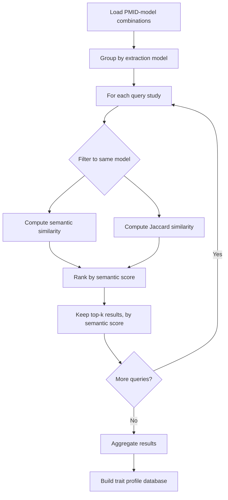

# Trait profile similarity

See processing/README.md for complete processing pipeline workflow.

## Overview

Trait profile similarity is a method for comparing studies based on the exposure and outcome traits they investigate.
Each study (identified by PMID and extraction model) is represented by a trait profile: a combined set of exposure and outcome traits extracted from the study's content.
This enables discovery of studies with similar research focuses and construction of a network of related research.

Studies investigating similar trait combinations are more likely to:

- Address related research questions
- Have complementary findings
- Be relevant for meta-analyses or systematic reviews

By comparing trait profiles, we can discover these relationships even when studies use different terminology or are published in different domains.

### Model-specific comparisons

Trait profiles are computed per extraction model (e.g., gpt-4-1, llama3).
Comparisons are performed only within the same model to ensure consistency in extraction methodology.
This design choice prevents artifacts from model differences influencing similarity measures.

## Similarity metrics

We use two complementary metrics to measure trait profile similarity:

### 1. Semantic similarity

Definition: Average of maximum cosine similarities between trait embeddings.

Rationale: Captures semantic overlap between trait sets using high-dimensional vector representations.
This metric recognizes that different trait terms may refer to similar concepts (e.g., "body mass index" and "BMI").

Formula:

Given two trait profiles $A = \{a_1, a_2, \ldots, a_n\}$ and $B = \{b_1, b_2, \ldots, b_m\}$ with corresponding embedding vectors $\mathbf{v}_{a_i}$ and $\mathbf{v}_{b_j}$, the semantic similarity is:

$$
S_{\text{semantic}}(A, B) = \frac{1}{|A|} \sum_{i=1}^{|A|} \max_{j=1,\ldots,|B|} \cos(\mathbf{v}_{a_i}, \mathbf{v}_{b_j})
$$

where:
- $|A|$ denotes the cardinality (number of elements) in set $A$
- $\cos(\mathbf{v}_{a_i}, \mathbf{v}_{b_j}) = \frac{\mathbf{v}_{a_i} \cdot \mathbf{v}_{b_j}}{\|\mathbf{v}_{a_i}\| \|\mathbf{v}_{b_j}\|}$ is the cosine similarity between embeddings

Computation:

1. For each trait in A (query traits), find its most similar trait in B (comparison traits) using cosine similarity of embeddings
2. Average these maximum similarities across all traits in A

Range: 0 to 1, where 1 indicates perfect semantic alignment

Edge cases:

- If either trait set is empty, returns 0.0

### 2. Jaccard similarity

Definition: Size of intersection divided by size of union of trait sets.

Rationale: Provides a set-based measure of overlap that is independent of trait order and embedding quality.
This metric is more conservative, requiring exact trait index matches.

Formula:

Given two trait profiles $A$ and $B$ (represented as sets of trait indices), the Jaccard similarity is:

$$
J(A, B) = \frac{|A \cap B|}{|A \cup B|}
$$

where:
- $|A \cap B|$ is the cardinality (size) of the intersection: the number of trait indices present in both sets
- $|A \cup B|$ is the cardinality (size) of the union: the total number of unique trait indices across both sets

Range: 0 to 1, where 1 indicates identical trait sets

Edge cases:

- If both trait sets are empty, returns 1.0 (both are identical)
- If one trait set is empty while the other is not, returns 0.0

Advantages:

- Simple and interpretable
- Does not depend on embedding quality
- Complementary to semantic similarity

## Workflow

The trait similarity computation follows these steps:

### Data preparation

1. Load PMID-model combinations from database
2. Each record contains:
   - Study identifier (PMID)
   - Extraction model used
   - Study title
   - List of extracted traits with embeddings

### Pairwise comparison

For each query PMID-model combination:

1. Filter comparison candidates to same model only
2. For each candidate (excluding self-comparison):
   - Compute semantic similarity using trait embeddings
   - Compute Jaccard similarity using trait indices
3. Rank candidates by semantic similarity score (descending)
4. Keep top-k most similar results (default k=10)

### Parallel processing

The workload is distributed using SLURM job arrays:

- Total combinations divided into N chunks
- Each job processes one chunk independently
- Within each job, multiprocessing parallelizes query processing
- Results saved as separate JSON files per chunk

### Output structure

Each query produces a record containing:

- Query metadata (PMID, model, title)
- Query trait count
- Top-k similar studies with:
  - Similar study metadata
  - Semantic similarity score
  - Jaccard similarity score
  - Trait counts for comparison

## See also

- Key terms and concepts: docs/GLOSSARY.md
- Evidence profile similarity: docs/processing/evidence-profile-similarity.md
- Processing pipeline: docs/processing/pipeline.md
