# Component architecture

This document details the component architecture for both backend and
frontend systems in MR-KG.

## Backend architecture

### Overview

The backend follows a layered architecture with clear separation of concerns:

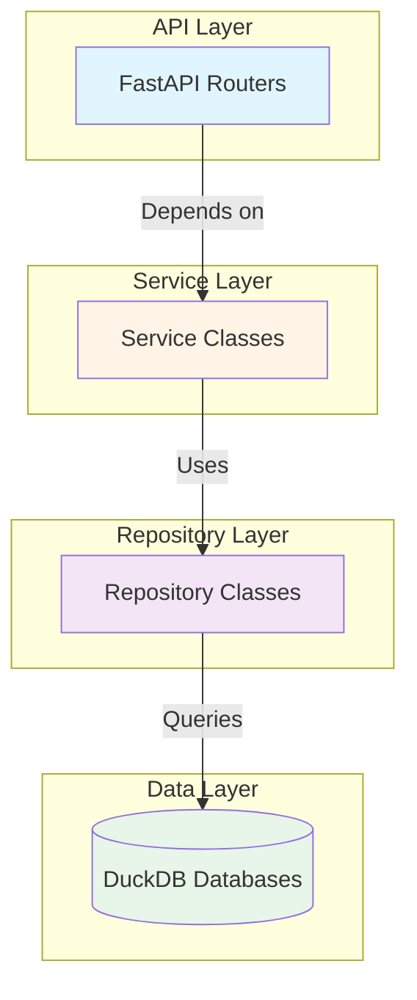

### API endpoints

Backend API endpoints are organized by domain under `backend/app/api/v1/`.

#### Health endpoints

Location: `backend/app/api/v1/health.py:router`

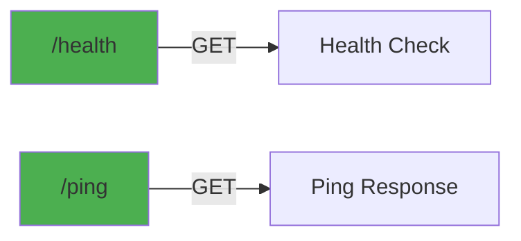

Endpoints:
- `GET /health` - System health check with database status
- `GET /ping` - Simple ping response

#### System endpoints

Location: `backend/app/api/v1/system.py:router`

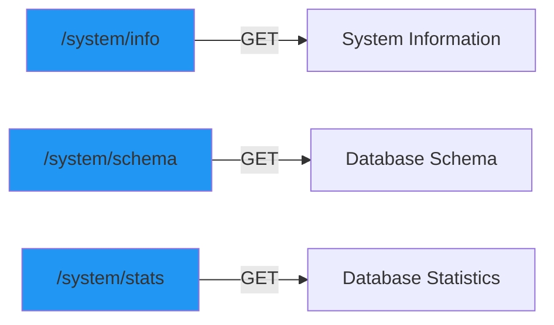

Endpoints:
- `GET /system/info` - System version and environment info
- `GET /system/schema` - Database schema information
- `GET /system/stats` - Database statistics

#### Traits endpoints

Location: `backend/app/api/v1/traits.py:router`

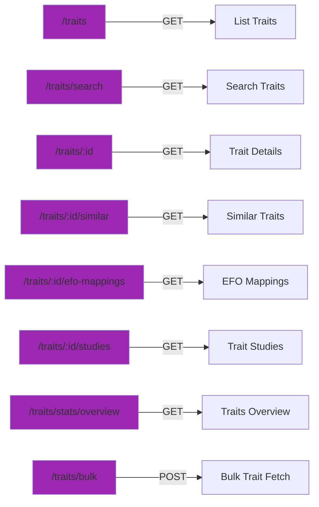

Key endpoints:
- `GET /traits` - Paginated list of traits with filtering
- `GET /traits/search?q=<query>` - Full-text search for traits
- `GET /traits/{trait_index}` - Detailed trait information
- `GET /traits/{trait_index}/similar` - Vector similarity search
- `GET /traits/{trait_index}/efo-mappings` - EFO term mappings
- `GET /traits/{trait_index}/studies` - Studies containing trait
- `GET /traits/stats/overview` - Aggregate statistics
- `POST /traits/bulk` - Fetch multiple traits by indices

#### Studies endpoints

Location: `backend/app/api/v1/studies.py:router`

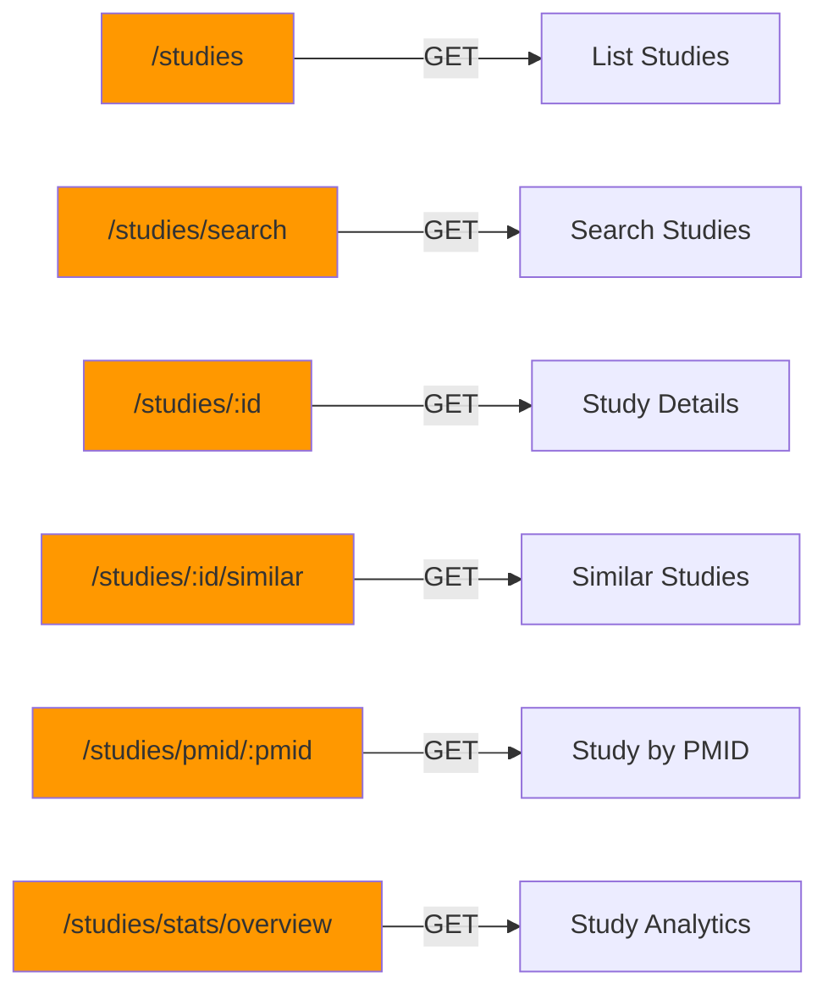

Key endpoints:
- `GET /studies` - Paginated list of studies with filtering
- `GET /studies/search?q=<query>` - Full-text search for studies
- `GET /studies/{study_id}` - Study details by internal ID
- `GET /studies/pmid/{pmid}?model=<model>` - Study by PMID and model
- `GET /studies/{study_id}/similar` - Similar studies
- `GET /studies/stats/overview` - Study analytics

#### Similarities endpoints

Location: `backend/app/api/v1/similarities.py:router`

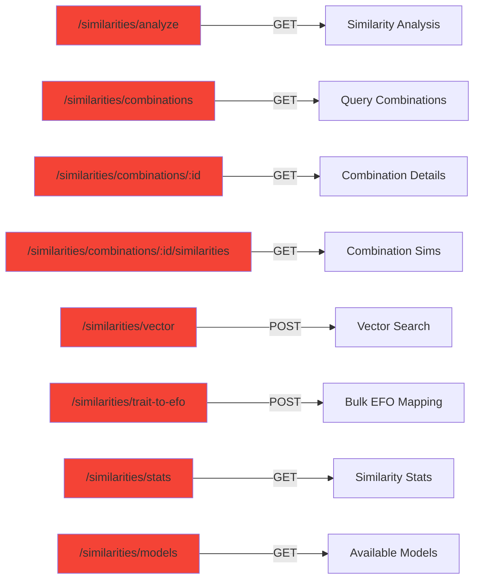

Key endpoints:
- `GET /similarities/analyze?pmid=<pmid>&model=<model>` - Analyze
  similarity for PMID-model combination
- `GET /similarities/combinations` - Search available combinations
- `GET /similarities/combinations/{id}` - Combination details
- `GET /similarities/combinations/{id}/similarities` - Get similarities
- `POST /similarities/vector` - Vector similarity search
- `POST /similarities/trait-to-efo` - Bulk trait to EFO mapping
- `GET /similarities/stats` - Similarity statistics
- `GET /similarities/models` - Available models

### Service layer

Services are located in `backend/app/services/database_service.py`.

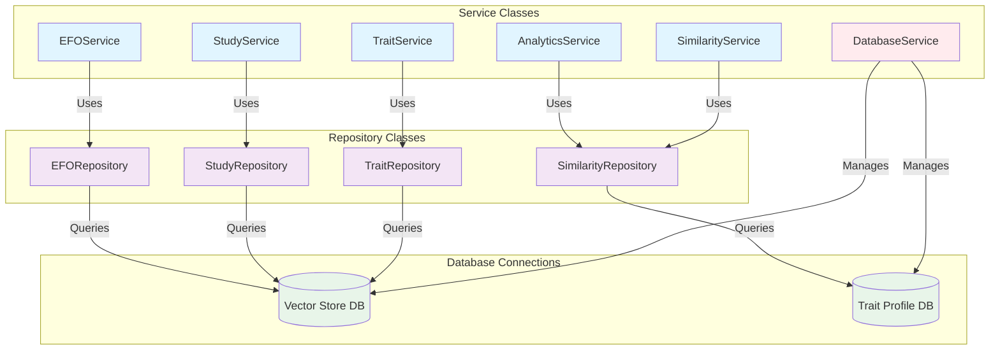

#### Service responsibilities

**TraitService**: Trait operations and statistics
- Methods: `get_traits()`, `search_traits()`, `get_trait_by_index()`,
  `get_trait_studies()`, `get_similar_traits()`, `get_trait_efo_mappings()`,
  `get_traits_overview()`, `get_traits_bulk()`

**StudyService**: Study operations and analytics
- Methods: `get_studies()`, `search_studies()`, `get_study_by_id()`,
  `get_study_by_pmid_model()`, `get_similar_studies()`,
  `get_study_traits()`, `get_study_analytics()`

**SimilarityService**: Similarity computations
- Methods: `get_query_combinations()`, `get_combination_by_id()`,
  `get_combination_similarities()`, `analyze_similarity()`,
  `vector_similarity_search()`, `bulk_trait_to_efo_mapping()`

**EFOService**: EFO term operations
- Methods: `get_efo_terms()`, `search_efo_terms()`, `get_efo_by_id()`,
  `get_similar_efo_terms()`

**AnalyticsService**: Cross-domain analytics
- Methods: `get_similarity_statistics()`, `get_trait_model_distribution()`,
  `get_study_temporal_distribution()`

**DatabaseService**: Database connection management
- Methods: `get_vector_store_connection()`,
  `get_trait_profile_connection()`, `close_connections()`

### Database access patterns

Services access databases through repository classes that encapsulate SQL
queries.

#### Vector store database (`main.duckdb`)

Tables and views accessed:

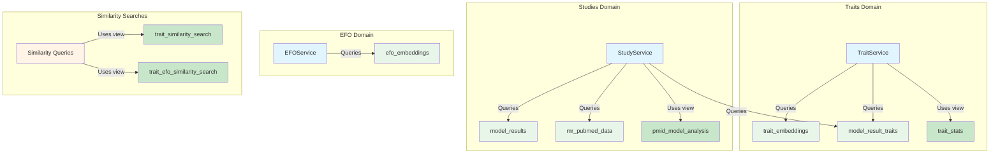

**TraitService table usage**:
- `trait_embeddings`: Columns `trait_index`, `trait_label`, `vector`,
  `appearance_count`
- `model_result_traits`: Columns `trait_index`, `model_result_id`
- `trait_stats` (view): Columns `trait_index`, `trait_label`,
  `appearance_count`, `study_count`, `model_distribution`

**StudyService table usage**:
- `model_results`: Columns `id`, `pmid`, `model`, `journal`,
  `publication_date`, `results_json`, `trait_count`
- `model_result_traits`: Columns `model_result_id`, `trait_index`
- `mr_pubmed_data`: Columns `pmid`, `title`, `authors`, `journal`,
  `publication_date`, `abstract`, `doi`
- `pmid_model_analysis` (view): Columns `pmid`, `model`, `title`,
  `journal`, `publication_date`, `trait_count`

**EFOService table usage**:
- `efo_embeddings`: Columns `id`, `label`, `description`, `vector`

**Similarity search views**:
- `trait_similarity_search`: Used for trait-to-trait vector similarity
- `trait_efo_similarity_search`: Used for trait-to-EFO mapping

#### Trait profile database (`trait-similarities.duckdb`)

Tables accessed:

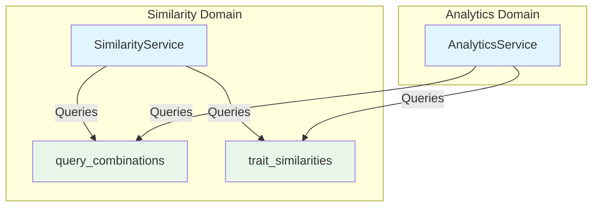

**SimilarityService table usage**:
- `query_combinations`: Columns `id`, `pmid`, `model`, `title`,
  `trait_count`
- `trait_similarities`: Columns `id`, `query_combination_id`,
  `similar_pmid`, `similar_model`, `similar_title`,
  `trait_profile_similarity`, `trait_jaccard_similarity`,
  `query_trait_count`, `similar_trait_count`

**AnalyticsService table usage**:
- `query_combinations`: Aggregate queries for model distribution
- `trait_similarities`: Statistical queries for similarity distributions

## Frontend architecture

### Overview

The frontend is built with Vue 3, TypeScript, and Tailwind CSS following a
component-based architecture.

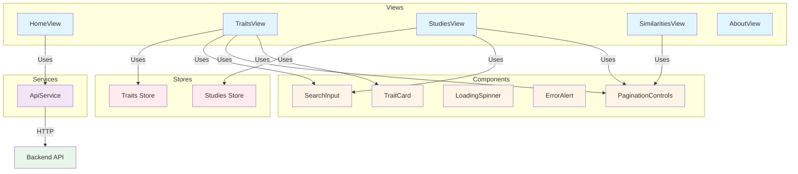

### View components

Main views are located in `frontend/src/views/`.

#### HomeView

Location: `frontend/src/views/HomeView.vue`

Landing page with navigation to main features.

#### TraitsView

Location: `frontend/src/views/TraitsView.vue`

Browse and search traits with the following features:
- Paginated trait list using `TraitCard` components
- Search functionality via `SearchInput` component
- Filtering by appearance count
- Sorting options
- Integration with `ApiService.getTraits()` and
  `ApiService.searchTraits()`

#### StudiesView

Location: `frontend/src/views/StudiesView.vue`

Browse and search studies with:
- Paginated study list
- Search and filtering (by model, journal, date range)
- Study details modal
- Integration with `ApiService.getStudies()` and
  `ApiService.searchStudies()`

#### SimilaritiesView

Location: `frontend/src/views/SimilaritiesView.vue`

Explore trait and study similarities with:
- Similarity pair browsing
- Model filtering
- Similarity threshold filtering
- Integration with `ApiService.getTopSimilarities()`

#### AboutView

Location: `frontend/src/views/AboutView.vue`

Project information and documentation.

### Reusable components

Shared components are located in `frontend/src/components/`.

#### TraitCard

Location: `frontend/src/components/trait/TraitCard.vue`

Displays trait information in card format.

**Props**:
- `trait`: TraitListItem - Trait data
- `statistics?`: TraitStats - Additional statistics
- `selectable?`: boolean - Enable selection checkbox
- `isSelected?`: boolean - Selection state
- `showActions?`: boolean - Show actions menu
- `showStats?`: boolean - Display statistics section
- `showSimilarAction?`: boolean - Show similar traits button
- `allowCompactToggle?`: boolean - Enable compact mode
- `size?`: 'sm' | 'md' | 'lg' - Card size variant
- `clickable?`: boolean - Enable card click events

**Emits**:
- `view-details`: User clicks details button
- `find-similar`: User clicks similar button
- `selection-change`: Checkbox state changes
- `menu-click`: Action menu clicked
- `click`: Card clicked

**Features**:
- Appearance count badge with color coding
- Optional statistics display (study count, model distribution)
- Action buttons (view details, find similar)
- Compact mode toggle
- Selection checkbox support

#### PaginationControls

Location: `frontend/src/components/common/PaginationControls.vue`

Pagination component for navigating paginated data.

#### LoadingSpinner

Location: `frontend/src/components/common/LoadingSpinner.vue`

Loading indicator component.

#### ErrorAlert

Location: `frontend/src/components/common/ErrorAlert.vue`

Error message display component.

#### SearchInput

Location: `frontend/src/components/common/SearchInput.vue`

Search input with debounce support.

### API service

Location: `frontend/src/services/api.ts`

The `ApiService` class provides a centralized interface for backend
communication.

#### Architecture

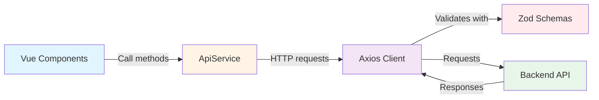

#### Key features

- Singleton pattern (`export const apiService = new ApiService()`)
- Axios-based HTTP client with interceptors
- Request/response logging
- Zod schema validation for type safety
- Centralized error handling
- Base URL configuration via environment variable
  `VITE_API_BASE_URL`

#### Method categories

**Health and System**:
- `ping()`, `getVersion()`, `getHealth()`
- `getSystemInfo()`, `getDatabaseSchema()`, `getDatabaseStats()`

**Traits**:
- `getTraits()`, `searchTraits()`, `getTraitDetails()`
- `getSimilarTraits()`, `getTraitEfoMappings()`, `getTraitStudies()`
- `getTraitsOverview()`, `getTraitsBulk()`

**Studies**:
- `getStudies()`, `searchStudies()`, `getStudyDetails()`
- `getStudyByPmid()`, `getSimilarStudies()`, `getStudiesAnalytics()`

**Similarities**:
- `getTopSimilarities()`, `searchSimilarities()`
- `getTraitSimilarities()`, `getStudySimilarities()`
- `getSimilaritiesOverview()`

### State management

Pinia stores are located in `frontend/src/stores/`.

#### Studies store

Location: `frontend/src/stores/studies.ts`

Manages studies state including:
- Current studies list
- Pagination state
- Search filters
- Loading states
- Selected study details

#### Traits store

Location: `frontend/src/stores/traits.ts`

Manages traits state including:
- Current traits list
- Pagination state
- Search filters
- Loading states
- Selected trait details

### Backend integration flow

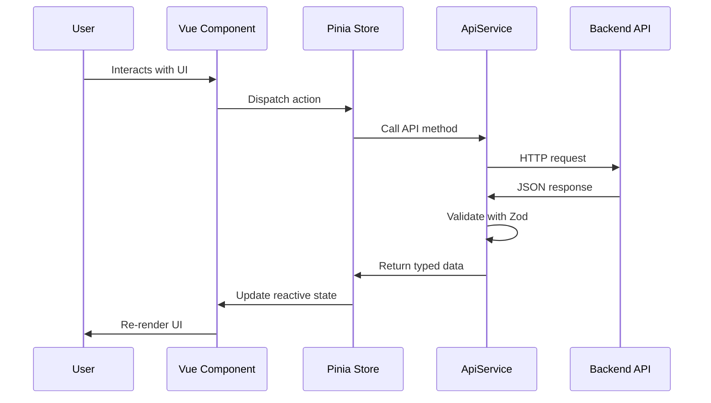

**Example flow for trait search**:

1. User enters search query in `SearchInput` component
2. `TraitsView` debounces input and calls store action
3. Traits store calls `apiService.searchTraits()`
4. `ApiService` sends GET request to `/api/v1/traits/search`
5. Backend `traits.py:search_traits()` endpoint processes request
6. `TraitService.search_traits()` queries `trait_embeddings` table
7. Response validated against `TraitsListResponseSchema`
8. Store updates reactive state with results
9. `TraitsView` re-renders with new `TraitCard` components
10. `PaginationControls` updated with new page info
