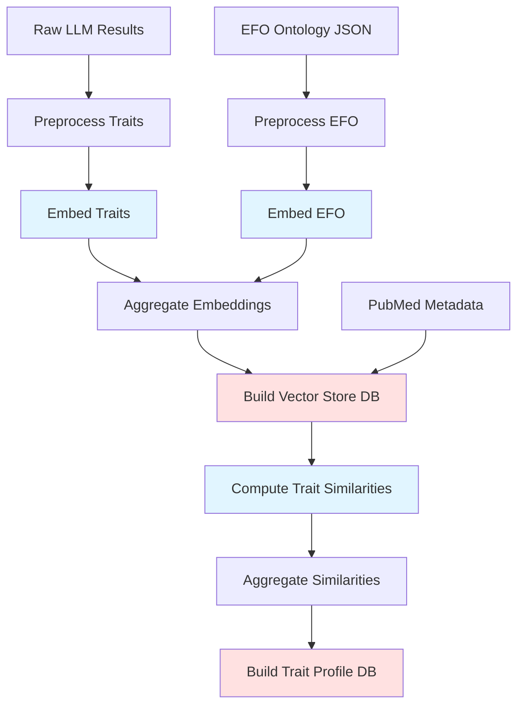
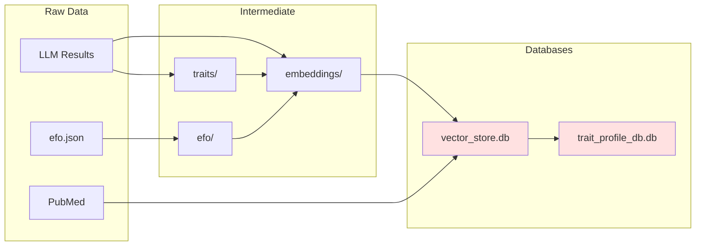

# MR-KG Processing Pipeline

Complete guide for the ETL processing pipeline that creates MR-KG databases from raw LLM results and EFO ontology data.

See @docs/SETTING-UP.md for initial repo setup.
See @docs/ENV.md for environment variables (ACCOUNT_CODE and others).

## Overview

The processing pipeline transforms raw inputs into vectorized databases consumed by the web stack:



**Legend**: Blue = HPC batch jobs, Red = Database outputs

**Key stages**:

1. **Preprocessing**: Normalize traits and EFO terms, create indices
2. **Embedding**: Generate 200-dim vectors using SciSpaCy (HPC)
3. **Database build**: Create vector_store.db with embeddings and results
4. **Similarity**: Compute trait profile similarities (HPC)
5. **Profile database**: Create trait_profile_db.db for network analysis

## Quick Start - Complete Pipeline

Run the complete processing pipeline with a single command:

```bash
just pipeline-full
```

This executes all steps in correct order, including HPC batch job submissions.

## Prerequisites

### Models Setup

```bash
cd models
wget https://s3-us-west-2.amazonaws.com/ai2-s2-scispacy/releases/v0.5.4/en_core_sci_lg-0.5.4.tar.gz
# Extract the model files
```

### Data Setup

```bash
# Download EFO ontology
wget https://github.com/EBISPOT/efo/releases/download/v3.80.0/efo.json
mv efo.json data/raw/
```

### Processing Environment

```bash
cd processing
uv sync               # Install dependencies
```

## Manual Step-by-Step Process

For more control or debugging, run individual steps:

### Main Processing

#### Preprocessing

Extract and normalize traits and EFO data:

```bash
just preprocess-traits    # Extract unique traits, create indices
just preprocess-efo       # Process EFO ontology
```

#### Embedding Generation

Generate embeddings for traits and EFO terms:

```bash
just embed-traits         # Generate trait embeddings (SLURM batch)
just embed-efo           # Generate EFO embeddings (SLURM batch)
```

#### Aggregate Embeddings

Combine HPC embedding results:

```bash
just aggregate-embeddings # Combine HPC results
```

### Database Building

Create the main vector store database:

```bash
just build-main-db        # Create vector_store.db
```

### Trait Profile Analysis

#### Compute Similarities

Generate trait-trait similarity matrices:

```bash
just compute-trait-similarities     # Compute similarities (SLURM batch)
```

#### Aggregate and Build Profile Database

Process similarity results and build final database:

```bash
just aggregate-trait-similarities   # Combine similarity results
just build-trait-profile-db         # Create trait_profile_db.db
```

## Key Processing Scripts

### Core Scripts

- `preprocess-traits.py`: Extracts unique trait labels from all models, creates trait indices
- `preprocess-efo.py`: Processes EFO ontology JSON to extract term IDs and labels
- `embed-traits.py`: Generates embeddings for trait labels using spaCy models
- `build-main-database.py`: Creates vector_store.db with trait/EFO embeddings and model results
- `compute-trait-similarity.py`: Computes pairwise trait similarities
- `build-trait-profile-database.py`: Creates trait_profile_db.db for similarity analysis

### Script Locations

```
processing/scripts/
├── main-processing/     # Core trait and EFO processing
│   ├── preprocess-traits.py
│   ├── preprocess-efo.py
│   ├── embed-traits.py
│   └── embed-efo.py
├── main-db/            # Database building scripts
│   ├── build-main-database.py
│   └── query-database.py
├── trait-profile/      # Similarity computation
│   ├── compute-trait-similarity.py
│   ├── aggregate-trait-similarities.py
│   └── build-trait-profile-database.py
└── bc4/               # HPC batch job scripts
    ├── compute-trait-similarity.sbatch
    ├── embed-efo.sbatch
    └── embed-traits.sbatch
```

## HPC Integration

The pipeline uses SLURM batch jobs for computationally intensive tasks:

### Requirements

- Environment variable `ACCOUNT_CODE` required for HPC submissions
- Results stored in `data/output/` with experiment IDs
- SLURM job definitions in `scripts/bc4/*.sbatch`

### HPC Workflow

1. **Trait Embedding**: Distributes trait embedding generation across HPC nodes
2. **EFO Embedding**: Generates EFO term embeddings in parallel
3. **Similarity Computation**: Computes pairwise trait similarities using HPC resources
4. **Result Aggregation**: Combines distributed results into final databases

### HPC Configuration

```bash
# Required environment variable
export ACCOUNT_CODE=your-hpc-account

# Batch job submission
sbatch scripts/bc4/embed-traits.sbatch
sbatch scripts/bc4/embed-efo.sbatch
sbatch scripts/bc4/compute-trait-similarity.sbatch
```

## Output Databases

See @processing/docs/databases.md for architecture details and @processing/docs/db_schema.md for schema reference.

### Vector Store Database

**Path**: `data/db/vector_store.db`

Primary database containing trait embeddings, EFO embeddings, and model
extraction results with optimized views for similarity search.

### Trait Profile Database

**Path**: `data/db/trait_profile_db.db`

Precomputed trait-to-trait similarities for study network analysis.
See @processing/docs/trait-profile-similarity.md for similarity methodology.

## Development Tools

### Code Quality

```bash
just ruff                # Format and lint
just ty                  # Type checking
```

### Database Inspection

```bash
just describe-db         # Database inspection
# Outputs to data/assets/database_schema/database_info.txt
```

### Pipeline Status

```bash
# Check processing status and intermediate files
ls data/processed/       # Intermediate processing artifacts
ls data/output/          # HPC job outputs
ls data/db/             # Final database files
```

## Troubleshooting

### Common Issues

- **Missing models**: Ensure spaCy models are downloaded and extracted
- **HPC account**: Set `ACCOUNT_CODE` environment variable for batch jobs
- **Disk space**: Processing generates large intermediate files
- **Memory**: Embedding generation requires substantial RAM

### Debug Mode

Run individual scripts with increased verbosity:

```bash
cd processing
uv run python scripts/main-processing/preprocess-traits.py --verbose
uv run python scripts/main-db/build-main-database.py --debug
```

## Data Flow



**Directories**:
- `data/raw/`: Source data (EFO, LLM outputs, PubMed)
- `data/processed/`: Normalized traits, embeddings, indices
- `data/output/`: HPC job results
- `data/db/`: Final database files

See @docs/DATA.md for complete data structure.

## Documentation

### Technical References

- **Database schema**: @processing/docs/db_schema.md (auto-generated, regenerate with `just generate-schema-docs`)
- **Trait profile similarity concepts**: @processing/docs/trait-profile-similarity.md
- **Vector store details**: @processing/docs/databases.md

### External References

- Shared schema definitions: @src/common_funcs/common_funcs/schema/database_schema.py
- Environment configuration: @docs/ENV.md
- System architecture: @docs/ARCHITECTURE.md
- Data structure details: @docs/DATA.md
