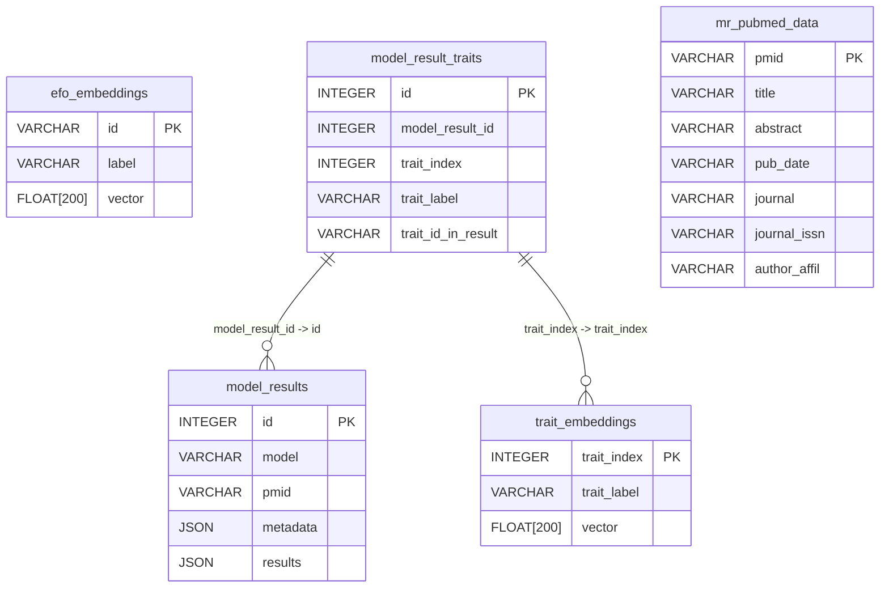

# Database schema

Auto-generated documentation from schema definitions.

## Overview



## Quick reference

| Table | Description | Key Columns |
|-------|-------------|-------------|
| `trait_embeddings` | Trait embeddings indexed by unique_traits | trait_index |
| `efo_embeddings` | EFO (Experimental Factor Ontology) term embeddings | id |
| `model_results` | Extracted structural data from model results organized by PMID | id |
| `model_result_traits` | Links model results to traits based on unique_traits indices | id |
| `mr_pubmed_data` | Raw PubMed metadata for papers with MR analysis | pmid |


## Tables

### trait_embeddings

Trait embeddings indexed by unique_traits.csv indices

**Columns:**

- **`trait_index`** (INTEGER, NOT NULL) (PRIMARY KEY)

- **`trait_label`** (VARCHAR, NOT NULL)

- **`vector`** (FLOAT[200], NOT NULL)

### efo_embeddings

EFO (Experimental Factor Ontology) term embeddings

**Columns:**

- **`id`** (VARCHAR, NOT NULL) (PRIMARY KEY)

- **`label`** (VARCHAR, NOT NULL)

- **`vector`** (FLOAT[200], NOT NULL)

### model_results

Extracted structural data from model results organized by PMID

**Columns:**

- **`id`** (INTEGER, NOT NULL) (PRIMARY KEY)

- **`model`** (VARCHAR, NOT NULL)

- **`pmid`** (VARCHAR, NOT NULL)

- **`metadata`** (JSON, NOT NULL)

- **`results`** (JSON, NOT NULL)

### model_result_traits

Links model results to traits based on unique_traits indices

**Columns:**

- **`id`** (INTEGER, NOT NULL) (PRIMARY KEY)

- **`model_result_id`** (INTEGER, NOT NULL)

- **`trait_index`** (INTEGER, NOT NULL)

- **`trait_label`** (VARCHAR, NOT NULL)

- **`trait_id_in_result`** (VARCHAR, nullable)

**Foreign Keys:**

- `model_result_id` -> `model_results.id`
- `trait_index` -> `trait_embeddings.trait_index`

### mr_pubmed_data

Raw PubMed metadata for papers with MR analysis

**Columns:**

- **`pmid`** (VARCHAR, NOT NULL) (PRIMARY KEY)

- **`title`** (VARCHAR, NOT NULL)

- **`abstract`** (VARCHAR, NOT NULL)

- **`pub_date`** (VARCHAR, NOT NULL)

- **`journal`** (VARCHAR, NOT NULL)

- **`journal_issn`** (VARCHAR, nullable)

- **`author_affil`** (VARCHAR, nullable)

## Indexes

Performance optimization indexes:

### efo_embeddings

- **`idx_efo_embeddings_label`** on (label)

### model_result_traits

- **`idx_model_result_traits_trait_index`** on (trait_index)

- **`idx_model_result_traits_model_result_id`** on (model_result_id)

- **`idx_model_result_traits_trait_label`** on (trait_label)

### model_results

- **`idx_model_results_model`** on (model)

- **`idx_model_results_pmid`** on (pmid)

### mr_pubmed_data

- **`idx_mr_pubmed_data_pmid`** on (pmid)

- **`idx_mr_pubmed_data_journal`** on (journal)

- **`idx_mr_pubmed_data_pub_date`** on (pub_date)

### trait_embeddings

- **`idx_trait_embeddings_label`** on (trait_label)

- **`idx_trait_embeddings_index`** on (trait_index)

## Views

Pre-computed views for common queries:

### trait_similarity_search

**SQL Definition:**

```sql
SELECT
            t1.trait_index as query_id,
            t1.trait_label as query_label,
            t2.trait_index as result_id,
            t2.trait_label as result_label,
            array_cosine_similarity(t1.vector, t2.vector) as similarity
        FROM trait_embeddings t1
        CROSS JOIN trait_embeddings t2
        WHERE t1.trait_index != t2.trait_index
```

### trait_efo_similarity_search

**SQL Definition:**

```sql
SELECT
            t.trait_index as trait_index,
            t.trait_label as trait_label,
            e.id as efo_id,
            e.label as efo_label,
            array_cosine_similarity(t.vector, e.vector) as similarity
        FROM trait_embeddings t
        CROSS JOIN efo_embeddings e
```

### pmid_model_analysis

**SQL Definition:**

```sql
SELECT
            mr.pmid,
            mr.model,
            mr.id as model_result_id,
            mr.metadata,
            mr.results,
            mpd.title,
            mpd.abstract,
            mpd.pub_date,
            mpd.journal,
            mpd.journal_issn,
            mpd.author_affil,
            COALESCE(
                LIST(
                    STRUCT_PACK(
                        trait_index := mrt.trait_index,
                        trait_label := mrt.trait_label,
                        trait_id_in_result := mrt.trait_id_in_result
                    )
                ) FILTER (WHERE mrt.trait_index IS NOT NULL),
                []
            ) as traits
        FROM model_results mr
        LEFT JOIN mr_pubmed_data mpd ON mr.pmid = mpd.pmid
        LEFT JOIN model_result_traits mrt ON mr.id = mrt.model_result_id
        GROUP BY 
            mr.pmid, mr.model, mr.id, mr.metadata, mr.results,
            mpd.title, mpd.abstract, mpd.pub_date, mpd.journal, 
            mpd.journal_issn, mpd.author_affil
```
