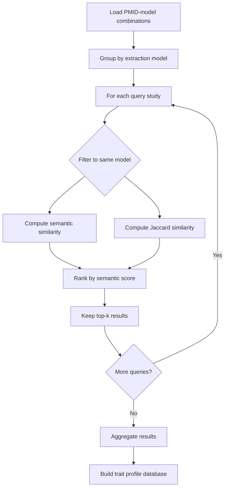

# Trait profile similarity

See @processing/README.md for complete processing pipeline workflow.

## Overview

Trait profile similarity is a method for comparing studies based on the
traits they investigate. Each study (identified by PMID and extraction
model) is represented by a trait profile - a set of traits extracted
from the study's content. This allows us to find studies with similar
research focuses and build a network of related research.

## Scientific rationale

### Why trait profiles?

In Mendelian randomization (MR) research, studies focus on specific
traits or outcomes. Two studies investigating similar traits are more
likely to:

- Address related research questions
- Share methodological approaches
- Have complementary findings
- Be relevant for meta-analyses or systematic reviews

By comparing trait profiles, we can discover these relationships even
when studies use different terminology or are published in different
domains.

### Model-specific comparisons

Trait profiles are computed per extraction model (e.g., gpt-4-1,
claude-3). Comparisons are performed only within the same model to
ensure consistency in extraction methodology. This design choice
prevents artifacts from model differences influencing similarity
measures.

## Similarity metrics

We use two complementary metrics to measure trait profile similarity:

### 1. Semantic similarity

**Definition**: Average of maximum cosine similarities between trait
embeddings.

**Rationale**: Captures semantic overlap between trait sets using
high-dimensional vector representations. This metric recognizes that
different trait terms may refer to similar concepts (e.g., "body mass
index" and "BMI").

**Computation**:
1. For each trait in the query profile, find its most similar trait in
   the comparison profile using cosine similarity of embeddings
2. Average these maximum similarities across all query traits

**Range**: 0 to 1, where 1 indicates perfect semantic alignment

**Advantages**:
- Captures conceptual similarity beyond exact matches
- Leverages pre-trained semantic representations
- Robust to terminology variations

### 2. Jaccard similarity

**Definition**: Size of intersection divided by size of union of trait
sets.

**Rationale**: Provides a set-based measure of overlap that is
independent of trait order and embedding quality. This metric is more
conservative, requiring exact trait index matches.

**Formula**: J(A,B) = |A intersect B| / |A union B|

**Range**: 0 to 1, where 1 indicates identical trait sets

**Advantages**:
- Simple and interpretable
- Does not depend on embedding quality
- Complementary to semantic similarity

## Workflow

The trait similarity computation follows these steps:

### Data preparation

1. Load PMID-model combinations from database
2. Each record contains:
   - Study identifier (PMID)
   - Extraction model used
   - Study title
   - List of extracted traits with embeddings

### Pairwise comparison

For each query PMID-model combination:

1. Filter comparison candidates to same model only
2. For each candidate (excluding self):
   - Compute semantic similarity using trait embeddings
   - Compute Jaccard similarity using trait indices
3. Rank candidates by semantic similarity
4. Keep top-k most similar results (default k=10)

### Parallel processing

The workload is distributed using SLURM job arrays:

- Total combinations divided into N chunks
- Each job processes one chunk independently
- Within each job, multiprocessing parallelizes query processing
- Results saved as separate JSON files per chunk

### Output structure

Each query produces a record containing:

- Query metadata (PMID, model, title)
- Query trait count
- Top-k similar studies with:
  - Similar study metadata
  - Semantic similarity score
  - Jaccard similarity score
  - Trait counts for comparison

## Use cases

### Finding related studies

Given a study of interest, retrieve the most similar studies based on
trait profiles. Useful for:

- Literature review
- Identifying replication studies
- Finding complementary evidence

### Network analysis

Build a similarity network where:

- Nodes represent PMID-model combinations
- Edges represent similarity above a threshold
- Communities indicate related research areas

### Model comparison

By keeping model-specific similarities, we can:

- Evaluate extraction consistency within models
- Compare similarity patterns across models
- Validate extraction quality

## Limitations

**Model dependency**: Similarities are model-specific and cannot be
compared across models without additional calibration.

**Embedding quality**: Semantic similarity depends on the quality of
trait embeddings from the upstream embedding model.

**Top-k truncation**: Only storing top-k results may lose information
about weaker but still meaningful similarities.

**Computational cost**: Pairwise comparison is O(n^2) per model,
requiring HPC resources for large datasets.
